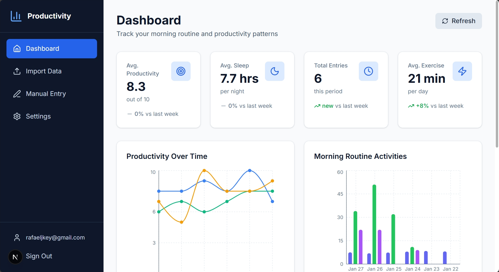

# Morning Routine & Productivity Tracker

[](https://github.com/nyanham/morning-routine-productivity/actions/workflows/ci.yml)
[](https://github.com/pre-commit/pre-commit)
[](https://opensource.org/licenses/MIT)
[](https://www.typescriptlang.org/)
[](https://www.python.org/)

A full-stack application for tracking morning routines and analyzing productivity data with beautiful visualizations.

<!--  -->

## ✨ Features

- 📊 **Interactive Dashboard** - Visualize your productivity trends with Recharts
- 📁 **CSV Import** - Bulk import historical data
- ✏️ **Manual Entry** - Log daily routines and productivity metrics
- 👥 **Multi-user Support** - Secure user authentication
- 🔐 **Row-Level Security** - Data isolation per user
- 📱 **Responsive Design** - Works on desktop and tablet

## 🛠️ Tech Stack

| Layer          | Technology                                     |
| -------------- | ---------------------------------------------- |
| **Frontend**   | Next.js 15, React 19, TypeScript, Tailwind CSS |
| **Backend**    | FastAPI, Python 3.11, Pydantic                 |
| **Database**   | Supabase (PostgreSQL)                          |
| **Auth**       | Supabase Auth (JWT)                            |
| **Charts**     | Recharts                                       |
| **Deployment** | Vercel (Frontend), AWS Lambda (Backend)        |

## 📁 Project Structure

```
morning-routine-productivity/
├── .github/                  # GitHub configuration
│   ├── workflows/           # CI/CD pipelines
│   ├── ISSUE_TEMPLATE/      # Issue templates
│   └── dependabot.yml       # Dependency updates
├── frontend/                 # Next.js application
│   ├── src/
│   │   ├── app/             # App router pages
│   │   ├── components/      # React components
│   │   ├── contexts/        # React contexts (Auth)
│   │   ├── hooks/           # Custom hooks
│   │   ├── lib/             # Utilities & API client
│   │   └── types/           # TypeScript types
│   └── public/
├── backend/                  # FastAPI application
│   ├── app/
│   │   ├── api/             # API routes
│   │   ├── core/            # Config & auth
│   │   ├── models/          # Pydantic models
│   │   └── services/        # Business logic
│   └── scripts/             # Utility scripts
├── database/                 # SQL migrations
├── docs/                     # Documentation
└── docker-compose.yml        # Local development
```

## 🚀 Quick Start

### Prerequisites

- [Node.js](https://nodejs.org/) 22+ (LTS)
- [Python](https://www.python.org/) 3.10+
- [Poetry](https://python-poetry.org/) (recommended) or pip
- [Supabase](https://supabase.com/) account (free tier works)

### 1. Clone the Repository

```bash
git clone https://github.com/YOUR_USERNAME/morning-routine-productivity.git
cd morning-routine-productivity
```

### 2. Set Up Supabase

1. Create a new project at [supabase.com](https://supabase.com)
2. Go to **SQL Editor** and run the scripts in `/database` folder
3. Copy your project URL and keys from **Settings > API**

### 3. Set Up Frontend

```bash
cd frontend
npm install
cp .env.example .env.local
```

Edit `.env.local`:

```env
NEXT_PUBLIC_SUPABASE_URL=your_supabase_url
NEXT_PUBLIC_SUPABASE_ANON_KEY=your_anon_key
NEXT_PUBLIC_API_URL=http://localhost:8000/api
```

### 4. Set Up Backend

```bash
cd ../backend
poetry install
cp .env.example .env
```

Edit `.env`:

```env
SUPABASE_URL=your_supabase_url
SUPABASE_KEY=your_service_role_key
```

### 5. Set Up Pre-commit Hooks (Recommended)

```bash
cd ..
# Windows
backend\.venv\Scripts\Activate.ps1
# Linux/Mac
source backend/.venv/bin/activate

# Install hooks
pre-commit install
pre-commit install --hook-type commit-msg
```

### 6. Run the Application

**Terminal 1 - Backend:**

```bash
cd backend
poetry run uvicorn app.main:app --reload
# API running at http://localhost:8000
```

**Terminal 2 - Frontend:**

```bash
cd frontend
npm run dev
# App running at http://localhost:3000
```

## 🐳 Docker (Alternative)

```bash
# Copy environment file
cp .env.example .env
# Edit .env with your Supabase credentials

# Start all services
docker-compose up -d

# View logs
docker-compose logs -f

# Stop services
docker-compose down
```

## 📊 API Documentation

Once the backend is running, visit:

- **Swagger UI**: <http://localhost:8000/docs>
- **ReDoc**: <http://localhost:8000/redoc>

### Main Endpoints

| Method | Endpoint                 | Description               |
| ------ | ------------------------ | ------------------------- |
| `GET`  | `/api/users/me`          | Get current user          |
| `GET`  | `/api/routines`          | List morning routines     |
| `POST` | `/api/routines`          | Create routine entry      |
| `GET`  | `/api/productivity`      | List productivity entries |
| `POST` | `/api/productivity`      | Create productivity entry |
| `POST` | `/api/import/csv`        | Import CSV data           |
| `GET`  | `/api/analytics/summary` | Get analytics summary     |
| `GET`  | `/api/analytics/charts`  | Get chart data            |

## 🧪 Testing & Linting

### Running Tests

**Backend Tests (pytest):**

```bash
cd backend
poetry run pytest -v              # Run all tests
poetry run pytest -v --tb=short   # Shorter traceback
poetry run pytest --cov           # With coverage report
```

**Frontend Tests (Jest):**

```bash
cd frontend
npm test                    # Run all tests
npm run test:watch          # Watch mode
npm run test:coverage       # With coverage report
```

### Test Structure

```
backend/tests/
├── conftest.py             # Fixtures and mocks
├── api/                    # API endpoint tests
│   ├── test_main.py        # Health endpoints
│   ├── test_routines.py    # Routines CRUD
│   ├── test_productivity.py
│   └── test_analytics.py
├── models/
│   └── test_models.py      # Pydantic validation
└── services/
    ├── test_routine_service.py
    └── test_productivity_service.py

frontend/src/
├── __tests__/
│   ├── components/         # Component tests
│   │   └── StatsCard.test.tsx
│   └── lib/                # Utility tests
│       ├── api.test.ts
│       └── utils.test.ts
└── test-utils.tsx          # Test helpers & factories
```

### Pre-commit (Recommended)

```bash
# Run all checks on staged files
pre-commit run

# Run all checks on all files
pre-commit run --all-files
```

### Linting

**Frontend:**

```bash
cd frontend
npm run lint          # ESLint
npm run format:check  # Prettier
npm run typecheck     # TypeScript check
```

**Backend:**

```bash
cd backend
poetry run ruff check .      # Linting
poetry run ruff format .     # Formatting
```

## 🚢 Deployment

### Frontend (Vercel)

1. Connect your GitHub repo to [Vercel](https://vercel.com)
2. Set root directory to `frontend`
3. Add environment variables
4. Deploy!

### Backend Options

- **AWS Lambda** - Using Mangum adapter (included)
- **Railway** - One-click deploy
- **Render** - Free tier available
- **Docker** - Self-hosted

## 🤝 Contributing

Contributions are welcome! Please read our [Contributing Guide](CONTRIBUTING.md) for details.

## 📄 License

This project is licensed under the MIT License - see the [LICENSE](LICENSE) file for details.

## 🙏 Acknowledgments

- [Supabase](https://supabase.com) - Backend as a Service
- [Vercel](https://vercel.com) - Frontend hosting
- [FastAPI](https://fastapi.tiangolo.com) - Python web framework
- [Next.js](https://nextjs.org) - React framework

---

<p align="center">
  Made with ❤️ by <a href="https://github.com/nyanham">Rafael Jyo Kondo</a>
</p>
