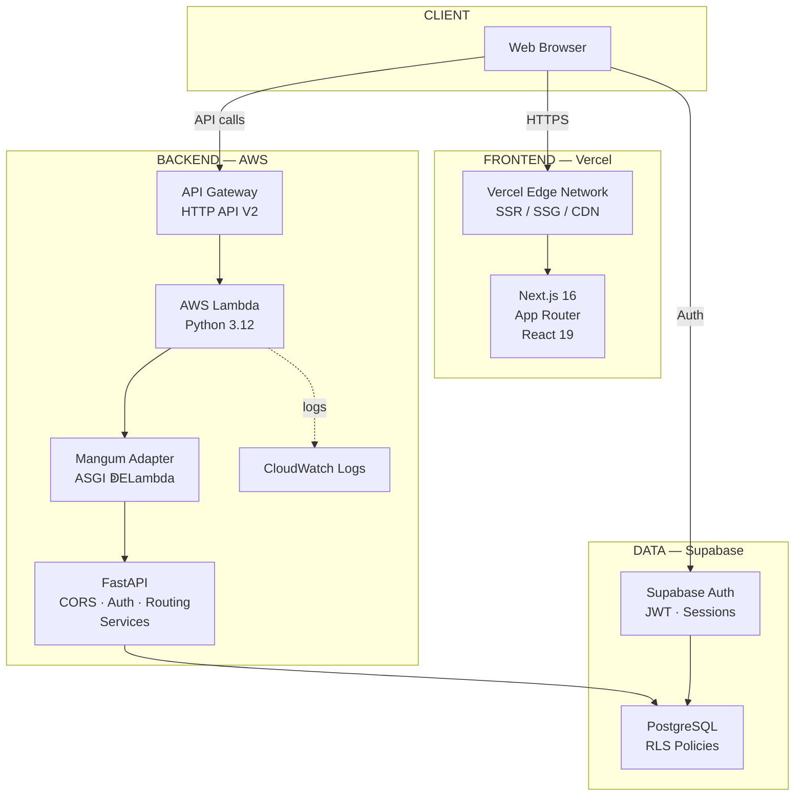
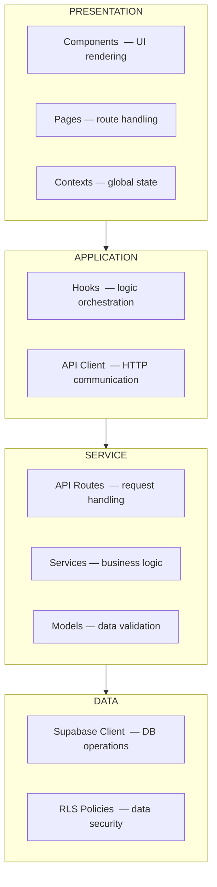
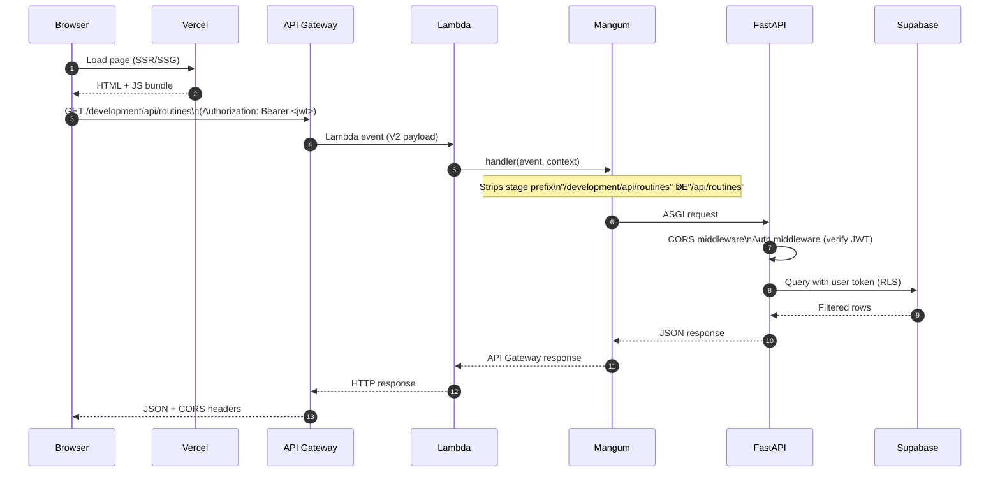

# System Overview

High-level view of how every part of the Morning Routine & Productivity Tracker connects, the design principles behind those connections, and how a request flows from browser to database and back.

---

## Architecture diagram

---

## Layers at a glance

| Layer              | Technology                         | Responsibility                                             |
| ------------------ | ---------------------------------- | ---------------------------------------------------------- |
| **Presentation**   | Next.js, React, Tailwind, Recharts | Pages, components, client-side state                       |
| **Application**    | Custom hooks, API client           | Orchestrate UI ↁEAPI communication                         |
| **API**            | FastAPI route handlers             | Accept HTTP requests, validate input, delegate to services |
| **Service**        | Python service modules             | Business logic, data transformation                        |
| **Data**           | Supabase client (postgrest)        | Database queries with RLS enforcement                      |
| **Auth**           | Supabase Auth + JWT                | Token issuance, verification, session management           |
| **Infrastructure** | AWS SAM, Vercel, Docker            | Provisioning, deployment, networking                       |

---

## Design principles

### 1. Separation of concerns

Each layer has a single job and communicates only with adjacent layers.

### 2. Security first

- **JWT authentication**  — every API request requires a valid token.
- **Row-Level Security**  — PostgreSQL enforces user data isolation at the query level.
- **Input validation**  — Pydantic models reject malformed data before it reaches the service layer.
- **CORS restriction**  — only explicitly allowed origins can call the API.

### 3. Type safety across the stack

- **TypeScript strict mode** on the frontend  — no implicit `any`.
- **Pydantic v2** on the backend  — runtime model validation.
- **Shared shapes**  — frontend `types/index.ts` mirrors backend Pydantic models.

### 4. Stateless design

- No server sessions  — JWT tokens carry all authentication state.
- RLS-enabled queries  — the database handles authorization.
- Any Lambda invocation can handle any request  — enables horizontal auto-scaling.

---

## Request lifecycle

A typical authenticated GET request flows through these steps:

---

## Production deployment topology

| Component     | Platform                     | Key traits                                   |
| ------------- | ---------------------------- | -------------------------------------------- |
| Frontend      | **Vercel**                   | Edge CDN, SSR/SSG, automatic preview deploys |
| Backend       | **AWS Lambda + API Gateway** | Serverless, auto-scaling, pay-per-invocation |
| Database      | **Supabase (PostgreSQL)**    | Managed, RLS, Auth, connection pooling       |
| IaC           | **AWS SAM**                  | `template.yaml` + `samconfig.toml`           |
| Observability | **CloudWatch**               | Structured logs, 14-day retention            |
| CI/CD         | **GitHub Actions**           | Lint, test, build on every PR                |

---

## Related Docs

| Topic                 | Link                                                    |
| --------------------- | ------------------------------------------------------- |
| Backend architecture  | [Backend-Architecture.md](02-Backend-Architecture.md)   |
| Frontend architecture | [Frontend-Architecture.md](03-Frontend-Architecture.md) |
| Data model            | [Data-Model.md](04-Data-Model.md)                       |
| Integration points    | [Integration-Points.md](05-Integration-Points.md)       |
