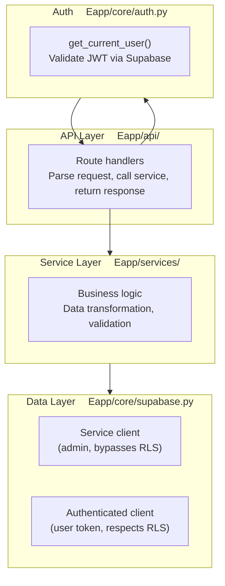
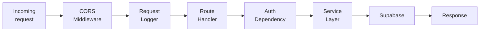
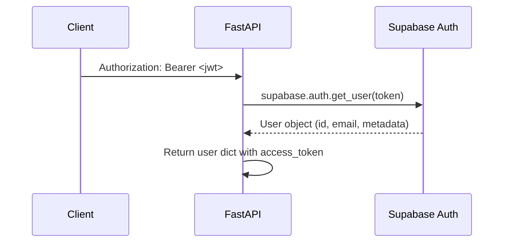

# Backend Architecture

How the FastAPI backend is structured, how a request moves through it, and how it runs on AWS Lambda.

---

## Directory layout

```
backend/app/
├── main.py              ↁEApp creation, middleware, Lambda handler
├── api/                 ↁERoute handlers (one file per resource)
━E  ├── __init__.py      ↁERouter aggregation
━E  ├── users.py
━E  ├── routines.py
━E  ├── productivity.py
━E  ├── analytics.py
━E  └── import_data.py
├── core/                ↁECross-cutting concerns
━E  ├── config.py        ↁEPydantic BaseSettings (env vars)
━E  ├── auth.py          ↁEJWT verification via Supabase
━E  └── supabase.py      ↁESupabase client factory
├── models/              ↁEPydantic request / response models
━E  ├── routine.py
━E  ├── productivity.py
━E  ├── user.py
━E  └── common.py
└── services/            ↁEBusiness logic
    ├── routine_service.py
    ├── productivity_service.py
    ├── analytics_service.py
    └── user_service.py
```

---

## Layered architecture



### Layer responsibilities

| Layer       | Location             | Does                                                                     | Does not                                        |
| ----------- | -------------------- | ------------------------------------------------------------------------ | ----------------------------------------------- |
| **API**     | `app/api/`           | Parse HTTP input, delegate to service, format HTTP output                | Contain business logic or database calls        |
| **Auth**    | `app/core/auth.py`   | Verify JWT, extract user identity, provide authenticated Supabase client | Make business decisions                         |
| **Service** | `app/services/`      | Implement business rules, transform data, call Supabase                  | Know about HTTP status codes or request objects |
| **Model**   | `app/models/`        | Validate and serialize data shapes                                       | Contain logic beyond validation                 |
| **Config**  | `app/core/config.py` | Load and validate environment variables                                  | Perform side effects                            |

---

## Application startup

`app/main.py` does everything in module-level code so it runs once per Lambda cold start:

1. **Configure logging**  Enamed logger `morning_routine` with `StreamHandler` (appears in CloudWatch).
2. **Load settings**  E`get_settings()` reads env vars via Pydantic, cached with `@lru_cache`.
3. **Create the FastAPI app**  Ewith conditional Swagger/ReDoc (disabled in production).
4. **Add CORS middleware**  Eexact origins from `CORS_ORIGINS`, regex from `CORS_ORIGIN_REGEX`.
5. **Include the API router**  Eaggregated in `app/api/__init__.py`.
6. **Register middleware**  Erequest/response logger, global exception handler.
7. **Create the Mangum handler**  E`handler = Mangum(app, ...)` for Lambda.

---

## Middleware pipeline

Every request passes through these layers in order:



### CORS middleware

CORS is handled by FastAPI (not API Gateway) because HTTP API V2 does not support wildcard subdomains:

- **Exact match**  E`CORS_ORIGINS` (comma-separated or JSON array).
- **Regex match**  E`CORS_ORIGIN_REGEX` for Vercel preview deploys (`https://.*\.vercel\.app`).
- **All methods and headers** are allowed; credentials are enabled.

### Request logger

Logs every request and response to CloudWatch with method, path, origin, status code, and latency in milliseconds.

### Global exception handler

Catches unhandled exceptions and returns a clean `{"detail": "Internal server error"}` JSON response instead of an HTML 500 page.

---

## Authentication

JWT verification is implemented as a FastAPI dependency (`get_current_user` in `app/core/auth.py`):



**Error handling:**

| Condition          | HTTP status | Detail message                                 |
| ------------------ | ----------- | ---------------------------------------------- |
| Token expired      | 401         | `Token expired  Eplease sign in again`         |
| Invalid signature  | 401         | `Invalid token  Eplease sign in again`         |
| Other auth failure | 401         | `Authentication failed  Eplease sign in again` |

### Two Supabase clients

| Client                   | Factory                             | RLS      | Use case                              |
| ------------------------ | ----------------------------------- | -------- | ------------------------------------- |
| **Service client**       | `get_supabase()`                    | Bypasses | Admin operations (token verification) |
| **Authenticated client** | `get_authenticated_supabase(token)` | Respects | User-scoped queries (CRUD)            |

The authenticated client calls `client.postgrest.auth(access_token)` so PostgreSQL's `auth.uid()` function resolves to the current user, enabling RLS policies.

---

## Configuration

All settings are defined in `app/core/config.py` using Pydantic `BaseSettings`:

```python
class Settings(BaseSettings):
    supabase_url: str
    supabase_key: str
    app_name: str = "Morning Routine Productivity API"
    debug: bool = False
    environment: str = "development"
    cors_origins: str = "http://localhost:3000"
    cors_origin_regex: str = r"https://.*\.vercel\.app"
```

- **Locally**  Evalues come from `backend/.env`.
- **On Lambda**  Evalues are injected by the SAM template as environment variables.
- Settings are cached with `@lru_cache` (parsed once per process).

See [../01-Getting-Started/02-Configuration.md](../01-Getting-Started/02-Configuration.md) for the full variable reference.

---

## Lambda handler

The bottom of `app/main.py` creates the Lambda entry point:

```python
handler = Mangum(
    app,
    lifespan="off",
    api_gateway_base_path=f"/{settings.environment}",
)
```

**Key details:**

- `lifespan="off"`  EASGI startup/shutdown events are not reliable in Lambda's execution model.
- `api_gateway_base_path`  Estrips the stage prefix (e.g. `/development`) so FastAPI routes match without modification.

### Lambda request lifecycle

```
Client
  ↁEAPI Gateway (adds stage prefix)
    ↁELambda (invokes handler)
      ↁEMangum (strips prefix, converts to ASGI)
        ↁEFastAPI (processes request)
      ↁEMangum (converts ASGI response)
    ↁELambda (returns to API Gateway)
  ↁEAPI Gateway (adds CORS headers, returns to client)
```

---

## Error handling strategy

| Layer              | Approach                                                                |
| ------------------ | ----------------------------------------------------------------------- |
| **Route handlers** | Raise `HTTPException` with appropriate status codes                     |
| **Service layer**  | Catch Supabase/DB errors, transform to meaningful exceptions            |
| **Auth**           | User-friendly messages based on error type (expired, invalid, etc.)     |
| **Global handler** | Catch-all for unhandled exceptions ↁE500 JSON response + CloudWatch log |

---

## Observability

The named logger (`morning_routine`) emits structured events to CloudWatch:

| Event                 | Fields                                |
| --------------------- | ------------------------------------- |
| `App initializing`    | environment, CORS origins, regex      |
| `REQ`                 | method, path, origin                  |
| `RES`                 | method, path, status, duration (ms)   |
| `AUTH`                | token prefix, length, success/failure |
| `Unhandled exception` | full traceback                        |

---

## Related Docs

| Topic              | Link                                              |
| ------------------ | ------------------------------------------------- |
| API endpoints      | [API-Overview.md](../03-API/01-API-Overview.md)   |
| Data model         | [Data-Model.md](04-Data-Model.md)                 |
| Integration points | [Integration-Points.md](05-Integration-Points.md) |
