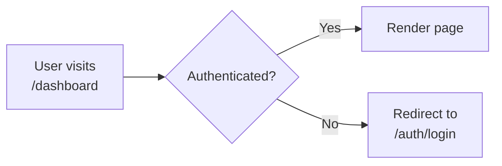
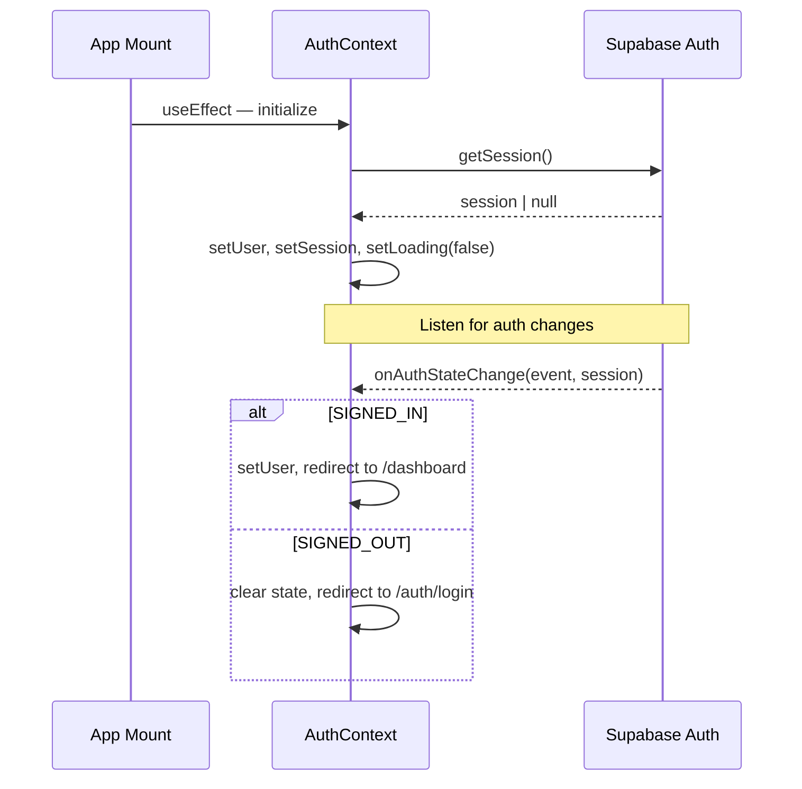
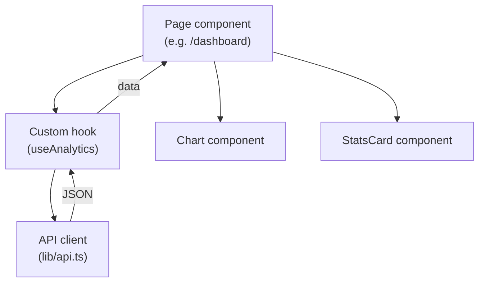

# Frontend Architecture

How the Next.js frontend is structured, how data flows from the UI to the API and back, and how authentication and state management work.

---

## Directory layout

```
frontend/src/
├── app/                     ↁENext.js App Router (pages + layouts)
━E  ├── layout.tsx           ↁERoot layout (AuthProvider, global styles)
━E  ├── page.tsx             ↁELanding page (/)
━E  ├── globals.css          ↁEGlobal CSS / Tailwind imports
━E  ├── auth/                ↁEPublic auth pages
━E  ━E  ├── login/page.tsx   ↁE/auth/login
━E  ━E  └── signup/page.tsx  ↁE/auth/signup
━E  └── dashboard/           ↁEProtected pages
━E      ├── page.tsx         ↁE/dashboard
━E      ├── entry/page.tsx   ↁE/dashboard/entry
━E      ├── import/page.tsx  ↁE/dashboard/import
━E      └── settings/page.tsxↁE/dashboard/settings
├── components/              ↁEReusable components
━E  ├── charts/              ↁERecharts visualizations
━E  ├── layout/              ↁEDashboardLayout, navigation
━E  └── ui/                  ↁEButton, Card, StatsCard, etc.
├── contexts/                ↁEReact contexts
━E  └── AuthContext.tsx      ↁEAuth state, sign in/up/out
├── hooks/                   ↁECustom hooks
━E  ├── useApi.ts            ↁEAPI interaction hooks
━E  └── useAuth.ts           ↁEAuth convenience hook
├── lib/                     ↁEUtilities and clients
━E  ├── api.ts               ↁEAPI client + ApiError class
━E  ├── utils.ts             ↁEHelper functions
━E  └── supabase/            ↁEBrowser and server Supabase clients
├── types/                   ↁEShared TypeScript definitions
━E  └── index.ts
└── __tests__/               ↁEJest tests (mirrors src/ structure)
```

---

## Routing

The app uses the **Next.js App Router** (file-based routing).

```
/                    ↁELanding page (public)
/auth/login          ↁELogin (public)
/auth/signup         ↁESign up (public)
/dashboard           ↁEDashboard home (protected)
/dashboard/entry     ↁEManual data entry (protected)
/dashboard/import    ↁECSV import (protected)
/dashboard/settings  ↁEUser settings (protected)
```

### Route protection

Protected routes are wrapped in a `RequireAuth` component from `AuthContext`. If the user is not authenticated, they are redirected to `/auth/login`.



### Root layout

`app/layout.tsx` wraps the entire app in the `AuthProvider`, making auth state available everywhere:

```
<html>
  <body>
    <AuthProvider>      ↁEprovides user, session, signIn, signOut
      {children}        ↁEall pages
    </AuthProvider>
  </body>
</html>
```

---

## State management

### AuthContext

The single React context manages all authentication state:

| Value                                | Type              | Description                                    |
| ------------------------------------ | ----------------- | ---------------------------------------------- |
| `user`                               | `User \| null`    | Current Supabase user object                   |
| `session`                            | `Session \| null` | Current session (contains JWT)                 |
| `loading`                            | `boolean`         | `true` while initial session is being resolved |
| `signIn(email, password)`            | `async`           | Sign in with email/password                    |
| `signUp(email, password, fullName?)` | `async`           | Create a new account                           |
| `signOut()`                          | `async`           | Sign out and redirect to login                 |
| `getAccessToken()`                   | `async`           | Get the current JWT (refreshes if needed)      |

### Auth state lifecycle



### No additional state library

The app intentionally avoids Redux, Zustand, or similar libraries. Server data is fetched via custom hooks and held in component-local state. Auth is the only global state, managed by context.

---

## API client

`lib/api.ts` is the single point of communication with the backend.

### Structure

```typescript
const API_URL = process.env.NEXT_PUBLIC_API_URL || "http://localhost:8000";

// Generic fetch wrapper  — adds auth header, parses JSON, throws ApiError
async function fetchApi<T>(endpoint: string, options?: ApiOptions): Promise<T>

// Resource-specific methods
export const api = {
  routines:    { list, get, create, update, delete },
  productivity:{ list, get, create, update, delete },
  analytics:   { summary, charts },
  import:      { csv },
  users:       { me, profile, settings, goals, ... },
};
```

### Error handling

The `ApiError` class carries `status` and `detail`. A helper function `getApiErrorMessage()` safely extracts a message from any caught value:

```typescript
// Uses name-based check instead of instanceof because
// Next.js Turbopack/webpack can duplicate class identities
// across chunk boundaries.
export function getApiErrorMessage(err: unknown, fallback: string): string;
```

Usage in hooks:

```typescript
try {
  const data = await api.routines.list(token);
} catch (err) {
  setError(getApiErrorMessage(err, "Failed to load routines"));
}
```

---

## Custom hooks

`hooks/useApi.ts` contains hooks that wire the API client to React state:

| Hook                | Purpose                       |
| ------------------- | ----------------------------- |
| `useRoutines()`     | CRUD for morning routines     |
| `useProductivity()` | CRUD for productivity entries |
| `useAnalytics()`    | Fetch summary + chart data    |

Each hook follows the same pattern:

1. Get the access token from `AuthContext`.
2. Call the appropriate `api.*` method.
3. Store the result in local state.
4. Expose `data`, `loading`, `error`, and mutation functions.

---

## Component structure

### Component categories

| Folder               | Purpose                            | Examples                                                         |
| -------------------- | ---------------------------------- | ---------------------------------------------------------------- |
| `components/charts/` | Recharts-based data visualizations | `ProductivityChart`, `RoutineBarChart`, `SleepDistributionChart` |
| `components/layout/` | Page structure and navigation      | `DashboardLayout`                                                |
| `components/ui/`     | Generic, reusable UI primitives    | `Button`, `Card`, `StatsCard`                                    |

### Data flow within a page



---

## Styling

- **Tailwind CSS 4**  — utility-first, configured in `tailwind.config.js`.
- **Global styles**  — minimal, in `app/globals.css`.
- **No CSS modules or styled-components**  — all styling is inline Tailwind classes.
- **Responsive**  — designed for desktop and tablet; mobile is functional but not the primary target.

---

## TypeScript conventions

- **Strict mode** enabled in `tsconfig.json`.
- **No `any`**  — use explicit types or `unknown` with type guards.
- **Shared types**  — all data shapes are defined in `types/index.ts` and mirror the backend Pydantic models.
- **Interfaces for props**  — every component defines its props interface.

---

## Testing

- **Jest + React Testing Library** for component and hook tests.
- **Test utilities** in `src/test-utils.tsx` provide custom renderers and factories.
- Tests live in `src/__tests__/`, mirroring the source structure.

See [../08-Testing/01-Testing-Strategy.md](../08-Testing/01-Testing-Strategy.md) for commands and coverage details.

---

## Related Docs

| Topic                | Link                                                  |
| -------------------- | ----------------------------------------------------- |
| Backend architecture | [Backend-Architecture.md](02-Backend-Architecture.md) |
| Data model           | [Data-Model.md](04-Data-Model.md)                     |
| API endpoints        | [API-Overview.md](../03-API/01-API-Overview.md)       |
