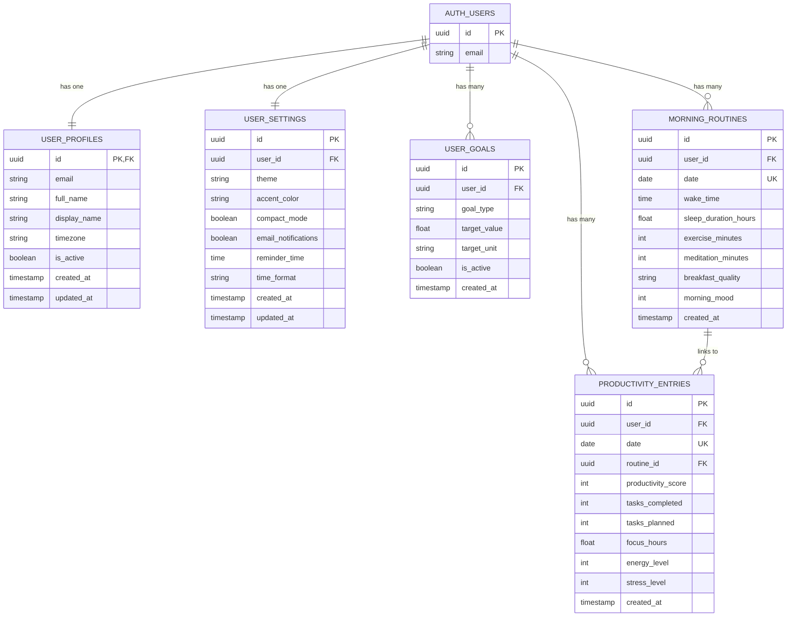

# Data Model

Entities, their relationships, and how they are represented on both sides of the stack.

---

## Entity-relationship diagram



---

## Entities

### User Profiles

Created automatically by a database trigger when a user signs up via Supabase Auth.

| Field                       | Type         | Notes                                               |
| --------------------------- | ------------ | --------------------------------------------------- |
| `id`                        | UUID         | PK  Ereferences `auth.users(id)`, cascade on delete |
| `email`                     | VARCHAR(255) | Unique                                              |
| `full_name`                 | VARCHAR(100) | From signup metadata                                |
| `display_name`              | VARCHAR(50)  | Optional nickname                                   |
| `avatar_url`                | TEXT         | Profile picture URL                                 |
| `timezone`                  | VARCHAR(50)  | Default `'UTC'`                                     |
| `locale`                    | VARCHAR(10)  | Default `'en-US'`                                   |
| `is_active`                 | BOOLEAN      | Default `true`                                      |
| `onboarding_completed`      | BOOLEAN      | Default `false`                                     |
| `created_at` / `updated_at` | TIMESTAMPTZ  | Auto-managed                                        |

### User Settings

One row per user. Created by the same signup trigger with sensible defaults.

| Field                 | Type        | Default    | Notes                        |
| --------------------- | ----------- | ---------- | ---------------------------- |
| `theme`               | VARCHAR(20) | `'system'` | `light`, `dark`, or `system` |
| `accent_color`        | VARCHAR(20) | `'blue'`   | UI accent color              |
| `compact_mode`        | BOOLEAN     | `false`    | Dense layout toggle          |
| `email_notifications` | BOOLEAN     | `true`     |                              |
| `reminder_time`       | TIME        | `NULL`     | Daily reminder               |
| `time_format`         | VARCHAR(5)  | `'12h'`    | `12h` or `24h`               |
| `default_chart_type`  | VARCHAR(20) | `'line'`   | Default visualization        |

### User Goals

Optional targets the user sets for themselves.

| Field          | Type        | Notes                                     |
| -------------- | ----------- | ----------------------------------------- |
| `goal_type`    | VARCHAR(50) | e.g. `sleep_duration`, `exercise_minutes` |
| `target_value` | FLOAT       | Numeric target                            |
| `target_unit`  | VARCHAR(20) | e.g. `hours`, `minutes`                   |
| `is_active`    | BOOLEAN     | Only active goals are shown               |

### Morning Routines

One entry per user per day. The **core tracking entity**.

| Field                    | Type        | Notes                                     |
| ------------------------ | ----------- | ----------------------------------------- |
| `date`                   | DATE        | Unique per user                           |
| `wake_time`              | TIME        | When the user woke up                     |
| `sleep_duration_hours`   | FLOAT       | Hours of sleep                            |
| `exercise_minutes`       | INT         | Morning exercise duration                 |
| `meditation_minutes`     | INT         | Meditation duration                       |
| `breakfast_quality`      | VARCHAR(20) | e.g. `none`, `light`, `balanced`, `heavy` |
| `morning_mood`           | INT         | 1 E0 scale                                |
| `screen_time_before_bed` | INT         | Minutes of screen time the night before   |
| `caffeine_intake`        | INT         | Number of caffeinated drinks              |
| `water_intake_ml`        | INT         | Water consumed (ml)                       |

### Productivity Entries

One entry per user per day, optionally linked to a morning routine.

| Field                | Type  | Notes                               |
| -------------------- | ----- | ----------------------------------- |
| `date`               | DATE  | Unique per user                     |
| `routine_id`         | UUID  | FK to `morning_routines` (nullable) |
| `productivity_score` | INT   | 1 E0 self-assessed score            |
| `tasks_completed`    | INT   |                                     |
| `tasks_planned`      | INT   |                                     |
| `focus_hours`        | FLOAT | Deep work hours                     |
| `distractions_count` | INT   | Number of distractions              |
| `energy_level`       | INT   | 1 E0                                |
| `stress_level`       | INT   | 1 E0                                |
| `notes`              | TEXT  | Free-form daily notes               |

---

## Constraints and integrity

| Constraint                 | Applies to                                             | Purpose                                                   |
| -------------------------- | ------------------------------------------------------ | --------------------------------------------------------- |
| **Unique (user_id, date)** | `morning_routines`, `productivity_entries`             | One entry per user per day                                |
| **Foreign key cascade**    | All user-owned tables ↁE`auth.users`                   | Delete user ↁEdelete all their data                       |
| **Foreign key set null**   | `productivity_entries.routine_id` ↁE`morning_routines` | Deleting a routine does not delete the productivity entry |
| **Check constraints**      | Various numeric fields                                 | Ensure values are within valid ranges                     |

---

## Row-Level Security (RLS)

Every table has RLS enabled. Policies follow the pattern:

```sql
CREATE POLICY "Users can view own data"
    ON <table> FOR SELECT
    USING (auth.uid() = user_id);

CREATE POLICY "Users can insert own data"
    ON <table> FOR INSERT
    WITH CHECK (auth.uid() = user_id);

CREATE POLICY "Users can update own data"
    ON <table> FOR UPDATE
    USING (auth.uid() = user_id);

CREATE POLICY "Users can delete own data"
    ON <table> FOR DELETE
    USING (auth.uid() = user_id);
```

The backend enforces this by using an **authenticated Supabase client** that passes the user's JWT to postgrest, so `auth.uid()` resolves correctly.

---

## Database triggers

| Trigger                | Table                        | Event           | Action                                           |
| ---------------------- | ---------------------------- | --------------- | ------------------------------------------------ |
| `on_auth_user_created` | `auth.users`                 | `AFTER INSERT`  | Creates `user_profiles` and `user_settings` rows |
| `update_updated_at`    | All tables with `updated_at` | `BEFORE UPDATE` | Sets `updated_at = NOW()`                        |

---

## Type mapping across the stack

| Database (PostgreSQL) | Backend (Pydantic)  | Frontend (TypeScript) |
| --------------------- | ------------------- | --------------------- |
| `UUID`                | `str` (UUID format) | `string`              |
| `DATE`                | `date`              | `string` (ISO format) |
| `TIME`                | `time`              | `string` (HH:MM)      |
| `TIMESTAMPTZ`         | `datetime`          | `string` (ISO format) |
| `INT`                 | `int`               | `number`              |
| `FLOAT`               | `float`             | `number`              |
| `BOOLEAN`             | `bool`              | `boolean`             |
| `VARCHAR` / `TEXT`    | `str`               | `string`              |

---

## Source of truth

The authoritative schema is `database/schema.sql`. If this document and the SQL file diverge, update this document to match the SQL.

---

## Related Docs

| Topic                | Link                                                  |
| -------------------- | ----------------------------------------------------- |
| Database schema      | [Schema.md](../06-Database/01-Schema.md)              |
| Backend architecture | [Backend-Architecture.md](02-Backend-Architecture.md) |
| Integration points   | [Integration-Points.md](05-Integration-Points.md)     |
