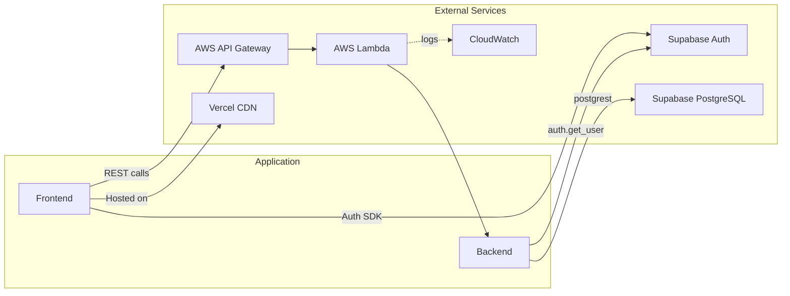
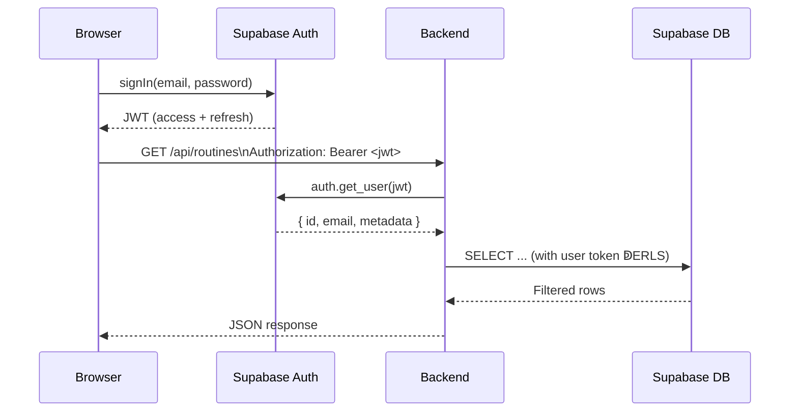

# Integration Points

How the application connects to external services  — Supabase, AWS, and Vercel  — and the contracts between them.

---

## Overview



---

## Supabase

Supabase provides **three services** to the application: Auth, PostgreSQL, and real-time (unused currently).

### Auth

| Concern       | Frontend                                                         | Backend                                     |
| ------------- | ---------------------------------------------------------------- | ------------------------------------------- |
| **SDK**       | `@supabase/supabase-js` v2                                       | `supabase-py` v2                            |
| **Operation** | `signUp`, `signIn`, `signOut`, `getSession`, `onAuthStateChange` | `auth.get_user(token)`  — verify JWT only    |
| **Key used**  | `NEXT_PUBLIC_SUPABASE_ANON_KEY` (public)                         | `SUPABASE_KEY` (service role, secret)       |
| **Token**     | Stored in browser by Supabase SDK                                | Received via `Authorization: Bearer` header |

**Auth flow:**



### PostgreSQL

| Concern                  | Detail                                                                       |
| ------------------------ | ---------------------------------------------------------------------------- |
| **Connection**           | Via Supabase's HTTP-based postgrest API (not a raw TCP connection)           |
| **Service client**       | Uses the service role key  — bypasses RLS (used for admin/token verification) |
| **Authenticated client** | Uses `client.postgrest.auth(access_token)`  — respects RLS                    |
| **Connection pooling**   | Managed by Supabase (PgBouncer)                                              |

The two clients are created in `backend/app/core/supabase.py`:

```python
# Service client  — bypasses RLS
supabase = create_client(settings.supabase_url, settings.supabase_key)

# Authenticated client  — respects RLS
def get_authenticated_supabase(access_token: str) -> Client:
    client = create_client(settings.supabase_url, settings.supabase_key)
    client.postgrest.auth(access_token)
    return client
```

### Row-Level Security enforcement

RLS policies use `auth.uid()` which resolves from the JWT passed via `postgrest.auth()`. This means:

- The **service client** sees all rows (no JWT ↁE`auth.uid()` is null ↁERLS policies don't match ↁEbut service role bypasses RLS entirely).
- The **authenticated client** sees only rows where `user_id = auth.uid()`.

---

## AWS

### API Gateway (HTTP API V2)

| Setting        | Value                                          |
| -------------- | ---------------------------------------------- |
| **Type**       | HTTP API (not REST API)                        |
| **Protocol**   | HTTPS                                          |
| **Stages**     | `development`, `staging`, `production`         |
| **Routing**    | Catch-all `$default` ↁELambda                  |
| **CORS**       | Disabled at Gateway level  — handled by FastAPI |
| **Throttling** | Default AWS limits apply                       |

### Lambda

| Setting          | Value                                       |
| ---------------- | ------------------------------------------- |
| **Runtime**      | Python 3.12                                 |
| **Architecture** | x86_64                                      |
| **Memory**       | 256 MB                                      |
| **Timeout**      | 30 seconds                                  |
| **Handler**      | `app.main.handler` (Mangum)                 |
| **Packaging**    | `requirements.txt` (installed by SAM build) |

**Cold start behavior:**

- First request after idle: 2 —  seconds (initializes Python, loads FastAPI, connects to Supabase).
- Subsequent requests: ~50 — 00 ms (warm invocation).
- Memory and Python 3.12 help keep cold starts reasonable.

### CloudWatch

| Setting       | Value                              |
| ------------- | ---------------------------------- |
| **Log group** | `/aws/lambda/<function-name>`      |
| **Retention** | 14 days (set in SAM template)      |
| **Format**    | Structured text via Python logging |

### SAM Template

`backend/template.yaml` defines all AWS resources:

| Resource                         | SAM Type                    | Purpose              |
| -------------------------------- | --------------------------- | -------------------- |
| `MorningRoutineFunction`         | `AWS::Serverless::Function` | Lambda function      |
| `HttpApi`                        | `AWS::Serverless::HttpApi`  | API Gateway HTTP API |
| `MorningRoutineFunctionLogGroup` | `AWS::Logs::LogGroup`       | CloudWatch log group |

Parameters are environment-specific and stored in `backend/samconfig.toml`:

```toml
[default.deploy.parameters]
stack_name = "morning-routine-api-dev"
parameter_overrides = "Environment=development SupabaseUrl=... SupabaseKey=..."

[staging.deploy.parameters]
stack_name = "morning-routine-api-staging"
parameter_overrides = "Environment=staging ..."
```

---

## Vercel

| Concern                   | Detail                                                   |
| ------------------------- | -------------------------------------------------------- |
| **Framework**             | Next.js (auto-detected)                                  |
| **Root directory**        | `frontend/`                                              |
| **Build command**         | `npm run build`                                          |
| **Output**                | `.next/` (SSR + static)                                  |
| **Environment variables** | Set in Vercel dashboard                                  |
| **Preview deploys**       | Automatic on every PR (dynamic subdomain `*.vercel.app`) |
| **Production deploy**     | On push to `main`                                        |
| **CDN**                   | Global edge network, automatic cache invalidation        |

### Preview deploy CORS

Vercel preview URLs have dynamic subdomains (e.g. `https://my-app-abc123.vercel.app`). The backend handles this via `CORS_ORIGIN_REGEX`:

```
CORS_ORIGIN_REGEX=https://.*\.vercel\.app
```

---

## Docker (local development)

`docker-compose.yml` defines two services on a shared bridge network:

| Service    | Image                            | Port | Notes                                   |
| ---------- | -------------------------------- | ---- | --------------------------------------- |
| `frontend` | Built from `frontend/Dockerfile` | 3000 | `src/` mounted read-only for hot reload |
| `backend`  | Built from `backend/Dockerfile`  | 8000 | `app/` mounted read-only for hot reload |

The frontend reaches the backend via the Docker service name (`http://backend:8000/api`), not `localhost`.

---

## Integration boundaries

| Boundary                 | Contract                        | Where it's defined                             |
| ------------------------ | ------------------------------- | ---------------------------------------------- |
| Frontend ↁEBackend       | REST API (JSON over HTTPS)      | `frontend/src/lib/api.ts` ↁE`backend/app/api/` |
| Frontend ↁESupabase Auth | Supabase JS SDK                 | `frontend/src/lib/supabase/client.ts`          |
| Backend ↁESupabase Auth  | `supabase.auth.get_user(token)` | `backend/app/core/auth.py`                     |
| Backend ↁESupabase DB    | postgrest HTTP queries          | `backend/app/core/supabase.py`                 |
| SAM ↁEAWS                | CloudFormation resources        | `backend/template.yaml`                        |
| Vercel ↁEFrontend        | Build + deploy pipeline         | `frontend/package.json`                        |

---

## Related Docs

| Topic                | Link                                                          |
| -------------------- | ------------------------------------------------------------- |
| System overview      | [System-Overview.md](01-System-Overview.md)                   |
| Backend architecture | [Backend-Architecture.md](02-Backend-Architecture.md)         |
| Configuration        | [Configuration.md](../01-Getting-Started/02-Configuration.md) |
| Deployment           | [Deployment.md](../07-Operations/01-Deployment.md)            |
