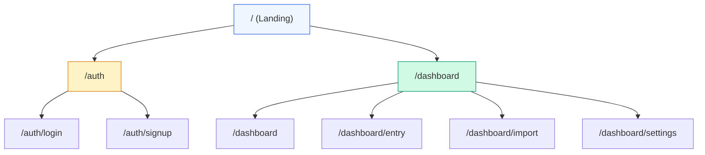

# UI Structure

> Routes, layouts, and page composition in the Next.js App Router.

---

## Technology Stack

| Technology   | Version | Purpose                             |
| ------------ | ------- | ----------------------------------- |
| Next.js      | 16.x    | React framework with App Router     |
| React        | 19.x    | UI library                          |
| TypeScript   | 5.7.x   | Type safety (strict mode)           |
| Tailwind CSS | 4.x     | Utility-first styling               |
| Recharts     | 2.x     | Data visualisation (line, bar, pie) |
| Lucide React | 0.5.x   | Icon library                        |
| Supabase JS  | 2.x     | Auth & real-time client             |
| PapaParse    |  —       | Client-side CSV parsing             |

---

## Directory Layout

```
frontend/src/
├── app/                       # Next.js App Router (file-based routing)
━E  ├── layout.tsx             # Root layout  — providers, fonts, global CSS
━E  ├── page.tsx               # Landing page (/)
━E  ├── globals.css            # Tailwind v4 @theme, component layer
━E  ├── auth/
━E  ━E  ├── login/page.tsx     # Login form (/auth/login)
━E  ━E  └── signup/page.tsx    # Signup form (/auth/signup)
━E  └── dashboard/
━E      ├── page.tsx           # Dashboard home (/dashboard)
━E      ├── entry/page.tsx     # Manual data entry (/dashboard/entry)
━E      ├── import/page.tsx    # CSV import (/dashboard/import)
━E      └── settings/page.tsx  # User settings (/dashboard/settings)
├── components/                # Reusable UI pieces
━E  ├── charts/                # Recharts wrappers
━E  ├── layout/                # DashboardLayout, Sidebar
━E  └── ui/                    # Primitives: StatsCard, CSVUploader
├── contexts/                  # React Context providers
├── hooks/                     # Custom hooks (useApi, useAuth)
├── lib/                       # Utilities & clients
━E  ├── api.ts                 # REST client (apiClient, api namespace)
━E  ├── utils.ts               # cn(), formatDate(), colour helpers
━E  └── supabase/              # Browser & server Supabase clients
└── types/                     # Shared TypeScript interfaces
    └── index.ts
```

---

## Route Map



| Route                 | Access    | Purpose                            |
| --------------------- | --------- | ---------------------------------- |
| `/`                   | Public    | Marketing landing page             |
| `/auth/login`         | Public    | Email + password sign-in           |
| `/auth/signup`        | Public    | New account registration           |
| `/dashboard`          | Protected | Overview with stats & charts       |
| `/dashboard/entry`    | Protected | Log a routine + productivity entry |
| `/dashboard/import`   | Protected | Drag-and-drop CSV import           |
| `/dashboard/settings` | Protected | Profile, preferences, goals        |

---

## Layout Hierarchy

```
RootLayout  (app/layout.tsx)
├── AuthProvider          ↁEwraps every page
━E
├── Landing page          ↁEno sidebar, full-width
━E
├── Auth pages            ↁEcentred forms, no sidebar
━E  ├── Login
━E  └── Signup
━E
└── DashboardLayout       ↁEfixed sidebar + content area
    ├── RequireAuth       ↁEredirects unauthenticated users
    ├── Sidebar           ↁEnavigation, user info, sign-out
    └── <main>            ↁEpage content (ml-64 p-8)
```

### Root Layout

The root layout is the outermost shell. It loads the Inter font, injects global
CSS, and wraps everything in `AuthProvider` so that any page can access
authentication state.

```tsx
// app/layout.tsx
export default function RootLayout({
  children,
}: {
  children: React.ReactNode;
}) {
  return (
    <html lang="en">
      <head>{/* Inter font preconnect */}</head>
      <body className="antialiased">
        <AuthProvider>{children}</AuthProvider>
      </body>
    </html>
  );
}
```

### Dashboard Layout

Protected pages share `DashboardLayout`, which renders a fixed-width sidebar
on the left and a content area offset by `ml-64`.

```tsx
// components/layout/DashboardLayout.tsx
export default function DashboardLayout({
  children,
}: {
  children: React.ReactNode;
}) {
  return (
    <div className="min-h-screen bg-slate-50">
      <Sidebar />
      <main className="ml-64 p-8">{children}</main>
    </div>
  );
}
```

---

## Route Protection

Routes under `/dashboard` are guarded by the `RequireAuth` component exported
from `AuthContext`. If the user is not signed in, `RequireAuth` redirects to
`/auth/login?returnUrl=<current_path>`.

```tsx
// Typical dashboard page
import { RequireAuth } from "@/contexts/AuthContext";

export default function DashboardPage() {
  return (
    <RequireAuth>
      <DashboardLayout>
        <DashboardContent />
      </DashboardLayout>
    </RequireAuth>
  );
}
```

While auth state is loading, `RequireAuth` shows a spinner by default (or a
custom `fallback` node). Once loading completes, it either renders `children`
or redirects.

---

## Landing Page

The public landing page (`/`) is a self-contained marketing page with:

1. **Header**  — logo + Login / Sign Up links
2. **Hero section**  — headline, subtitle, CTA buttons
3. **Features grid**  — three `FeatureCard` components (CSV Import, Manual Input, Visual Analytics)
4. **Footer**  — copyright

It uses no shared dashboard layout and renders at full width.

---

## Navigation

The `Sidebar` component provides all in-app navigation for authenticated users.

| Item         | Icon       | Route                 |
| ------------ | ---------- | --------------------- |
| Dashboard    | `Home`     | `/dashboard`          |
| Import Data  | `Upload`   | `/dashboard/import`   |
| Manual Entry | `PenLine`  | `/dashboard/entry`    |
| Settings     | `Settings` | `/dashboard/settings` |

The active route is highlighted with `bg-primary-600`; inactive items use
`text-slate-300` with a hover state. The bottom of the sidebar shows the
current user's email and a **Sign Out** button.

---

## Related Docs

| Topic                | Link                                                   |
| -------------------- | ------------------------------------------------------ |
| State management     | [State-Management.md](04-State-Management.md)             |
| Components catalogue | [Components.md](02-Components.md)                         |
| Custom hooks         | [Hooks.md](03-Hooks.md)                                   |
| Styling system       | [Styling.md](05-Styling.md)                               |
| API layer            | [../03-API/01-API-Overview.md](../03-API/01-API-Overview.md) |
