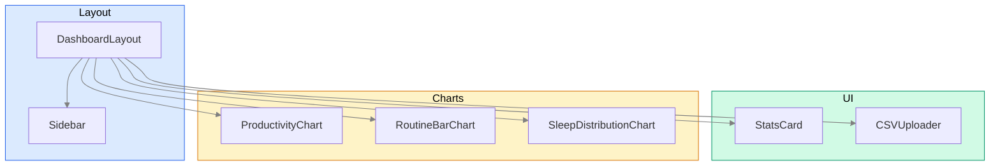

# Components

> Catalogue of reusable React components  Elayout, UI primitives, and charts.

---

## Component Tree



---

## Layout Components

### DashboardLayout

> `components/layout/DashboardLayout.tsx`

Wraps every page under `/dashboard`. Renders the `Sidebar` on the left and
positions page content in a padded main area.

| Prop       | Type              | Description  |
| ---------- | ----------------- | ------------ |
| `children` | `React.ReactNode` | Page content |

```tsx
<DashboardLayout>
  <h1>Dashboard</h1>
  {/* page content */}
</DashboardLayout>
```

**Implementation notes:**

- The sidebar is `fixed` and `w-64`, so `<main>` uses `ml-64 p-8` to avoid
  overlap.
- Background: `bg-slate-50` for the full viewport.

---

### Sidebar

> `components/layout/Sidebar.tsx`

Fixed left sidebar with navigation links, user info, and sign-out.

**Sections (top ↁEbottom):**

| Section    | Content                                |
| ---------- | -------------------------------------- |
| Logo       | `BarChart3` icon + "Productivity" text |
| Navigation | Four `NavLink` items (see table below) |
| User       | Current email + Sign Out button        |

**Navigation items:**

| Label        | Icon       | Route                 | Active style     |
| ------------ | ---------- | --------------------- | ---------------- |
| Dashboard    | `Home`     | `/dashboard`          | `bg-primary-600` |
| Import Data  | `Upload`   | `/dashboard/import`   | `bg-primary-600` |
| Manual Entry | `PenLine`  | `/dashboard/entry`    | `bg-primary-600` |
| Settings     | `Settings` | `/dashboard/settings` | `bg-primary-600` |

Active route detection uses `usePathname()` and exact equality (`===`).
The `cn()` utility merges conditional class names cleanly.

**Dependencies:** `useAuthContext` (for `user.email` and `signOut`).

---

## UI Primitives

### StatsCard

> `components/ui/StatsCard.tsx`

Displays a single metric with an optional trend indicator.

| Prop         | Type                         | Required | Description              |
| ------------ | ---------------------------- | -------- | ------------------------ |
| `title`      | `string`                     | Yes      | Metric label             |
| `value`      | `string \| number`           | Yes      | Primary display value    |
| `subtitle`   | `string`                     | No       | Secondary description    |
| `trend`      | `'up' \| 'down' \| 'stable'` | No       | Arrow direction          |
| `trendValue` | `string`                     | No       | Trend text (e.g. "+12%") |
| `icon`       | `React.ReactNode`            | No       | Icon in top-right badge  |

```tsx
import { Target } from "lucide-react";

<StatsCard
  title="Avg Productivity"
  value="7.5"
  subtitle="Last 7 days"
  trend="up"
  trendValue="+12%"
  icon={<Target className="h-6 w-6 text-primary-600" />}
/>;
```

**Rendering:**

- Uses the `.card` component class (rounded-xl, border, shadow).
- Trend icon: `TrendingUp` (green), `TrendingDown` (red), `Minus` (grey).
- Trend colour is derived from `trend` direction.

---

### CSVUploader

> `components/ui/CSVUploader.tsx`

Drag-and-drop (or click-to-browse) CSV file uploader with preview table.

| Prop             | Type                      | Required | Description             |
| ---------------- | ------------------------- | -------- | ----------------------- |
| `onUpload`       | `(data: any[]) => void`   | Yes      | Called with parsed rows |
| `onError`        | `(error: string) => void` | No       | Called on parse failure |
| `acceptedFields` | `string[]`                | No       | Expected column names   |

**Behaviour:**

1. User drags a `.csv` file onto the drop zone (or clicks to browse).
2. `PapaParse` parses the file client-side with `header: true`.
3. On success, the first 5 rows are shown in a preview table and `onUpload`
   fires with the full data array.
4. On error, the drop zone turns red and `onError` fires.

**States:**

| Status    | Icon          | Message                       |
| --------- | ------------- | ----------------------------- |
| `idle`    | `Upload`      | "Drop your CSV file here"     |
| `success` | `CheckCircle` | "File uploaded successfully!" |
| `error`   | `XCircle`     | "Upload failed"               |

**Dependencies:** `papaparse` (CSV parsing).

---

## Chart Components

All charts use **Recharts** with `ResponsiveContainer` for fluid widths. They
follow a consistent pattern:

1. Wrapped in a `.card` container.
2. Accept a `data` array and optional `title`.
3. Render inside a fixed `h-80` div.
4. Share a common `Tooltip` style (white background, slate border, rounded).

Charts are exported from a barrel file:

```typescript
// components/charts/index.ts
export { default as ProductivityChart } from "./ProductivityChart";
export { default as RoutineBarChart } from "./RoutineBarChart";
export { default as SleepDistributionChart } from "./SleepDistributionChart";
```

---

### ProductivityChart

> `components/charts/ProductivityChart.tsx`

Line chart displaying three daily metrics over time.

| Prop    | Type               | Default                    |
| ------- | ------------------ | -------------------------- |
| `data`  | `ChartDataPoint[]` |  E                         |
| `title` | `string`           | `"Productivity Over Time"` |

**Series:**

| Data key             | Colour    | Label        |
| -------------------- | --------- | ------------ |
| `productivity_score` | `#3b82f6` | Productivity |
| `energy_level`       | `#10b981` | Energy       |
| `morning_mood`       | `#f59e0b` | Mood         |

- Y-axis domain: `[0, 10]` (all metrics use a 1 E0 scale).
- Active dot radius: `6` for hover highlighting.

```tsx
import { ProductivityChart } from "@/components/charts";

<ProductivityChart data={chartData} title="Last 30 Days" />;
```

---

### RoutineBarChart

> `components/charts/RoutineBarChart.tsx`

Grouped bar chart for morning routine activity durations.

| Prop    | Type               | Default                        |
| ------- | ------------------ | ------------------------------ |
| `data`  | `ChartDataPoint[]` |  E                             |
| `title` | `string`           | `"Morning Routine Activities"` |

**Series:**

| Data key               | Colour    | Label            |
| ---------------------- | --------- | ---------------- |
| `sleep_duration_hours` | `#6366f1` | Sleep (hrs)      |
| `exercise_minutes`     | `#22c55e` | Exercise (min)   |
| `meditation_minutes`   | `#a855f7` | Meditation (min) |

- Bars have `radius={[4, 4, 0, 0]}` for rounded top corners.

```tsx
import { RoutineBarChart } from "@/components/charts";

<RoutineBarChart data={chartData} />;
```

---

### SleepDistributionChart

> `components/charts/SleepDistributionChart.tsx`

Donut (pie) chart showing how sleep durations are distributed across buckets.

| Prop    | Type                                               | Default                         |
| ------- | -------------------------------------------------- | ------------------------------- |
| `data`  | `{ name: string; value: number; color: string }[]` |  E                              |
| `title` | `string`                                           | `"Sleep Duration Distribution"` |

**Appearance:**

- Inner radius: `60`, outer radius: `100` (donut shape).
- Padding angle: `5` for visual separation.
- Labels show `name: percent%`.
- Fallback colour palette: `['#ef4444', '#f97316', '#eab308', '#22c55e', '#3b82f6']`.

```tsx
import { SleepDistributionChart } from "@/components/charts";

const sleepBuckets = [
  { name: "< 6h", value: 5, color: "#ef4444" },
  { name: "6-7h", value: 12, color: "#f97316" },
  { name: "7-8h", value: 45, color: "#22c55e" },
  { name: "8-9h", value: 30, color: "#3b82f6" },
  { name: "> 9h", value: 8, color: "#6366f1" },
];

<SleepDistributionChart data={sleepBuckets} />;
```

---

## Adding a New Component

1. Create the file in the appropriate subdirectory (`ui/`, `charts/`, or `layout/`).
2. Use `'use client'` directive if the component uses hooks or browser APIs.
3. Export as `default` and add to the barrel file if one exists.
4. Follow existing patterns: accept typed props, use Tailwind + `cn()`, wrap
   in `.card` where appropriate.
5. Add a test alongside in `__tests__/components/`.

---

## Related Docs

| Topic            | Link                                       |
| ---------------- | ------------------------------------------ |
| UI structure     | [UI-Structure.md](01-UI-Structure.md)         |
| Styling system   | [Styling.md](05-Styling.md)                   |
| Custom hooks     | [Hooks.md](03-Hooks.md)                       |
| TypeScript types | [Hooks.md](03-Hooks.md#typescript-types)      |
| State management | [State-Management.md](04-State-Management.md) |
