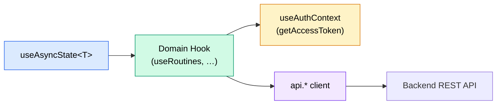

# Hooks

> Custom React hooks  Ethe shared async pattern, domain-specific hooks, and TypeScript types.

---

## Architecture

All data-fetching hooks follow a single pattern built on `useAsyncState`, a
tiny generic hook that manages `{ data, loading, error }`:



---

## Generic Foundation: `useAsyncState<T>`

> Source: `src/hooks/useApi.ts` (internal, not exported)

```typescript
interface AsyncState<T> {
  data: T | null;
  loading: boolean;
  error: string | null;
}

function useAsyncState<T>(initialData: T | null = null) {
  const [state, setState] = useState<AsyncState<T>>({ ... });

  const setLoading = useCallback(() => { ... }, []);
  const setData    = useCallback((data: T)     => { ... }, []);
  const setError   = useCallback((error: string) => { ... }, []);

  return { ...state, setLoading, setData, setError };
}
```

Every domain hook spreads this triple into its return value, so consumers
always see a consistent shape:

```tsx
const { data, loading, error, fetch } = useRoutines();
```

---

## Hook Catalogue

All hooks are exported from the barrel file `src/hooks/index.ts`:

```typescript
export { useAuth } from "./useAuth";
export { useCurrentUser } from "./useApi";
export { useUserProfile } from "./useApi";
export { useUserSettings } from "./useApi";
export { useUserGoals } from "./useApi";
export { useRoutines } from "./useApi";
export { useProductivity } from "./useApi";
export { useAnalyticsSummary } from "./useApi";
export { useChartData } from "./useApi";
export { useCSVImport } from "./useApi";
```

---

### `useAuth()`

> Source: `src/hooks/useAuth.ts`

Standalone auth hook (lighter alternative to `useAuthContext`). Manages its
own Supabase listener and provides the same sign-in / sign-up / sign-out
methods.

| Return value     | Type                                        | Description              |
| ---------------- | ------------------------------------------- | ------------------------ |
| `user`           | `User \| null`                              | Supabase user            |
| `loading`        | `boolean`                                   | Initial session check    |
| `signIn`         | `(email, password) => Promise<data>`        | Sign in with password    |
| `signUp`         | `(email, password, name?) => Promise<data>` | Register                 |
| `signOut`        | `() => Promise<void>`                       | Sign out                 |
| `getAccessToken` | `() => Promise<string \| undefined>`        | Extract JWT from session |

> Most pages use `useAuthContext()` instead (from `AuthContext`), which shares
> a single subscription. `useAuth()` is useful for isolated testing or
> components that don't live inside `AuthProvider`.

---

### `useCurrentUser()`

Fetches the combined user object (profile + settings + goals).

| Method  | API call            | Returns       |
| ------- | ------------------- | ------------- |
| `fetch` | `GET /api/users/me` | `CurrentUser` |

```tsx
const { data: me, loading, error, fetch } = useCurrentUser();

useEffect(() => {
  fetch();
}, [fetch]);

if (me) {
  console.log(me.profile.full_name, me.settings.theme, me.goals.length);
}
```

---

### `useUserProfile()`

Profile CRUD operations.

| Method   | API call                      | Returns       |
| -------- | ----------------------------- | ------------- |
| `fetch`  | `GET  /api/users/me/profile`  | `UserProfile` |
| `update` | `PATCH /api/users/me/profile` | `UserProfile` |

```tsx
const { data: profile, fetch, update } = useUserProfile();

// Update display name
await update({ display_name: "Alex" });
```

---

### `useUserSettings()`

User preferences CRUD.

| Method   | API call                       | Returns        |
| -------- | ------------------------------ | -------------- |
| `fetch`  | `GET  /api/users/me/settings`  | `UserSettings` |
| `update` | `PATCH /api/users/me/settings` | `UserSettings` |

---

### `useUserGoals()`

Manage user goals.

| Method   | API call                             | Returns      |
| -------- | ------------------------------------ | ------------ |
| `fetch`  | `GET  /api/users/me/goals`           | `UserGoal[]` |
| `create` | `POST /api/users/me/goals`           | `UserGoal`   |
| `update` | `PATCH /api/users/me/goals/:goalId`  | `UserGoal`   |
| `remove` | `DELETE /api/users/me/goals/:goalId` |  E           |

`fetch` accepts an optional `activeOnly` boolean. After `create`, `update`,
or `remove`, the local `data` array is updated optimistically.

---

### `useRoutines()`

Morning routine CRUD with pagination.

| Method   | API call                   | Returns                             |
| -------- | -------------------------- | ----------------------------------- |
| `fetch`  | `GET  /api/routines`       | `PaginatedResponse<MorningRoutine>` |
| `create` | `POST /api/routines`       | `MorningRoutine`                    |
| `update` | `PUT  /api/routines/:id`   | `MorningRoutine`                    |
| `remove` | `DELETE /api/routines/:id` |  E                                  |

**Fetch parameters:**

```typescript
interface RoutinesParams {
  page?: number;
  pageSize?: number;
  startDate?: string; // YYYY-MM-DD
  endDate?: string; // YYYY-MM-DD
}
```

```tsx
const { data, loading, error, fetch, create } = useRoutines();

// Fetch page 1
useEffect(() => {
  fetch({ page: 1, pageSize: 10 });
}, [fetch]);

// Create a new entry
await create({
  date: "2026-02-13",
  wake_time: "06:30",
  sleep_duration_hours: 7.5,
  exercise_minutes: 30,
  meditation_minutes: 10,
  breakfast_quality: "good",
  morning_mood: 8,
  screen_time_before_bed: 20,
  caffeine_intake: 2,
  water_intake_ml: 500,
});
```

---

### `useProductivity()`

Productivity entry CRUD with pagination. Same shape as `useRoutines()`.

| Method   | API call                       | Returns                                |
| -------- | ------------------------------ | -------------------------------------- |
| `fetch`  | `GET  /api/productivity`       | `PaginatedResponse<ProductivityEntry>` |
| `create` | `POST /api/productivity`       | `ProductivityEntry`                    |
| `update` | `PUT  /api/productivity/:id`   | `ProductivityEntry`                    |
| `remove` | `DELETE /api/productivity/:id` |  E                                     |

---

### `useAnalyticsSummary()`

Read-only aggregate metrics.

| Method  | API call                     | Returns            |
| ------- | ---------------------------- | ------------------ |
| `fetch` | `GET /api/analytics/summary` | `AnalyticsSummary` |

`fetch` accepts optional `startDate` and `endDate` strings.

---

### `useChartData()`

Read-only time-series data for chart components.

| Method  | API call                    | Returns            |
| ------- | --------------------------- | ------------------ |
| `fetch` | `GET /api/analytics/charts` | `ChartDataPoint[]` |

`fetch` accepts optional `startDate` and `endDate` strings.

---

### `useCSVImport()`

File upload for CSV import.

| Method       | API call               | Returns           |
| ------------ | ---------------------- | ----------------- |
| `importFile` | `POST /api/import/csv` | `CSVImportResult` |

```tsx
const { data: result, loading, error, importFile } = useCSVImport();

const handleUpload = async (file: File) => {
  try {
    const result = await importFile(file);
    console.log(`Imported ${result?.imported_count} rows`);
  } catch {
    // error state is already set
  }
};
```

---

## TypeScript Types

All types consumed by hooks are defined in `src/types/index.ts`. Key
interfaces grouped by domain:

### User

| Type                 | Purpose                                      |
| -------------------- | -------------------------------------------- |
| `UserProfile`        | Full profile fields (name, avatar, timezone) |
| `UserProfileUpdate`  | Partial update payload                       |
| `UserSettings`       | Theme, notifications, formatting preferences |
| `UserSettingsUpdate` | Partial update payload                       |
| `UserGoal`           | Goal with target value and type              |
| `UserGoalCreate`     | Create payload                               |
| `UserGoalUpdate`     | Partial update payload                       |
| `GoalType`           | Union of 11 goal type strings                |
| `CurrentUser`        | `{ profile, settings, goals }`               |

### Routine & Productivity

| Type                   | Purpose                                      |
| ---------------------- | -------------------------------------------- |
| `MorningRoutine`       | Full routine entry                           |
| `MorningRoutineCreate` | `Omit<..., 'id' \| 'user_id' \| timestamps>` |
| `MorningRoutineUpdate` | `Partial<MorningRoutineCreate>`              |
| `ProductivityEntry`    | Full productivity entry                      |

### Analytics & Common

| Type                   | Purpose                                             |
| ---------------------- | --------------------------------------------------- |
| `AnalyticsSummary`     | Aggregate averages, streaks, totals                 |
| `ChartDataPoint`       | `{ date, [metric]: number \| null }`                |
| `PaginatedResponse<T>` | `{ data, total, page, page_size, total_pages }`     |
| `CSVImportResult`      | `{ success, imported_count, failed_count, errors }` |
| `DateRange`            | `{ start, end }`                                    |

---

## Error Handling in Hooks

Every async method wraps its API call in try/catch and uses
`getApiErrorMessage()` to extract a user-friendly string:

```typescript
try {
  const data = await api.routines.list(token, params);
  state.setData(data);
} catch (err) {
  state.setError(getApiErrorMessage(err, "Failed to fetch routines"));
}
```

`getApiErrorMessage` checks for `ApiError` by `name` property (not
`instanceof`) to avoid identity issues across Turbopack/webpack chunks.

---

## Writing a New Hook

1. Define a function in `useApi.ts` following the existing pattern.
2. Call `useAsyncState<ReturnType>()` for the state triple.
3. Get `getAccessToken` from `useAuthContext()`.
4. Wrap each method in `useCallback` with `[getAccessToken]` dependency.
5. Export from `hooks/index.ts`.

```typescript
export function useMyFeature() {
  const { getAccessToken } = useAuthContext();
  const state = useAsyncState<MyFeatureData>();

  const fetch = useCallback(async () => {
    const token = await getAccessToken();
    if (!token) return;

    state.setLoading();
    try {
      const data = await api.myFeature.list(token);
      state.setData(data);
    } catch (err) {
      state.setError(getApiErrorMessage(err, "Failed to fetch"));
    }
  }, [getAccessToken]);

  return { ...state, fetch };
}
```

---

## Related Docs

| Topic            | Link                                                       |
| ---------------- | ---------------------------------------------------------- |
| State management | [State-Management.md](04-State-Management.md)                 |
| Components       | [Components.md](02-Components.md)                             |
| API client       | [../03-API/01-API-Overview.md](../03-API/01-API-Overview.md)     |
| API endpoints    | [../03-API/Endpoints/](../03-API/Endpoints/)               |
| Error handling   | [../03-API/03-Error-Handling.md](../03-API/03-Error-Handling.md) |
