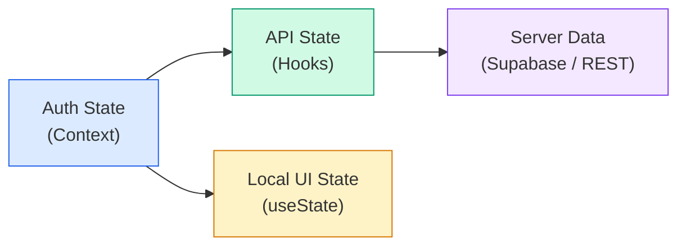
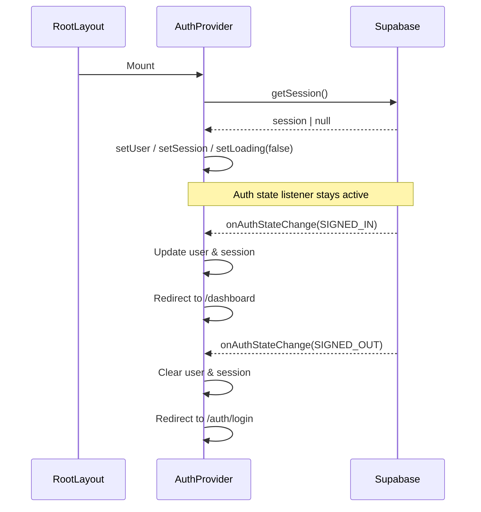
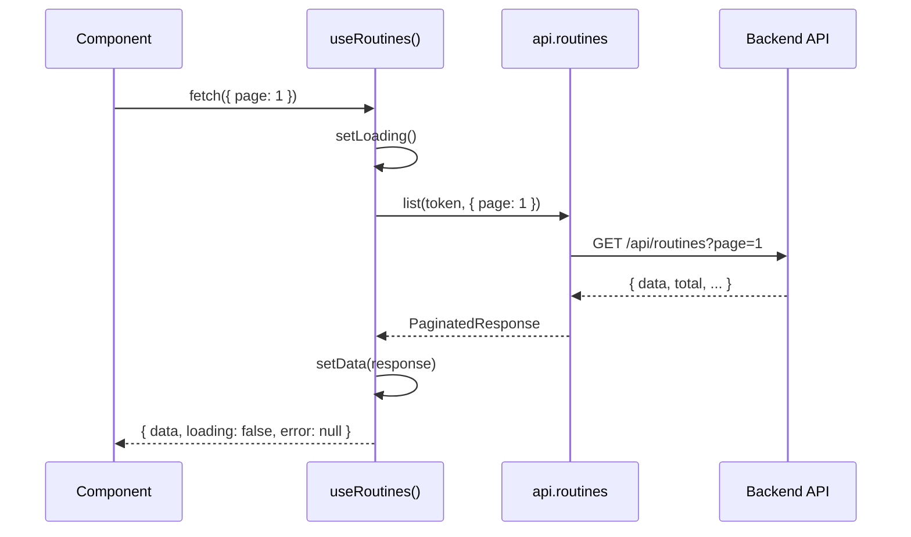

# State Management

> How client-side state is organised, shared, and kept in sync with the backend.

---

## Overview

The frontend uses a deliberately simple state model  — no external state library
(Redux, Zustand, etc.) is needed. State falls into three categories:



| Category       | Mechanism               | Scope         | Examples                            |
| -------------- | ----------------------- | ------------- | ----------------------------------- |
| **Auth state** | React Context           | Global        | `user`, `session`, `loading`        |
| **API state**  | Custom hooks (`useApi`) | Per-component | Routines list, analytics summary    |
| **Local UI**   | `useState` / `useRef`   | Component     | Modal open, form inputs, drag state |

---

## Auth Context

> Source: `frontend/src/contexts/AuthContext.tsx`

`AuthContext` is the only React Context in the app. It wraps the entire
component tree (set up in `RootLayout`) and exposes:

```typescript
interface AuthContextType {
  user: User | null; // Supabase User object
  session: Session | null; // Supabase Session (contains JWT)
  loading: boolean; // true while initial session check runs
  signIn: (email, password) => Promise<void>;
  signUp: (email, password, fullName?) => Promise<void>;
  signOut: () => Promise<void>;
  getAccessToken: () => Promise<string | undefined>;
}
```

### Lifecycle



### Key Design Decisions

1. **Single Context**  — authentication is the only truly global state.
   Everything else lives in hooks scoped to individual pages or components.
2. **Supabase listener**  — `onAuthStateChange` keeps the context in sync
   across tabs and after token refresh, so we never hold stale credentials.
3. **Redirect on events**  — navigation happens inside the provider, not in
   individual pages. `SIGNED_IN` ↁE`/dashboard`, `SIGNED_OUT` ↁE`/auth/login`.

### Usage

```tsx
import { useAuthContext } from "@/contexts/AuthContext";

function ProfileMenu() {
  const { user, signOut } = useAuthContext();
  return (
    <div>
      <span>{user?.email}</span>
      <button onClick={signOut}>Sign out</button>
    </div>
  );
}
```

---

## API State (Custom Hooks)

Server data is fetched and cached locally inside custom hooks that follow a
shared pattern (detailed in [Hooks.md](03-Hooks.md)). Each hook owns its own
`{ data, loading, error }` triple and exposes CRUD methods.

```
useRoutines()         ↁE{ data, loading, error, fetch, create, update, remove }
useProductivity()     ↁE{ data, loading, error, fetch, create, update, remove }
useAnalyticsSummary() ↁE{ data, loading, error, fetch }
useChartData()        ↁE{ data, loading, error, fetch }
useCurrentUser()      ↁE{ data, loading, error, fetch }
useUserProfile()      ↁE{ data, loading, error, fetch, update }
useUserSettings()     ↁE{ data, loading, error, fetch, update }
useUserGoals()        ↁE{ data, loading, error, fetch, create, update, remove }
useCSVImport()        ↁE{ data, loading, error, importFile }
```

These hooks are **not** global  — each component that calls a hook gets its own
copy of the state. This avoids accidental cross-component coupling and makes
components easy to test in isolation.

### Data Flow



---

## Local UI State

Component-local state uses standard React primitives:

| Primitive     | Use case                                   |
| ------------- | ------------------------------------------ |
| `useState`    | Form inputs, toggles, modals, pagination   |
| `useCallback` | Memoised event handlers (all hook methods) |
| `useEffect`   | Fetch-on-mount, auth listener cleanup      |
| `useRef`      | DOM references, imperative focus           |

No state management library is needed because:

- The app is primarily read-heavy (fetch & display).
- Write operations (create / update / delete) trigger an immediate re-fetch
  or optimistic local update within the same hook.
- There is no cross-page shared state beyond authentication.

---

## Supabase Client Layer

Two Supabase client factories coexist for different rendering contexts:

| Factory                    | File                     | Context               |
| -------------------------- | ------------------------ | --------------------- |
| `createClient()` (browser) | `lib/supabase/client.ts` | Client Components     |
| `createClient()` (server)  | `lib/supabase/server.ts` | Server Components/API |

The **browser client** uses `createBrowserClient` from `@supabase/ssr` and is
used by `AuthProvider` and all `'use client'` hooks.

The **server client** uses `createServerClient` with cookie-based session
management and is available for server-side data fetching when needed.

Both clients read from the same environment variables:

- `NEXT_PUBLIC_SUPABASE_URL`
- `NEXT_PUBLIC_SUPABASE_ANON_KEY`

---

## Token Flow

Every authenticated API call follows the same path:

```
Component ↁEuseXxx() hook ↁEgetAccessToken() ↁEapi.xxx.method(token, ...)
```

`getAccessToken()` reads the current Supabase session and extracts the JWT.
The token is passed explicitly to each `api.*` call rather than stored in a
module-level variable, which keeps the client stateless and testable.

---

## Related Docs

| Topic          | Link                                                   |
| -------------- | ------------------------------------------------------ |
| UI structure   | [UI-Structure.md](01-UI-Structure.md)                     |
| Custom hooks   | [Hooks.md](03-Hooks.md)                                   |
| API client     | [../03-API/01-API-Overview.md](../03-API/01-API-Overview.md) |
| Auth endpoints | [../03-API/02-Auth.md](../03-API/02-Auth.md)                 |
