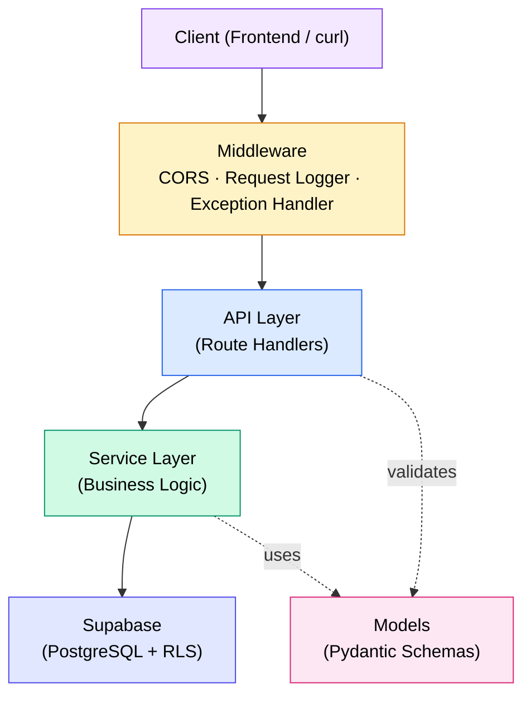
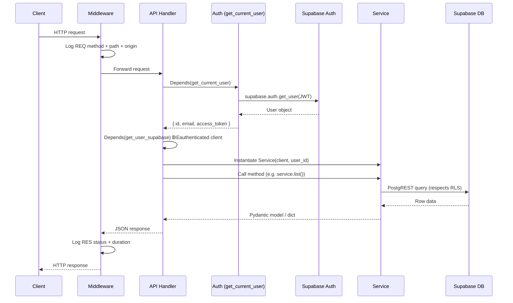

# Backend Overview

> FastAPI application structure, layered design, and request lifecycle.

---

## Technology Stack

| Technology        | Version | Purpose                                 |
| ----------------- | ------- | --------------------------------------- |
| Python            | 3.12+   | Runtime                                 |
| FastAPI           | 0.128.x | Web framework (async, OpenAPI built-in) |
| Pydantic          | 2.12.x  | Data validation & serialisation         |
| Pydantic-Settings | 2.12.x  | Environment-based configuration         |
| Supabase-py       | 2.27.x  | PostgreSQL client (PostgREST + Auth)    |
| Mangum            | 0.21.x  | ASGI ↁEAWS Lambda adapter               |
| Pandas            | 2.x     | CSV import parsing                      |
| Uvicorn           | 0.40.x  | Local ASGI development server           |
| Poetry            |  —       | Dependency management                   |

---

## Directory Layout

```
backend/
├── app/
━E  ├── __init__.py
━E  ├── main.py                  # FastAPI app, middleware, Lambda handler
━E  ├── api/                     # Route handlers (thin controllers)
━E  ━E  ├── __init__.py          # api_router + sub-router registration
━E  ━E  ├── analytics.py         # GET  /api/analytics/*
━E  ━E  ├── import_data.py       # POST /api/import/csv
━E  ━E  ├── productivity.py      # CRUD /api/productivity
━E  ━E  ├── routines.py          # CRUD /api/routines
━E  ━E  └── users.py             # CRUD /api/users/me/*
━E  ├── core/                    # Cross-cutting concerns
━E  ━E  ├── __init__.py          # Re-exports for convenience
━E  ━E  ├── auth.py              # JWT verification, dependency injection
━E  ━E  ├── config.py            # Settings (env vars, CORS, etc.)
━E  ━E  └── supabase.py          # Supabase client factories
━E  ├── models/                  # Pydantic schemas
━E  ━E  ├── __init__.py          # Barrel exports
━E  ━E  ├── common.py            # PaginatedResponse, AnalyticsSummary, …
━E  ━E  ├── productivity.py      # Productivity models
━E  ━E  ├── routine.py           # MorningRoutine models
━E  ━E  └── user.py              # Profile, Settings, Goals models
━E  └── services/                # Business logic
━E      ├── __init__.py          # Barrel exports
━E      ├── analytics_service.py # Summary & chart computation
━E      ├── productivity_service.py
━E      ├── routine_service.py
━E      └── user_service.py
├── data/                        # Sample CSV datasets
├── scripts/                     # One-off scripts (Kaggle download)
├── tests/                       # Pytest test suite
├── pyproject.toml               # Poetry config + tool settings
├── requirements.txt             # Pinned dependencies (Lambda deploy)
├── template.yaml                # AWS SAM infrastructure-as-code
├── samconfig.toml               # SAM deploy parameters
└── Dockerfile                   # Container build for local dev
```

---

## Layered Architecture



| Layer          | Responsibility                                            |
| -------------- | --------------------------------------------------------- |
| **Middleware** | CORS, request/response logging, global exception handler  |
| **API**        | HTTP parsing, auth dependency injection, status codes     |
| **Service**    | Domain logic, Supabase queries, data transformation       |
| **Models**     | Input validation, output serialisation, field constraints |

### Design Rules

1. **API handlers are thin.** They parse the request, delegate to a service,
   and return the result. No direct database calls.
2. **Services own business logic.** Each service receives an authenticated
   Supabase client and the `user_id` at construction time.
3. **Models are plain Pydantic schemas.** No ORM mapping  — the Supabase
   client returns dicts that Pydantic validates on the way out.
4. **Core is infrastructure.** Config loading, client factories, and auth
   verification live here; domain code does not.

---

## Request Lifecycle



### Key Points

- **Every protected endpoint** depends on `get_current_user`, which extracts
  and validates the JWT. If the token is missing or invalid, a `401` is
  returned before the handler body executes.
- **`get_user_supabase`** creates a Supabase client that injects the user's
  JWT into PostgREST requests, so Row-Level Security (RLS) policies filter
  results server-side.
- **Middleware logs** every request/response pair with method, path, origin,
  status code, and latency in milliseconds  — all visible in CloudWatch.

---

## Entry Points

| Context    | Entry point                                 |
| ---------- | ------------------------------------------- |
| Local dev  | `uvicorn app.main:app --reload --port 8000` |
| Docker     | Same Uvicorn command inside container       |
| AWS Lambda | `handler = Mangum(app, ...)` in `main.py`   |
| SAM local  | `sam local start-api` ↁEinvokes `handler`   |

The `Mangum` adapter translates API Gateway HTTP API v2 events into ASGI
requests. The `api_gateway_base_path` setting strips the stage prefix
(e.g. `/development`) so that FastAPI routes match correctly.

---

## Router Registration

All route modules are assembled in `api/__init__.py`:

```python
api_router = APIRouter(prefix="/api")

api_router.include_router(users_router)         # /api/users/*
api_router.include_router(routines_router)       # /api/routines/*
api_router.include_router(productivity_router)   # /api/productivity/*
api_router.include_router(analytics_router)      # /api/analytics/*
api_router.include_router(import_router)         # /api/import/*
```

The top-level `app` includes `api_router` once in `main.py`, keeping all
versioned routes under the `/api` prefix.

Two additional root-level endpoints exist outside the router:

| Endpoint      | Auth | Purpose            |
| ------------- | ---- | ------------------ |
| `GET /`       | No   | Version + docs URL |
| `GET /health` | No   | Health check       |

---

## Interactive Documentation

In non-production environments, FastAPI auto-generates:

| URL      | Format  |
| -------- | ------- |
| `/docs`  | Swagger |
| `/redoc` | ReDoc   |

Both are **disabled in production** (`docs_url=None, redoc_url=None`) to
reduce attack surface.

---

## Related Docs

| Topic               | Link                                                                                     |
| ------------------- | ---------------------------------------------------------------------------------------- |
| Services            | [Services.md](04-Services.md)                                                               |
| Pydantic models     | [Models.md](03-Models.md)                                                                   |
| Middleware & config | [Middleware-and-Config.md](02-Middleware-and-Config.md)                                     |
| API endpoints       | [../03-API/Endpoints/](../03-API/Endpoints/)                                             |
| Architecture        | [../02-Architecture/02-Backend-Architecture.md](../02-Architecture/02-Backend-Architecture.md) |
