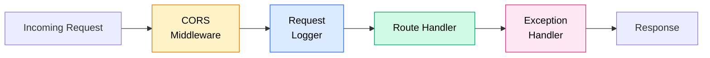
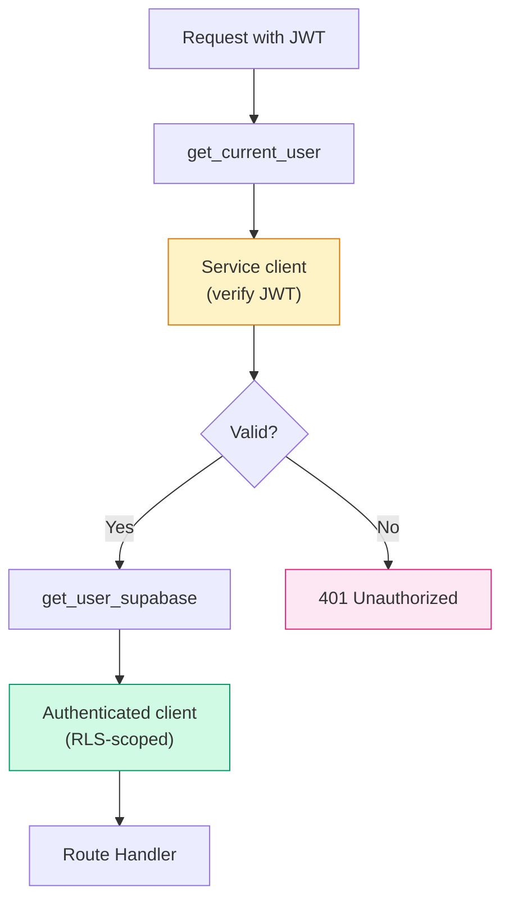

# Middleware & Configuration

> CORS, request logging, error handling, environment settings, and Supabase
> client management.

---

## Middleware Pipeline

Requests flow through three middleware layers before reaching a route handler:



---

### 1. CORS Middleware

> Configured in `main.py` via `CORSMiddleware`.

CORS is handled entirely at the application level (not in API Gateway) because
HTTP API v2 does not support wildcard sub-domains in `AllowOrigins`.

```python
app.add_middleware(
    CORSMiddleware,
    allow_origins=settings.get_cors_origins_list(),
    allow_origin_regex=settings.cors_origin_regex or None,
    allow_credentials=True,
    allow_methods=["*"],
    allow_headers=["*"],
)
```

| Setting              | Source env var      | Purpose                              |
| -------------------- | ------------------- | ------------------------------------ |
| `allow_origins`      | `CORS_ORIGINS`      | Exact origin allow-list              |
| `allow_origin_regex` | `CORS_ORIGIN_REGEX` | Wildcard match (e.g. `*.vercel.app`) |
| `allow_credentials`  |  E                  | Cookies / Auth headers               |

**`CORS_ORIGINS` parsing** (in `Settings.get_cors_origins_list()`):

- If the value starts with `[`, try JSON array parsing first.
- Otherwise, split on commas.
- This handles both SAM/Lambda plain strings and JSON array formats.

---

### 2. Request Logger

> `@app.middleware("http")`  E`log_requests` in `main.py`.

Every request/response pair is logged for CloudWatch observability:

**Request (REQ):**

```
REQ GET /api/routines origin=https://my-app.vercel.app
```

**Response (RES):**

```
RES GET /api/routines status=200 duration=42.3ms
```

Fields logged:

| Field    | Source                        |
| -------- | ----------------------------- |
| Method   | `request.method`              |
| Path     | `request.url.path`            |
| Origin   | `Origin` header (CORS debug)  |
| Status   | `response.status_code`        |
| Duration | `time.monotonic()` difference |

---

### 3. Global Exception Handler

> `@app.exception_handler(Exception)` in `main.py`.

Catches any unhandled exception and returns a clean JSON response instead of
a raw HTML 500 page:

```python
@app.exception_handler(Exception)
async def unhandled_exception_handler(request, exc):
    logger.error("Unhandled exception on %s %s: %s", ..., exc_info=True)
    return JSONResponse(
        status_code=500,
        content={"detail": "Internal server error"},
    )
```

- Full stack trace is logged (visible in CloudWatch).
- The client receives only `{"detail": "Internal server error"}` to avoid
  leaking internals.

---

## Configuration

> Source: `core/config.py`

### Settings Class

Uses **Pydantic-Settings v2** to load values from environment variables (or a
`.env` file in local development):

```python
class Settings(BaseSettings):
    supabase_url: str
    supabase_key: str
    app_name: str = "Morning Routine Productivity API"
    debug: bool = False
    environment: str = "development"
    cors_origins: str = "http://localhost:3000"
    cors_origin_regex: str = r"https://.*\.vercel\.app"

    class Config:
        env_file = ".env"
        extra = "ignore"
```

### Environment Variables

| Variable            | Required | Default                              | Description                   |
| ------------------- | -------- | ------------------------------------ | ----------------------------- |
| `SUPABASE_URL`      | Yes      |  E                                   | Supabase project URL          |
| `SUPABASE_KEY`      | Yes      |  E                                   | Supabase service role key     |
| `APP_NAME`          | No       | `"Morning Routine Productivity API"` | Shown in OpenAPI docs         |
| `DEBUG`             | No       | `false`                              | Debug mode toggle             |
| `ENVIRONMENT`       | No       | `"development"`                      | `development` / `production`  |
| `CORS_ORIGINS`      | No       | `"http://localhost:3000"`            | Comma-separated or JSON array |
| `CORS_ORIGIN_REGEX` | No       | `r"https://.*\.vercel\.app"`         | Regex for preview deploys     |

### Caching

```python
@lru_cache(128)
def get_settings() -> Settings:
    return Settings()
```

Settings are parsed once and cached for the lifetime of the process. In
Lambda, this means once per cold start.

### Environment-Dependent Behaviour

| Setting         | Development       | Production            |
| --------------- | ----------------- | --------------------- |
| `/docs`         | Enabled (Swagger) | Disabled (`None`)     |
| `/redoc`        | Enabled           | Disabled (`None`)     |
| Base path strip | `/development`    | `/production`         |
| Logging         | StreamHandler     | CloudWatch via Lambda |

---

## Supabase Client Management

> Source: `core/supabase.py`

Two client factories serve different security contexts:

### Service Client (Admin)

```python
supabase: Client = create_client(settings.supabase_url, settings.supabase_key)

def get_supabase() -> Client:
    """Bypasses RLS  Eused for admin operations and token verification."""
    return supabase
```

- Created once at module load.
- Uses the **service role key**.
- Can read/write any row regardless of RLS policies.
- Used by `get_current_user` to validate JWTs via `supabase.auth.get_user()`.

### Authenticated Client (User-scoped)

```python
def get_authenticated_supabase(access_token: str) -> Client:
    """Respects RLS policies based on auth.uid()."""
    client = create_client(settings.supabase_url, settings.supabase_key)
    client.postgrest.auth(access_token)
    return client
```

- Created per-request.
- Injects the user's JWT into PostgREST headers.
- All queries go through RLS  Ethe user can only see their own data.
- Returned by the `get_user_supabase` dependency.

### Client Selection in Auth



---

## Authentication Dependency

> Source: `core/auth.py`

### get_current_user

FastAPI dependency that:

1. Extracts the Bearer token from the `Authorization` header (`HTTPBearer`).
2. Calls `supabase.auth.get_user(token)` on the **service client**.
3. Returns `{ id, email, user_metadata, access_token }` on success.
4. Raises `401` with a descriptive message on failure:

| Error condition         | Detail message                                   |
| ----------------------- | ------------------------------------------------ |
| Expired token           | `"Token expired  Eplease sign in again"`         |
| Invalid signature / JWT | `"Invalid token  Eplease sign in again"`         |
| Other                   | `"Authentication failed  Eplease sign in again"` |

### get_user_supabase

Chains on `get_current_user` and returns an RLS-authenticated Supabase client:

```python
async def get_user_supabase(
    current_user: dict = Depends(get_current_user),
) -> Client:
    return get_authenticated_supabase(current_user["access_token"])
```

---

## Logging

The backend uses Python's built-in `logging` module with a named logger
(`morning_routine`):

```python
logger = logging.getLogger("morning_routine")
logger.setLevel(logging.INFO)
```

| Log event       | Level | Format                                              |
| --------------- | ----- | --------------------------------------------------- |
| App init        | INFO  | Environment, CORS origins, regex                    |
| Request in      | INFO  | `REQ {method} {path} origin={origin}`               |
| Response out    | INFO  | `RES {method} {path} status={code} duration={ms}ms` |
| Auth success    | INFO  | `AUTH success: user_id=... email=...`               |
| Auth failure    | ERROR | `AUTH failed: {type}: {message}`                    |
| Unhandled error | ERROR | Full exception with stack trace                     |

In Lambda, log output goes directly to **CloudWatch Logs** without additional
configuration.

---

## Related Docs

| Topic            | Link                                                                                 |
| ---------------- | ------------------------------------------------------------------------------------ |
| Backend overview | [Backend-Overview.md](01-Backend-Overview.md)                                           |
| Services         | [Services.md](04-Services.md)                                                           |
| API auth         | [../03-API/02-Auth.md](../03-API/02-Auth.md)                                               |
| Error handling   | [../03-API/03-Error-Handling.md](../03-API/03-Error-Handling.md)                           |
| Configuration    | [../01-Getting-Started/02-Configuration.md](../01-Getting-Started/02-Configuration.md)     |
| Integration      | [../02-Architecture/05-Integration-Points.md](../02-Architecture/05-Integration-Points.md) |
