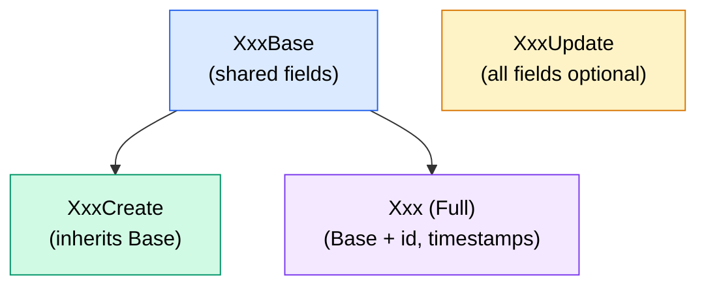

# Models

> Pydantic schemas for request validation, response serialisation, and
> shared data structures.

---

## Organisation

```
models/
├── __init__.py        # Barrel re-exports (all public names)
├── common.py          # Generic / cross-domain models
├── routine.py         # MorningRoutine schemas
├── productivity.py    # Productivity schemas
└── user.py            # Profile, Settings, Goals schemas
```

Every domain follows a **Base ↁECreate ↁEUpdate ↁEFull** pattern:



| Variant    | Purpose                          | Used by                    |
| ---------- | -------------------------------- | -------------------------- |
| **Base**   | Shared field definitions         | Inherited by Create & Full |
| **Create** | Request body for `POST`          | API handler parameter      |
| **Update** | Request body for `PUT` / `PATCH` | API handler parameter      |
| **Full**   | Response model with DB fields    | Service return / response  |

---

## Morning Routine Models

> Source: `models/routine.py`

### MorningRoutineBase

| Field                    | Type                                        | Constraints         |
| ------------------------ | ------------------------------------------- | ------------------- |
| `date`                   | `date`                                      | Required            |
| `wake_time`              | `str`                                       | HH:MM format        |
| `sleep_duration_hours`   | `float`                                     | `>= 0`, `<= 24`     |
| `exercise_minutes`       | `int`                                       | `>= 0`, default `0` |
| `meditation_minutes`     | `int`                                       | `>= 0`, default `0` |
| `breakfast_quality`      | `Literal["poor","fair","good","excellent"]` | Default `"good"`    |
| `morning_mood`           | `int`                                       | `1 E0`              |
| `screen_time_before_bed` | `int`                                       | `>= 0`, minutes     |
| `caffeine_intake`        | `int`                                       | `>= 0`, mg or cups  |
| `water_intake_ml`        | `int`                                       | `>= 0`              |

### MorningRoutineCreate

Inherits `MorningRoutineBase` unchanged.

### MorningRoutineUpdate

All fields from Base made **optional** (`| None`), allowing partial updates.

### MorningRoutine (Full)

Adds: `id: str`, `user_id: str`, `created_at: datetime`, `updated_at: datetime`.  
Config: `from_attributes = True`.

---

## Productivity Models

> Source: `models/productivity.py`

### ProductivityBase

| Field                | Type          | Constraints         |
| -------------------- | ------------- | ------------------- |
| `date`               | `date`        | Required            |
| `routine_id`         | `str \| None` | FK to routine       |
| `productivity_score` | `int`         | `1 E0`              |
| `tasks_completed`    | `int`         | `>= 0`, default `0` |
| `tasks_planned`      | `int`         | `>= 0`, default `0` |
| `focus_hours`        | `float`       | `>= 0`, default `0` |
| `distractions_count` | `int`         | `>= 0`, default `0` |
| `energy_level`       | `int`         | `1 E0`              |
| `stress_level`       | `int`         | `1 E0`              |
| `notes`              | `str \| None` | Free text           |

### ProductivityCreate

Inherits `ProductivityBase` unchanged.

### ProductivityUpdate

All fields optional.

### Productivity (Full)

Adds: `id`, `user_id`, `created_at`, `updated_at`. Config: `from_attributes = True`.

---

## User Models

> Source: `models/user.py`

### UserProfile

#### UserProfileBase

| Field           | Type                                                                | Constraints       |
| --------------- | ------------------------------------------------------------------- | ----------------- |
| `full_name`     | `str \| None`                                                       | max 100 chars     |
| `display_name`  | `str \| None`                                                       | max 50 chars      |
| `avatar_url`    | `str \| None`                                                       |  E                |
| `date_of_birth` | `date \| None`                                                      |  E                |
| `gender`        | `Literal["male","female","non_binary","prefer_not_to_say"] \| None` |  E                |
| `timezone`      | `str`                                                               | default `"UTC"`   |
| `locale`        | `str`                                                               | default `"en-US"` |
| `bio`           | `str \| None`                                                       |  E                |
| `occupation`    | `str \| None`                                                       | max 100 chars     |

#### UserProfileCreate

Extends Base with `email: EmailStr`.

#### UserProfileUpdate

All Base fields optional, plus `onboarding_completed: bool | None`.

#### UserProfile (Full)

Adds: `id`, `email`, `is_active`, `email_verified`, `onboarding_completed`,
`created_at`, `updated_at`, `last_login_at`.

---

### UserSettings

#### UserSettingsBase

**Appearance:**

| Field          | Type                               | Default    |
| -------------- | ---------------------------------- | ---------- |
| `theme`        | `Literal["light","dark","system"]` | `"system"` |
| `accent_color` | `str`                              | `"blue"`   |
| `compact_mode` | `bool`                             | `False`    |

**Notifications:**

| Field                  | Type   | Default |
| ---------------------- | ------ | ------- |
| `email_notifications`  | `bool` | `True`  |
| `push_notifications`   | `bool` | `True`  |
| `weekly_summary_email` | `bool` | `True`  |
| `reminder_time`        | `time` | `07:00` |

**Privacy:**

| Field                  | Type                                    | Default     |
| ---------------------- | --------------------------------------- | ----------- |
| `profile_visibility`   | `Literal["public","private","friends"]` | `"private"` |
| `show_streak_publicly` | `bool`                                  | `False`     |
| `allow_data_analytics` | `bool`                                  | `True`      |

**Dashboard Preferences:**

| Field                  | Type                           | Default      |
| ---------------------- | ------------------------------ | ------------ |
| `default_date_range`   | `int`                          | `30` (7 E65) |
| `default_chart_type`   | `Literal["line","bar","area"]` | `"line"`     |
| `show_weekend_markers` | `bool`                         | `True`       |
| `start_week_on`        | `Literal["monday","sunday"]`   | `"monday"`   |

**Units & Formats:**

| Field                | Type                           | Default        |
| -------------------- | ------------------------------ | -------------- |
| `time_format`        | `Literal["12h","24h"]`         | `"24h"`        |
| `date_format`        | `str`                          | `"YYYY-MM-DD"` |
| `measurement_system` | `Literal["metric","imperial"]` | `"metric"`     |

#### UserSettingsUpdate

All fields optional.

#### UserSettings (Full)

Adds: `id`, `user_id`, `created_at`, `updated_at`.

---

### UserGoals

#### GoalType

A `Literal` union of 11 allowed goal types:

```python
GoalType = Literal[
    "sleep_duration", "wake_time", "exercise_minutes",
    "meditation_minutes", "water_intake", "caffeine_limit",
    "productivity_score", "focus_hours", "tasks_completed",
    "stress_level_max", "screen_time_limit",
]
```

#### UserGoalBase

| Field              | Type          | Default  |
| ------------------ | ------------- | -------- |
| `goal_type`        | `GoalType`    | Required |
| `target_value`     | `float`       | Required |
| `target_unit`      | `str \| None` | max 20   |
| `is_active`        | `bool`        | `True`   |
| `reminder_enabled` | `bool`        | `False`  |

#### UserGoalCreate / UserGoalUpdate

Create inherits Base. Update has all fields optional.

#### UserGoal (Full)

Adds: `id`, `user_id`, `created_at`, `updated_at`.

---

### CurrentUser

Composite model returned by `GET /api/users/me`:

```python
class CurrentUser(BaseModel):
    profile: UserProfile
    settings: UserSettings
    goals: list[UserGoal] = []
```

---

## Common / Shared Models

> Source: `models/common.py`

### PaginatedResponse[T]

Generic wrapper for list endpoints:

```python
class PaginatedResponse(BaseModel, Generic[T]):
    data: list[T]
    total: int
    page: int
    page_size: int
    total_pages: int
```

### AnalyticsSummary

| Field                | Type          |
| -------------------- | ------------- |
| `avg_productivity`   | `float`       |
| `avg_sleep`          | `float`       |
| `avg_exercise`       | `float`       |
| `avg_mood`           | `float`       |
| `avg_energy`         | `float`       |
| `total_entries`      | `int`         |
| `best_day`           | `str \| None` |
| `worst_day`          | `str \| None` |
| `productivity_trend` | `str`         |

### ChartDataPoint

| Field                  | Type            |
| ---------------------- | --------------- |
| `date`                 | `str`           |
| `productivity_score`   | `float \| None` |
| `energy_level`         | `float \| None` |
| `morning_mood`         | `float \| None` |
| `sleep_duration_hours` | `float \| None` |
| `exercise_minutes`     | `int \| None`   |
| `meditation_minutes`   | `int \| None`   |

### CSVImportResult

| Field            | Type        |
| ---------------- | ----------- |
| `success`        | `bool`      |
| `imported_count` | `int`       |
| `failed_count`   | `int`       |
| `errors`         | `list[str]` |

---

## Validation Notes

- **Pydantic v2** with `model_dump()` / `model_dump(exclude_unset=True)`.
- **`Field(ge=, le=)`** enforces numeric range constraints at the schema
  level, before any service logic runs.
- **`Literal` types** restrict string fields to an allowlist  Einvalid values
  produce a `422` with a clear validation error.
- **`from_attributes = True`** (formerly `orm_mode`) allows models to be
  constructed from dict-like objects returned by Supabase.

---

## Related Docs

| Topic            | Link                                                                 |
| ---------------- | -------------------------------------------------------------------- |
| Backend overview | [Backend-Overview.md](01-Backend-Overview.md)                           |
| Services         | [Services.md](04-Services.md)                                           |
| Error handling   | [../03-API/03-Error-Handling.md](../03-API/03-Error-Handling.md)           |
| Data model (DB)  | [../02-Architecture/04-Data-Model.md](../02-Architecture/04-Data-Model.md) |
