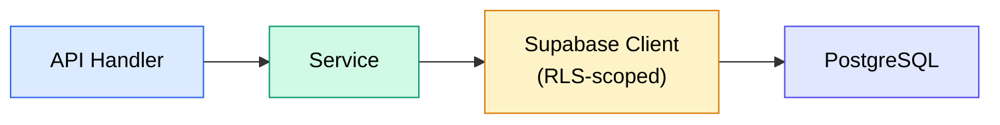

# Services

> Business-logic layer  Ehow each service is constructed, what it does, and
> how it interacts with Supabase.

---

## Design Pattern

Every service follows the same conventions:

```python
class XxxService:
    def __init__(self, supabase: Client, user_id: str):
        self.supabase = supabase   # RLS-authenticated client
        self.user_id  = user_id    # from get_current_user dependency
        self.table    = "..."      # target table name
```

1. **Instantiated per-request** inside the API handler.
2. **Receives an authenticated Supabase client** so queries automatically
   pass through Row-Level Security.
3. **Filters on `user_id`** as an additional guard  Edefence in depth even
   if RLS policies change.
4. **Returns dicts or Pydantic models**  Eno ORM objects.



---

## Service Catalogue

| Service               | Table(s)                                       | Source file                        |
| --------------------- | ---------------------------------------------- | ---------------------------------- |
| `RoutineService`      | `morning_routines`                             | `services/routine_service.py`      |
| `ProductivityService` | `productivity_entries`                         | `services/productivity_service.py` |
| `AnalyticsService`    | `morning_routines`, `productivity_entries`     | `services/analytics_service.py`    |
| `UserService`         | `user_profiles`, `user_settings`, `user_goals` | `services/user_service.py`         |

All services are re-exported from the barrel file `services/__init__.py`.

---

## RoutineService

> `services/routine_service.py`  ECRUD for morning routine entries.

| Method   | Supabase call                | Returns                             |
| -------- | ---------------------------- | ----------------------------------- |
| `list`   | `select("*", count="exact")` | `PaginatedResponse[MorningRoutine]` |
| `get`    | `select("*").single()`       | `dict \| None`                      |
| `create` | `insert(payload)`            | `dict`                              |
| `update` | `update(payload)`            | `dict \| None`                      |
| `delete` | `delete()`                   | `bool`                              |

### list()

```python
def list(
    self,
    page: int = 1,
    page_size: int = 10,
    start_date: date | None = None,
    end_date: date | None = None,
) -> PaginatedResponse[MorningRoutine]:
```

- Orders by `date DESC`.
- Optional `start_date` / `end_date` filters via `.gte()` / `.lte()`.
- Calculates offset from `page` and `page_size`, fetches a window with `.range()`.
- Returns total count via PostgREST `count="exact"`.

### create()

- Calls `model_dump()` on the Pydantic input to get a plain dict.
- Injects `user_id` and converts the `date` field to ISO string.
- Inserts and returns the first row from the response.

### update()

- Uses `model_dump(exclude_unset=True)` so only provided fields are patched.
- Filters by both `id` and `user_id`.

### delete()

- Filters by both `id` and `user_id`.
- Returns `True` if at least one row was deleted.

---

## ProductivityService

> `services/productivity_service.py`  ECRUD for productivity entries.

Structurally identical to `RoutineService` but operates on the
`productivity_entries` table. All method signatures and behaviours match
one-to-one.

| Method   | Returns                           |
| -------- | --------------------------------- |
| `list`   | `PaginatedResponse[Productivity]` |
| `get`    | `dict \| None`                    |
| `create` | `dict`                            |
| `update` | `dict \| None`                    |
| `delete` | `bool`                            |

---

## AnalyticsService

> `services/analytics_service.py`  Eread-only aggregate computations.

### get_summary()

```python
def get_summary(
    self,
    start_date: date | None = None,
    end_date: date | None = None,
) -> AnalyticsSummary:
```

**Defaults:** last 30 days if no dates are provided.

**Logic:**

1. Fetches all routines and productivity entries in the date range.
2. Computes averages: sleep, exercise, mood (from routines), productivity
   score, energy (from productivity).
3. Identifies best and worst days by `productivity_score`.
4. Calculates **trend**: splits the productivity entries into two halves and
   compares their averages:
   - Second half > first half ÁE1.1 ↁE`"up"`
   - Second half < first half ÁE0.9 ↁE`"down"`
   - Otherwise ↁE`"stable"`

Returns an `AnalyticsSummary` model.

### get_chart_data()

```python
def get_chart_data(
    self,
    start_date: date | None = None,
    end_date: date | None = None,
) -> list[ChartDataPoint]:
```

1. Fetches selected columns from both tables (only chart-relevant fields).
2. Indexes each result set by date.
3. Merges on the union of all dates, filling `None` for missing values.
4. Returns a sorted list of `ChartDataPoint` objects ready for the frontend
   chart components.

---

## UserService

> `services/user_service.py`  Eprofile, settings, and goals management.

### Profile Methods

| Method              | Table           | Operation                            |
| ------------------- | --------------- | ------------------------------------ |
| `get_profile`       | `user_profiles` | `select.single()`                    |
| `update_profile`    | `user_profiles` | `update(payload)`                    |
| `update_last_login` | `user_profiles` | `update({ last_login_at: "now()" })` |

### Settings Methods

| Method            | Table           | Operation         |
| ----------------- | --------------- | ----------------- |
| `get_settings`    | `user_settings` | `select.single()` |
| `update_settings` | `user_settings` | `update(payload)` |

`update_settings` converts `time` objects to ISO strings before sending to
PostgREST.

### Goals Methods

| Method        | Table        | Operation                       |
| ------------- | ------------ | ------------------------------- |
| `list_goals`  | `user_goals` | `select.order(created_at DESC)` |
| `get_goal`    | `user_goals` | `select.single()`               |
| `create_goal` | `user_goals` | `insert(payload)`               |
| `update_goal` | `user_goals` | `update(payload)`               |
| `delete_goal` | `user_goals` | `delete()`                      |

**Goal uniqueness rule:** when creating or activating a goal, any existing
**active** goal of the **same type** is automatically deactivated first. This
ensures at most one active goal per `goal_type`.

```python
# Deactivate existing active goal of same type
if data.is_active:
    self.supabase.table("user_goals") \
        .update({"is_active": False}) \
        .eq("user_id", self.user_id) \
        .eq("goal_type", data.goal_type) \
        .eq("is_active", True) \
        .execute()
```

---

## Dependency Injection Flow

API handlers use FastAPI's `Depends()` to wire services:

```python
@router.get("")
async def list_routines(
    current_user: dict = Depends(get_current_user),    # 1. Validate JWT
    supabase: Client = Depends(get_user_supabase),     # 2. Auth'd client
):
    service = RoutineService(supabase, current_user["id"])  # 3. Create service
    return service.list(page, page_size)                     # 4. Delegate
```

This keeps handlers thin (typically 3 E lines of meaningful code) and makes
services easy to test by injecting mock clients.

---

## Adding a New Service

1. Create `services/my_feature_service.py`.
2. Follow the constructor pattern: `__init__(self, supabase: Client, user_id: str)`.
3. Add CRUD methods that call `self.supabase.table(...)`.
4. Export from `services/__init__.py`.
5. Instantiate in the corresponding API handler via `Depends`.
6. Add tests in `tests/services/`.

---

## Related Docs

| Topic            | Link                                                                 |
| ---------------- | -------------------------------------------------------------------- |
| Backend overview | [Backend-Overview.md](01-Backend-Overview.md)                           |
| Pydantic models  | [Models.md](03-Models.md)                                               |
| API endpoints    | [../03-API/Endpoints/](../03-API/Endpoints/)                         |
| Data model (DB)  | [../02-Architecture/04-Data-Model.md](../02-Architecture/04-Data-Model.md) |
