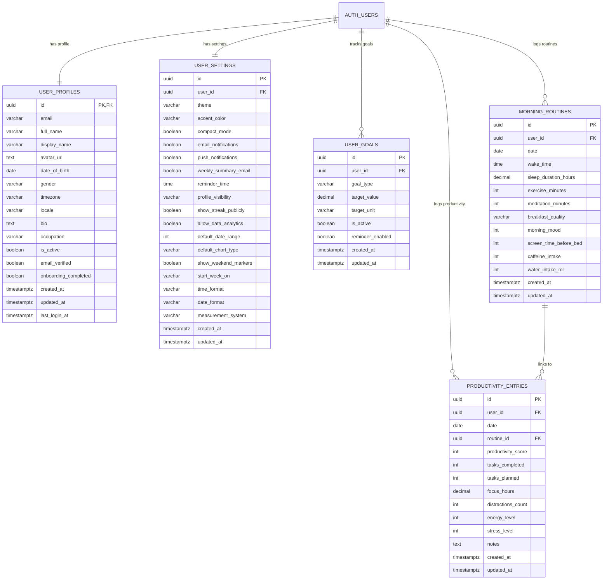

# Database Schema

> Full reference for the PostgreSQL schema that powers the Morning Routine &
> Productivity Tracker.  
> **Source of truth:** [database/schema.sql](../../database/schema.sql)  Eif
> this document and the SQL file disagree, the SQL file wins.

---

## Platform

| Item      | Value                            |
| --------- | -------------------------------- |
| Provider  | Supabase (managed PostgreSQL)    |
| Version   | PostgreSQL 15+                   |
| Extension | `uuid-ossp`  EUUID generation    |
| Auth      | Supabase `auth.users` (built-in) |

---

## Entity-Relationship Diagram



---

## Design Principles

1. **User isolation**  EEvery data table includes a `user_id` foreign key to
   `auth.users(id)`. Row-Level Security ensures each user only sees their own
   data (see [Row-Level-Security.md](02-Row-Level-Security.md)).
2. **Referential integrity**  EForeign keys use `ON DELETE CASCADE` so deleting
   a Supabase auth user removes all related data. The one exception is
   `productivity_entries.routine_id`, which uses `ON DELETE SET NULL` so a
   productivity entry survives if its linked routine is deleted.
3. **Audit timestamps**  EEvery table carries `created_at` and `updated_at`.
   A shared trigger keeps `updated_at` current on every `UPDATE` (see
   [Triggers-and-Functions.md](03-Triggers-and-Functions.md)).
4. **Normalization**  EProfiles, settings, and goals live in separate tables
   with clear single-responsibility boundaries.
5. **Database-level validation**  E`CHECK` constraints enforce ranges and
   enum-like values directly in PostgreSQL, preventing bad data even if the
   application layer is bypassed.

---

## Tables

### `user_profiles`

Extends `auth.users` with application-specific profile data. Created
automatically by the `handle_new_user` trigger when a user signs up.

| Column                 | Type           | Nullable | Default   | Notes                                               |
| ---------------------- | -------------- | :------: | --------- | --------------------------------------------------- |
| `id`                   | `UUID`         |    NO    |  E        | **PK**, references `auth.users(id)`                 |
| `email`                | `VARCHAR(255)` |    NO    |  E        | Unique                                              |
| `full_name`            | `VARCHAR(100)` |   YES    | `NULL`    |                                                     |
| `display_name`         | `VARCHAR(50)`  |   YES    | `NULL`    |                                                     |
| `avatar_url`           | `TEXT`         |   YES    | `NULL`    |                                                     |
| `date_of_birth`        | `DATE`         |   YES    | `NULL`    |                                                     |
| `gender`               | `VARCHAR(20)`  |   YES    | `NULL`    | `male`, `female`, `non_binary`, `prefer_not_to_say` |
| `timezone`             | `VARCHAR(50)`  |   YES    | `'UTC'`   | IANA timezone                                       |
| `locale`               | `VARCHAR(10)`  |   YES    | `'en-US'` |                                                     |
| `bio`                  | `TEXT`         |   YES    | `NULL`    |                                                     |
| `occupation`           | `VARCHAR(100)` |   YES    | `NULL`    |                                                     |
| `is_active`            | `BOOLEAN`      |   YES    | `true`    |                                                     |
| `email_verified`       | `BOOLEAN`      |   YES    | `false`   |                                                     |
| `onboarding_completed` | `BOOLEAN`      |   YES    | `false`   |                                                     |
| `created_at`           | `TIMESTAMPTZ`  |   YES    | `NOW()`   |                                                     |
| `updated_at`           | `TIMESTAMPTZ`  |   YES    | `NOW()`   | Auto-updated by trigger                             |
| `last_login_at`        | `TIMESTAMPTZ`  |   YES    | `NULL`    |                                                     |

**Key constraints:**

```sql
PRIMARY KEY (id)
FOREIGN KEY (id) REFERENCES auth.users(id) ON DELETE CASCADE
UNIQUE (email)
CHECK (gender IN ('male', 'female', 'non_binary', 'prefer_not_to_say', NULL))
```

---

### `user_settings`

Stores user preferences. Also auto-created by `handle_new_user` with sensible
defaults. Separated from the profile table for single-responsibility and
because settings change more frequently.

| Column                 | Type          | Nullable | Default              | Notes                          |
| ---------------------- | ------------- | :------: | -------------------- | ------------------------------ |
| `id`                   | `UUID`        |    NO    | `uuid_generate_v4()` | **PK**                         |
| `user_id`              | `UUID`        |    NO    |  E                   | **FK ↁEauth.users**, unique    |
| `theme`                | `VARCHAR(20)` |   YES    | `'system'`           | `light`, `dark`, `system`      |
| `accent_color`         | `VARCHAR(20)` |   YES    | `'blue'`             |                                |
| `compact_mode`         | `BOOLEAN`     |   YES    | `false`              |                                |
| `email_notifications`  | `BOOLEAN`     |   YES    | `true`               |                                |
| `push_notifications`   | `BOOLEAN`     |   YES    | `true`               |                                |
| `weekly_summary_email` | `BOOLEAN`     |   YES    | `true`               |                                |
| `reminder_time`        | `TIME`        |   YES    | `'07:00'`            |                                |
| `profile_visibility`   | `VARCHAR(20)` |   YES    | `'private'`          | `public`, `private`, `friends` |
| `show_streak_publicly` | `BOOLEAN`     |   YES    | `false`              |                                |
| `allow_data_analytics` | `BOOLEAN`     |   YES    | `true`               |                                |
| `default_date_range`   | `INTEGER`     |   YES    | `30`                 | Days shown on dashboard        |
| `default_chart_type`   | `VARCHAR(20)` |   YES    | `'line'`             | `line`, `bar`, `area`          |
| `show_weekend_markers` | `BOOLEAN`     |   YES    | `true`               |                                |
| `start_week_on`        | `VARCHAR(10)` |   YES    | `'monday'`           | `monday`, `sunday`             |
| `time_format`          | `VARCHAR(5)`  |   YES    | `'24h'`              | `12h`, `24h`                   |
| `date_format`          | `VARCHAR(20)` |   YES    | `'YYYY-MM-DD'`       |                                |
| `measurement_system`   | `VARCHAR(10)` |   YES    | `'metric'`           | `metric`, `imperial`           |
| `created_at`           | `TIMESTAMPTZ` |   YES    | `NOW()`              |                                |
| `updated_at`           | `TIMESTAMPTZ` |   YES    | `NOW()`              | Auto-updated by trigger        |

**Key constraints:**

```sql
PRIMARY KEY (id)
FOREIGN KEY (user_id) REFERENCES auth.users(id) ON DELETE CASCADE
UNIQUE (user_id)
CHECK (theme IN ('light', 'dark', 'system'))
CHECK (profile_visibility IN ('public', 'private', 'friends'))
CHECK (default_chart_type IN ('line', 'bar', 'area'))
CHECK (start_week_on IN ('monday', 'sunday'))
CHECK (time_format IN ('12h', '24h'))
CHECK (measurement_system IN ('metric', 'imperial'))
```

---

### `user_goals`

Each user may track multiple goals. A partial unique index enforces **one
active goal per `(user_id, goal_type)`**  Ewe can deactivate an old goal and
create a new one without violating the constraint.

| Column             | Type            | Nullable | Default              | Notes                                            |
| ------------------ | --------------- | :------: | -------------------- | ------------------------------------------------ |
| `id`               | `UUID`          |    NO    | `uuid_generate_v4()` | **PK**                                           |
| `user_id`          | `UUID`          |    NO    |  E                   | **FK ↁEauth.users**                              |
| `goal_type`        | `VARCHAR(30)`   |    NO    |  E                   | See allowed values below                         |
| `target_value`     | `DECIMAL(10,2)` |    NO    |  E                   |                                                  |
| `target_unit`      | `VARCHAR(20)`   |   YES    | `NULL`               | `hours`, `minutes`, `ml`, `mg`, `score`, `count` |
| `is_active`        | `BOOLEAN`       |   YES    | `true`               |                                                  |
| `reminder_enabled` | `BOOLEAN`       |   YES    | `false`              |                                                  |
| `created_at`       | `TIMESTAMPTZ`   |   YES    | `NOW()`              |                                                  |
| `updated_at`       | `TIMESTAMPTZ`   |   YES    | `NOW()`              | Auto-updated by trigger                          |

**Allowed `goal_type` values:**

| Type                 | Unit    | Example |
| -------------------- | ------- | ------- |
| `sleep_duration`     | hours   | 8.0     |
| `wake_time`          | hours   | 06:30   |
| `exercise_minutes`   | minutes | 30      |
| `meditation_minutes` | minutes | 15      |
| `water_intake`       | ml      | 2000    |
| `caffeine_limit`     | mg      | 400     |
| `productivity_score` | score   | 8       |
| `focus_hours`        | hours   | 6       |
| `tasks_completed`    | count   | 10      |
| `stress_level_max`   | score   | 5       |
| `screen_time_limit`  | minutes | 60      |

**Key constraints:**

```sql
PRIMARY KEY (id)
FOREIGN KEY (user_id) REFERENCES auth.users(id) ON DELETE CASCADE
CHECK (goal_type IN ('sleep_duration', 'wake_time', 'exercise_minutes', ...))
-- Partial unique index (only active goals)
CREATE UNIQUE INDEX idx_user_goals_unique_active
    ON user_goals(user_id, goal_type) WHERE is_active = true;
```

---

### `morning_routines`

One row per user per day. Captures everything about the morning  Esleep, mood,
exercise, nutrition, and habits.

| Column                   | Type           | Nullable | Default              | Notes                               |
| ------------------------ | -------------- | :------: | -------------------- | ----------------------------------- |
| `id`                     | `UUID`         |    NO    | `uuid_generate_v4()` | **PK**                              |
| `user_id`                | `UUID`         |    NO    |  E                   | **FK ↁEauth.users**                 |
| `date`                   | `DATE`         |    NO    |  E                   | Unique per user                     |
| `wake_time`              | `TIME`         |    NO    |  E                   |                                     |
| `sleep_duration_hours`   | `DECIMAL(4,2)` |    NO    |  E                   | 0  E24                              |
| `exercise_minutes`       | `INTEGER`      |   YES    | `0`                  | ≥ 0                                 |
| `meditation_minutes`     | `INTEGER`      |   YES    | `0`                  | ≥ 0                                 |
| `breakfast_quality`      | `VARCHAR(20)`  |   YES    | `'good'`             | `poor`, `fair`, `good`, `excellent` |
| `morning_mood`           | `INTEGER`      |    NO    |  E                   | 1  E10                              |
| `screen_time_before_bed` | `INTEGER`      |   YES    | `0`                  | ≥ 0 (minutes)                       |
| `caffeine_intake`        | `INTEGER`      |   YES    | `0`                  | ≥ 0 (mg)                            |
| `water_intake_ml`        | `INTEGER`      |   YES    | `0`                  | ≥ 0                                 |
| `created_at`             | `TIMESTAMPTZ`  |   YES    | `NOW()`              |                                     |
| `updated_at`             | `TIMESTAMPTZ`  |   YES    | `NOW()`              | Auto-updated by trigger             |

**Key constraints:**

```sql
PRIMARY KEY (id)
FOREIGN KEY (user_id) REFERENCES auth.users(id) ON DELETE CASCADE
UNIQUE (user_id, date)
CHECK (sleep_duration_hours >= 0 AND sleep_duration_hours <= 24)
CHECK (morning_mood >= 1 AND morning_mood <= 10)
CHECK (breakfast_quality IN ('poor', 'fair', 'good', 'excellent'))
CHECK (exercise_minutes >= 0)
CHECK (meditation_minutes >= 0)
CHECK (screen_time_before_bed >= 0)
CHECK (caffeine_intake >= 0)
CHECK (water_intake_ml >= 0)
```

---

### `productivity_entries`

One row per user per day. Captures work output, focus, energy, and stress. An
optional `routine_id` links back to the morning routine for the same day  E
enabling routine-to-productivity correlation analytics.

| Column               | Type           | Nullable | Default              | Notes                                           |
| -------------------- | -------------- | :------: | -------------------- | ----------------------------------------------- |
| `id`                 | `UUID`         |    NO    | `uuid_generate_v4()` | **PK**                                          |
| `user_id`            | `UUID`         |    NO    |  E                   | **FK ↁEauth.users**                             |
| `date`               | `DATE`         |    NO    |  E                   | Unique per user                                 |
| `routine_id`         | `UUID`         |   YES    | `NULL`               | **FK ↁEmorning_routines**, `ON DELETE SET NULL` |
| `productivity_score` | `INTEGER`      |    NO    |  E                   | 1  E10                                          |
| `tasks_completed`    | `INTEGER`      |   YES    | `0`                  | ≥ 0                                             |
| `tasks_planned`      | `INTEGER`      |   YES    | `0`                  | ≥ 0                                             |
| `focus_hours`        | `DECIMAL(4,2)` |   YES    | `0`                  | ≥ 0                                             |
| `distractions_count` | `INTEGER`      |   YES    | `0`                  | ≥ 0                                             |
| `energy_level`       | `INTEGER`      |    NO    |  E                   | 1  E10                                          |
| `stress_level`       | `INTEGER`      |    NO    |  E                   | 1  E10                                          |
| `notes`              | `TEXT`         |   YES    | `NULL`               |                                                 |
| `created_at`         | `TIMESTAMPTZ`  |   YES    | `NOW()`              |                                                 |
| `updated_at`         | `TIMESTAMPTZ`  |   YES    | `NOW()`              | Auto-updated by trigger                         |

**Key constraints:**

```sql
PRIMARY KEY (id)
FOREIGN KEY (user_id) REFERENCES auth.users(id) ON DELETE CASCADE
FOREIGN KEY (routine_id) REFERENCES morning_routines(id) ON DELETE SET NULL
UNIQUE (user_id, date)
CHECK (productivity_score >= 1 AND productivity_score <= 10)
CHECK (energy_level >= 1 AND energy_level <= 10)
CHECK (stress_level >= 1 AND stress_level <= 10)
CHECK (tasks_completed >= 0)
CHECK (tasks_planned >= 0)
CHECK (focus_hours >= 0)
CHECK (distractions_count >= 0)
```

---

## Score Ranges

Every `1  E10` scale in the schema follows this interpretation:

| Score  | Label     |
| ------ | --------- |
| 1  E2  | Very Low  |
| 3  E4  | Low       |
| 5  E6  | Moderate  |
| 7  E8  | High      |
| 9  E10 | Very High |

---

## Related Docs

| Topic                 | Link                                                                   |
| --------------------- | ---------------------------------------------------------------------- |
| Row-Level Security    | [Row-Level-Security.md](02-Row-Level-Security.md)                         |
| Indexes & performance | [Indexes-and-Performance.md](04-Indexes-and-Performance.md)               |
| Triggers & functions  | [Triggers-and-Functions.md](03-Triggers-and-Functions.md)                 |
| Seed / sample data    | [Seed-Data.md](05-Seed-Data.md)                                           |
| Backend architecture  | [../05-Backend/01-Backend-Overview.md](../05-Backend/01-Backend-Overview.md) |
