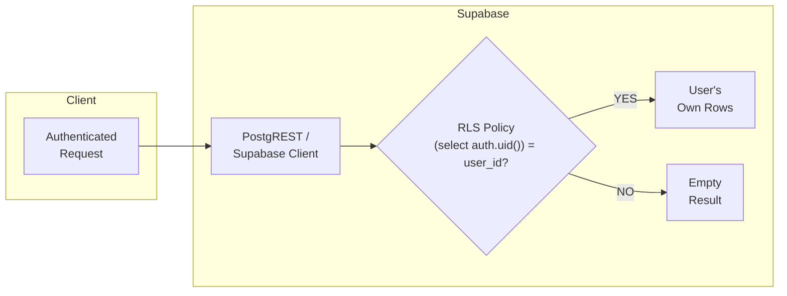
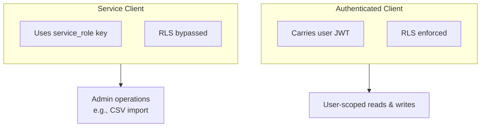

# Row-Level Security (RLS)

> How Supabase RLS keeps every user's data isolated at the database layer  E
> even if the application code has a bug.

---

## Why RLS Matters



Row-Level Security is the **final guard**: even if a service accidentally
queries without filtering by `user_id`, PostgreSQL itself will strip rows that
don't belong to the caller. This is especially important because:

- The Supabase **authenticated client** sends the user's JWT on every request.
  PostgreSQL extracts the `sub` claim via `auth.uid()` and enforces RLS before
  returning results.
- The Supabase **service client** (admin key) bypasses RLS entirely. It is only
  used server-side for operations that intentionally cross user boundaries
  (e.g., the CSV import endpoint).

---

## Enablement

RLS is enabled on **every application table**:

```sql
ALTER TABLE user_profiles       ENABLE ROW LEVEL SECURITY;
ALTER TABLE user_settings       ENABLE ROW LEVEL SECURITY;
ALTER TABLE user_goals          ENABLE ROW LEVEL SECURITY;
ALTER TABLE morning_routines    ENABLE ROW LEVEL SECURITY;
ALTER TABLE productivity_entries ENABLE ROW LEVEL SECURITY;
```

> Without at least one matching policy, enabling RLS causes **all queries to
> return zero rows** for non-superuser roles. Policies below grant the
> `authenticated` role access to its own data.

---

## Policy Matrix

Every table follows the same ownership pattern: _a user may only
SELECT / INSERT / UPDATE / DELETE rows where the user-id column equals
`(select auth.uid())`_. The column used to match differs slightly between tables.

| Table                  | Match Column | SELECT | INSERT | UPDATE | DELETE |
| ---------------------- | ------------ | :----: | :----: | :----: | :----: |
| `user_profiles`        | `id`         |  Yes   |    E   |  Yes   |    E   |
| `user_settings`        | `user_id`    |  Yes   |    E   |  Yes   |    E   |
| `user_goals`           | `user_id`    |  Yes   |  Yes   |  Yes   |  Yes   |
| `morning_routines`     | `user_id`    |  Yes   |  Yes   |  Yes   |  Yes   |
| `productivity_entries` | `user_id`    |  Yes   |  Yes   |  Yes   |  Yes   |

> `user_profiles` and `user_settings` lack INSERT/DELETE policies because these
> rows are created and owned by the `handle_new_user` trigger (which runs as
> `SECURITY DEFINER`). Users never create or delete their own profile/settings
> row  Ethey only read and update.

---

## Policies per Table

### `user_profiles`

```sql
-- Users can read their own profile
CREATE POLICY "Users can view own profile"
    ON user_profiles FOR SELECT
    USING ((select auth.uid()) = id);

-- Users can update their own profile
CREATE POLICY "Users can update own profile"
    ON user_profiles FOR UPDATE
    USING ((select auth.uid()) = id);
```

### `user_settings`

```sql
CREATE POLICY "Users can view own settings"
    ON user_settings FOR SELECT
    USING ((select auth.uid()) = user_id);

CREATE POLICY "Users can update own settings"
    ON user_settings FOR UPDATE
    USING ((select auth.uid()) = user_id);
```

### `user_goals`

```sql
CREATE POLICY "Users can view own goals"
    ON user_goals FOR SELECT
    USING ((select auth.uid()) = user_id);

CREATE POLICY "Users can insert own goals"
    ON user_goals FOR INSERT
    WITH CHECK ((select auth.uid()) = user_id);

CREATE POLICY "Users can update own goals"
    ON user_goals FOR UPDATE
    USING ((select auth.uid()) = user_id);

CREATE POLICY "Users can delete own goals"
    ON user_goals FOR DELETE
    USING ((select auth.uid()) = user_id);
```

### `morning_routines`

```sql
CREATE POLICY "Users can view own routines"
    ON morning_routines FOR SELECT
    USING ((select auth.uid()) = user_id);

CREATE POLICY "Users can insert own routines"
    ON morning_routines FOR INSERT
    WITH CHECK ((select auth.uid()) = user_id);

CREATE POLICY "Users can update own routines"
    ON morning_routines FOR UPDATE
    USING ((select auth.uid()) = user_id);

CREATE POLICY "Users can delete own routines"
    ON morning_routines FOR DELETE
    USING ((select auth.uid()) = user_id);
```

### `productivity_entries`

```sql
CREATE POLICY "Users can view own productivity"
    ON productivity_entries FOR SELECT
    USING ((select auth.uid()) = user_id);

CREATE POLICY "Users can insert own productivity"
    ON productivity_entries FOR INSERT
    WITH CHECK ((select auth.uid()) = user_id);

CREATE POLICY "Users can update own productivity"
    ON productivity_entries FOR UPDATE
    USING ((select auth.uid()) = user_id);

CREATE POLICY "Users can delete own productivity"
    ON productivity_entries FOR DELETE
    USING ((select auth.uid()) = user_id);
```

> **Performance note — `(select auth.uid())`:** All policies wrap the call in
> a scalar subselect. Without it, PostgreSQL re-evaluates `auth.uid()` for
> every row. The subselect lets the planner evaluate it **once** and reuse the
> result, which makes a meaningful difference at scale.

---

## `USING` vs `WITH CHECK`

| Clause       | Applies To             | Purpose                                                         |
| ------------ | ---------------------- | --------------------------------------------------------------- |
| `USING`      | SELECT, UPDATE, DELETE | Filters **existing** rows the user can see or act on            |
| `WITH CHECK` | INSERT, UPDATE         | Validates that **new / modified** rows still satisfy the policy |

For INSERT policies we use `WITH CHECK` only (there is no existing row to
filter). For UPDATE policies, both clauses can be provided; this schema uses
only `USING` because the ownership column (`user_id`) is never changed.

---

## Grants

After enabling RLS and creating policies, the `authenticated` role is granted
access to operate on all tables:

```sql
GRANT ALL ON user_profiles       TO authenticated;
GRANT ALL ON user_settings       TO authenticated;
GRANT ALL ON user_goals          TO authenticated;
GRANT ALL ON morning_routines    TO authenticated;
GRANT ALL ON productivity_entries TO authenticated;
```

> `GRANT ALL` gives the role permission to run any DML statement. RLS then
> narrows the visible / modifiable rows to the current user. This is the
> standard Supabase pattern.

---

## Service Client (Bypass RLS)

The backend uses two Supabase clients (see
[../05-Backend/02-Middleware-and-Config.md](../05-Backend/02-Middleware-and-Config.md)):



Most endpoints use the **authenticated client** so RLS naturally scopes every
query. The **service client** is reserved for admin paths like CSV import,
where the backend stamps `user_id` manually before inserting.

---

## Testing RLS Locally

When developing against a local Supabase instance or the hosted dashboard:

1. **SQL Editor**  ERun queries as the `authenticated` role by setting the JWT
   claim before the query:

   ```sql
   SET request.jwt.claims = '{"sub": "<user-uuid>"}';
   SELECT * FROM morning_routines;
   -- Returns only rows for that user
   ```

2. **Supabase Dashboard ↁEAuthentication ↁEUsers**  ECopy a user's UUID and
   use the SQL Editor to impersonate them.

3. **Disable RLS temporarily** (development only!):

   ```sql
   ALTER TABLE morning_routines DISABLE ROW LEVEL SECURITY;
   -- Don't forget to re-enable!
   ALTER TABLE morning_routines ENABLE ROW LEVEL SECURITY;
   ```

---

## Related Docs

| Topic                 | Link                                                                             |
| --------------------- | -------------------------------------------------------------------------------- |
| Full schema reference | [Schema.md](01-Schema.md)                                                           |
| Auth flow (backend)   | [../03-API/02-Auth.md](../03-API/02-Auth.md)                                           |
| Supabase clients      | [../05-Backend/02-Middleware-and-Config.md](../05-Backend/02-Middleware-and-Config.md) |
