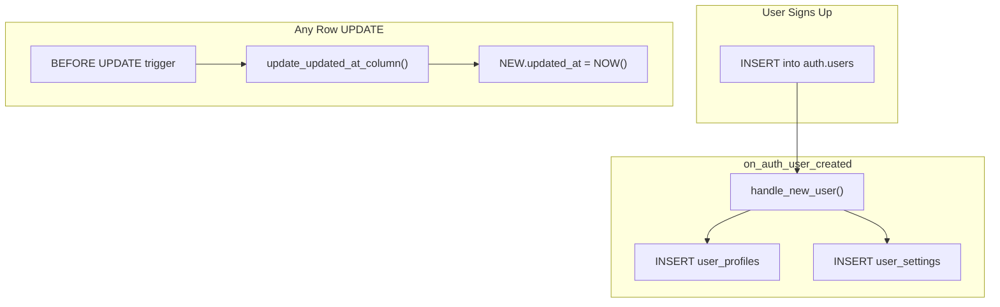
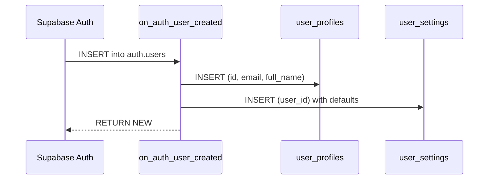

# Triggers & Functions

> Every PostgreSQL trigger and stored function in the schema, what it does, and
> when it fires.

---

## Overview

The schema defines two stored functions and six triggers. Together they
handle two concerns:

1. **Automatic `updated_at` timestamps**  Ekeep the audit column current on
   every `UPDATE`.
2. **New-user provisioning**  Ecreate a `user_profiles` row and a
   `user_settings` row the moment a user signs up via Supabase Auth.



---

## Function: `update_updated_at_column()`

Sets `updated_at` to the current timestamp whenever a row is updated.

```sql
CREATE OR REPLACE FUNCTION update_updated_at_column()
RETURNS TRIGGER AS $$
BEGIN
    NEW.updated_at = NOW();
    RETURN NEW;
END;
$$ LANGUAGE plpgsql SET search_path = '';
```

| Property    | Value           |
| ----------- | --------------- |
| Language    | PL/pgSQL        |
| Returns     | `TRIGGER`       |
| Timing      | `BEFORE UPDATE` |
| Scope       | `FOR EACH ROW`  |
| search_path | `''` (empty)    |

This function is generic  Ethe same function is reused across all five
application tables.

### Triggers That Call It

| Trigger Name                             | Table                  |
| ---------------------------------------- | ---------------------- |
| `update_user_profiles_updated_at`        | `user_profiles`        |
| `update_user_settings_updated_at`        | `user_settings`        |
| `update_user_goals_updated_at`           | `user_goals`           |
| `update_morning_routines_updated_at`     | `morning_routines`     |
| `update_productivity_entries_updated_at` | `productivity_entries` |

Each trigger follows the same pattern:

```sql
DROP TRIGGER IF EXISTS update_<table>_updated_at ON <table>;
CREATE TRIGGER update_<table>_updated_at
    BEFORE UPDATE ON <table>
    FOR EACH ROW
    EXECUTE FUNCTION update_updated_at_column();
```

> **Why `BEFORE UPDATE`?**  EBy modifying `NEW` before the row is written,
> we avoid a second write and keep the operation in a single disk I/O pass.

---

## Function: `handle_new_user()`

Automatically provisions application data when a new Supabase Auth user is
created. Runs with `SECURITY DEFINER` so it can bypass RLS (the newly created
user doesn't have RLS-visible rows yet).

```sql
CREATE OR REPLACE FUNCTION handle_new_user()
RETURNS TRIGGER AS $$
BEGIN
    -- Create user profile
    INSERT INTO public.user_profiles (id, email, full_name)
    VALUES (
        NEW.id,
        NEW.email,
        COALESCE(NEW.raw_user_meta_data->>'full_name', NULL)
    );

    -- Create default settings
    INSERT INTO public.user_settings (user_id)
    VALUES (NEW.id);

    RETURN NEW;
END;
$$ LANGUAGE plpgsql SECURITY DEFINER SET search_path = '';
```

| Property    | Value                                                         |
| ----------- | ------------------------------------------------------------- |
| Language    | PL/pgSQL                                                      |
| Returns     | `TRIGGER`                                                     |
| Security    | `SECURITY DEFINER` (runs as the function owner, bypasses RLS) |
| Timing      | `AFTER INSERT` on `auth.users`                                |
| Scope       | `FOR EACH ROW`                                                |
| search_path | `''` (empty)                                                  |

### What It Creates



1. **`user_profiles`**  ECopies `id`, `email`, and optionally `full_name`
   from the auth metadata. All other profile columns use their DDL defaults.
2. **`user_settings`**  ECreates a row with every preference set to its
   default value (theme = `system`, accent_color = `blue`, etc.).

### Trigger

```sql
DROP TRIGGER IF EXISTS on_auth_user_created ON auth.users;
CREATE TRIGGER on_auth_user_created
    AFTER INSERT ON auth.users
    FOR EACH ROW
    EXECUTE FUNCTION handle_new_user();
```

> **Why `AFTER INSERT`?**  EThe `auth.users` row must be committed first so
> the foreign key from `user_profiles.id` and `user_settings.user_id` can
> reference it.

---

## `SECURITY DEFINER` Explained

By default, PostgreSQL functions run with the privileges of the **caller**
(`SECURITY INVOKER`). `handle_new_user()` is marked `SECURITY DEFINER`,
meaning it runs with the privileges of the **function owner** (typically a
superuser or the migration role). This is necessary because:

- RLS is enabled on `user_profiles` and `user_settings`.
- The newly created user has no existing rows, and the RLS policies only allow
  actions on rows the user already owns.
- Without `SECURITY DEFINER`, the INSERT would be denied by RLS.

> **Security note:** `SECURITY DEFINER` functions should be kept minimal and
> carefully reviewed. This function only inserts into two tables using data
> from the triggering row  Eit does not accept external input.
---

## Immutable `search_path`

Both functions are declared with `SET search_path = ''`. This prevents
**search_path injection**, where an attacker creates a schema containing a
malicious object with the same name as a table or function the trigger
references. With an empty `search_path`, all table references inside the
function body must be schema-qualified (e.g., `public.user_profiles`).

`update_updated_at_column()` only touches `NEW` and calls `NOW()`, so it
needs no schema-qualified references. `handle_new_user()` explicitly
references `public.user_profiles` and `public.user_settings`.

> **Supabase security lint:** If you omit `SET search_path`, the Supabase
> Dashboard will flag the function with *"Function has a role mutable
> search_path"*.
---

## Adding a New Trigger

1. If the trigger calls `update_updated_at_column()`, just add the
   `CREATE TRIGGER` statement  Eno new function needed.
2. For custom logic, create a new function with a clear name and
   `RETURNS TRIGGER`.
3. Prefer `BEFORE UPDATE` for column mutations and `AFTER INSERT` for
   side-effect operations.
4. Add all SQL to `database/schema.sql` and update this document.

---

## Related Docs

| Topic              | Link                                           |
| ------------------ | ---------------------------------------------- |
| Full schema        | [Schema.md](01-Schema.md)                         |
| Row-Level Security | [Row-Level-Security.md](02-Row-Level-Security.md) |
| Backend auth flow  | [../03-API/02-Auth.md](../03-API/02-Auth.md)         |
