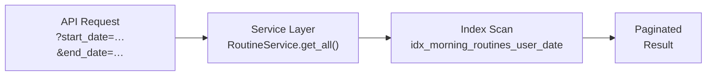

# Indexes & Performance

> A guide to every index in the schema and the query patterns they accelerate.

---

## Index Inventory

All indexes are defined in
[database/schema.sql](../../database/schema.sql). The table below lists each
one with its purpose and the typical queries it supports.

| Index Name                           | Table                  | Column(s)              | Type           | Purpose                                              |
| ------------------------------------ | ---------------------- | ---------------------- | -------------- | ---------------------------------------------------- |
| `idx_user_profiles_email`            | `user_profiles`        | `email`                | B-tree         | Fast email look-up during login/profile fetch        |
| `idx_user_settings_user_id`          | `user_settings`        | `user_id`              | B-tree         | FK look-up when loading user settings                |
| `idx_user_goals_user_id`             | `user_goals`           | `user_id`              | B-tree         | Fetch all goals for a user                           |
| `idx_user_goals_active`              | `user_goals`           | `(user_id, is_active)` | Partial B-tree | Active-goals-only queries (`WHERE is_active = true`) |
| `idx_user_goals_unique_active`       | `user_goals`           | `(user_id, goal_type)` | Partial unique | Enforces one active goal per type per user           |
| `idx_morning_routines_user_date`     | `morning_routines`     | `(user_id, date DESC)` | B-tree         | Date-range routine queries, newest-first             |
| `idx_productivity_entries_user_date` | `productivity_entries` | `(user_id, date DESC)` | B-tree         | Date-range productivity queries, newest-first        |

---

## How the Application Uses These Indexes

### Date-Range Queries (Routines & Productivity)

The most common query pattern is _"give me this user's entries between two
dates, newest first"_. Both `idx_morning_routines_user_date` and
`idx_productivity_entries_user_date` are composite B-tree indexes ordered
`(user_id, date DESC)`, which means PostgreSQL can satisfy the filter and sort
in a single index scan:

```sql
-- Service layer translates this into:
SELECT *
  FROM morning_routines
 WHERE user_id = $1
   AND date >= $2
   AND date <= $3
 ORDER BY date DESC
 LIMIT $4 OFFSET $5;
```



### Goal Uniqueness

The **partial unique index** `idx_user_goals_unique_active` ensures that
inserting a second active goal of the same type for the same user fails at the
database level:

```sql
-- Only covers rows WHERE is_active = true
CREATE UNIQUE INDEX idx_user_goals_unique_active
    ON user_goals(user_id, goal_type)
    WHERE is_active = true;
```

This is the database-side counterpart of the uniqueness check in
`UserService.create_goal()` (see
[../05-Backend/04-Services.md](../05-Backend/04-Services.md)).

### Email Look-Up

`idx_user_profiles_email` supports the profile fetch during the sign-up
trigger and any admin queries that search by email.

---

## Implicit Indexes

PostgreSQL automatically creates B-tree indexes for:

- **Primary keys**  E`id` on every table.
- **Unique constraints**  E`(user_id, date)` on `morning_routines` and
  `productivity_entries`; `(user_id)` on `user_settings`; `(email)` on
  `user_profiles`.

These don't appear in the explicit `CREATE INDEX` statements but are still
used by the query planner.

---

## Performance Notes

### RLS Overhead

Every query goes through the RLS policy check (`auth.uid() = user_id`).
Because the composite indexes already include `user_id` as the leading column,
the RLS filter piggy-backs on the same index scan with negligible extra cost.

### Pagination

Both service classes use `LIMIT` / `OFFSET` pagination. For large datasets
(thousands of entries per user) this is fine  Ethe `(user_id, date DESC)`
index keeps the scan efficient. If the dataset grows significantly, consider
switching to **keyset (cursor) pagination** using the `date` column as the
cursor.

### Write Overhead

Each index adds a small cost to `INSERT` and `UPDATE` operations. With five
tables and a handful of indexes, this is negligible for the expected workload
(≤ 1 entry per table per user per day).

### EXPLAIN ANALYZE

To verify that the planner uses the expected index:

```sql
EXPLAIN (ANALYZE, BUFFERS)
SELECT *
  FROM morning_routines
 WHERE user_id = '<uuid>'
   AND date BETWEEN '2025-01-01' AND '2025-12-31'
 ORDER BY date DESC;
```

Look for `Index Scan using idx_morning_routines_user_date` in the output.

---

## Adding a New Index

When introducing a new query pattern:

1. Write the SQL query and run `EXPLAIN ANALYZE` on realistic data.
2. If a sequential scan appears, add a targeted index.
3. Prefer **composite indexes** where the leading column matches the
   equality filter and the trailing column matches the sort/range.
4. Use **partial indexes** (with `WHERE`) when only a subset of rows is
   relevant (like the active-goals index).
5. Add the `CREATE INDEX` statement to `database/schema.sql` and update this
   document.

---

## Related Docs

| Topic                 | Link                                                   |
| --------------------- | ------------------------------------------------------ |
| Full schema           | [Schema.md](01-Schema.md)                                 |
| Service layer queries | [../05-Backend/04-Services.md](../05-Backend/04-Services.md) |
| Row-Level Security    | [Row-Level-Security.md](02-Row-Level-Security.md)         |
