# Seed & Sample Data

> How to generate, import, and work with sample data for development and demos.

---

## Data Sources

The project ships with two approaches for getting data into the database:

| Method                 | Files                                                                        | Description                                              |
| ---------------------- | ---------------------------------------------------------------------------- | -------------------------------------------------------- |
| **Generator script**   | `backend/scripts/download_dataset.py`                                        | Produces synthetic CSV files with realistic correlations |
| **Pre-generated CSVs** | `backend/data/morning_routines.csv`, `backend/data/productivity_entries.csv` | Ready-to-import files (90 days, ~85 entries each)        |
| **CSV Import API**     | `POST /api/import/csv`                                                       | Upload CSVs through the running application              |

---

## Generator Script

The script creates correlated synthetic data  Esleep quality affects mood,
exercise influences energy, meditation reduces stress, etc.

### Running the Generator

```bash
cd backend
python scripts/download_dataset.py
```

Output is saved to `backend/data/`:

```
backend/data/
├── morning_routines.csv      (~4 KB, ~85 rows)
└── productivity_entries.csv   (~5 KB, ~85 rows)
```

### Configuration

The `generate_dataset()` function accepts three parameters:

| Parameter    | Default              | Description                      |
| ------------ | -------------------- | -------------------------------- |
| `num_days`   | `90`                 | Number of calendar days to cover |
| `start_date` | 90 days before today | First date in the dataset        |
| `seed`       | `42`                 | Random seed for reproducibility  |

To customize, edit the call in `main()`:

```python
routines_df, productivity_df = generate_dataset(
    num_days=180,  # 6 months instead of 3
    seed=123,
)
```

### Built-In Correlations

The generator models realistic relationships between morning habits and
productivity outcomes:

```mermaid
flowchart LR
    Sleep["Sleep Quality"] --> Mood["Morning Mood"]
    Sleep --> Energy["Energy Level"]
    Sleep --> Productivity["Productivity Score"]

    Exercise["Exercise"] --> Energy
    Exercise --> Stress["Stress ↁE]

    Meditation["Meditation"] --> Stress
    Meditation --> Focus["Focus Hours"]

    ScreenTime["Screen Time\nbefore Bed"] --> Sleep

    Caffeine["Caffeine"] -.->|"optimal\n100-200 mg"| Focus
    Caffeine -.->|"> 200 mg"| Distractions["Distractions ↁE]
```

Key rules baked into the data:

- ~5 % of days are skipped (realistic logging gaps)
- Weekend patterns differ (longer sleep, fewer tasks)
- Exercise streaks build meditation habit probability
- Caffeine intake rises when sleep duration drops

### Statistics Printed

The script outputs summary statistics after generation:

```
🌅 MORNING ROUTINE AVERAGES:
   Sleep duration: 7.2 hrs
   Exercise: 17 min (52% of days)
   Meditation: 6 min (35% of days)
   Morning mood: 6.8/10

📈 PRODUCTIVITY AVERAGES:
   Productivity score: 6.5/10
   Energy level: 6.1/10
   Stress level: 4.3/10
   Focus hours: 4.2 hrs

🔗 KEY CORRELATIONS:
   Sleep ↁEProductivity: 0.42
   Exercise ↁEEnergy: 0.38
   Meditation ↁEStress: -0.25
```

---

## CSV File Format

### `morning_routines.csv`

| Column                   | Type       | Example      |
| ------------------------ | ---------- | ------------ |
| `date`                   | ISO date   | `2025-11-14` |
| `wake_time`              | HH:MM      | `06:10`      |
| `sleep_duration_hours`   | float      | `7.5`        |
| `exercise_minutes`       | int        | `30`         |
| `meditation_minutes`     | int        | `11`         |
| `breakfast_quality`      | string     | `good`       |
| `morning_mood`           | int (1-10) | `6`          |
| `screen_time_before_bed` | int (min)  | `39`         |
| `caffeine_intake`        | int (mg)   | `89`         |
| `water_intake_ml`        | int        | `641`        |

### `productivity_entries.csv`

| Column               | Type       | Example                |
| -------------------- | ---------- | ---------------------- |
| `date`               | ISO date   | `2025-11-14`           |
| `productivity_score` | int (1-10) | `5`                    |
| `tasks_completed`    | int        | `4`                    |
| `tasks_planned`      | int        | `4`                    |
| `focus_hours`        | float      | `4.7`                  |
| `distractions_count` | int        | `1`                    |
| `energy_level`       | int (1-10) | `6`                    |
| `stress_level`       | int (1-10) | `4`                    |
| `notes`              | string     | `Average day overall.` |

> **Note:** The CSV files do not include `id`, `user_id`, `routine_id`,
> `created_at`, or `updated_at`. These are populated by the database or by
> the import endpoint.

---

## Importing Data

### Option 1: CSV Import API

The easiest path  Eupload through the running application:

```bash
curl -X POST http://localhost:8000/api/import/csv \
  -H "Authorization: Bearer <token>" \
  -F "file=@backend/data/morning_routines.csv"

curl -X POST http://localhost:8000/api/import/csv \
  -H "Authorization: Bearer <token>" \
  -F "file=@backend/data/productivity_entries.csv"
```

The endpoint auto-detects the data type by inspecting columns:

| If CSV contains these columns                       | Imported as            |
| --------------------------------------------------- | ---------------------- |
| `wake_time`, `sleep_duration_hours`, `morning_mood` | `morning_routines`     |
| `productivity_score`, `energy_level`                | `productivity_entries` |

Each row gets the authenticated user's `user_id` stamped automatically.

```mermaid
sequenceDiagram
    participant Client
    participant API as POST /api/import/csv
    participant DB as Supabase

    Client ->> API: Upload CSV + JWT
    API ->> API: Detect columns ↁEtable
    loop Each Row
        API ->> DB: INSERT with user_id
    end
    API -->> Client: { imported_count, failed_count, errors }
```



### Option 2: Frontend CSV Uploader

The dashboard includes a drag-and-drop CSV uploader component at
`/dashboard`. It calls the same `/api/import/csv` endpoint under the hood.
See [../04-Frontend/02-Components.md](../04-Frontend/02-Components.md) for details on
the `CSVUploader` component.

### Option 3: Direct SQL Insert

For development, paste directly into the Supabase SQL Editor:

```sql
-- Insert a single routine
INSERT INTO morning_routines (
    user_id, date, wake_time, sleep_duration_hours,
    exercise_minutes, meditation_minutes, breakfast_quality,
    morning_mood, screen_time_before_bed, caffeine_intake, water_intake_ml
) VALUES (
    '<your-user-uuid>',
    '2025-11-14', '06:10', 7.5,
    30, 11, 'good',
    6, 39, 89, 641
);
```

---

## Required Dependencies

The generator script requires `numpy` and `pandas`:

```bash
cd backend
pip install numpy pandas
# Or, if using Poetry:
poetry install  # both are in pyproject.toml
```

---

## Regenerating Data

If the schema changes (e.g., a new column is added to `morning_routines`):

1. Update `generate_dataset()` in `backend/scripts/download_dataset.py` to
   produce the new column.
2. Re-run the script:
   ```bash
   python scripts/download_dataset.py
   ```
3. Commit the updated CSV files in `backend/data/`.

---

## Related Docs

| Topic                  | Link                                                                                   |
| ---------------------- | -------------------------------------------------------------------------------------- |
| Schema reference       | [Schema.md](01-Schema.md)                                                                 |
| Import API endpoint    | [../03-API/Endpoints/05-Import.md](../03-API/Endpoints/05-Import.md)                         |
| CSV Uploader component | [../04-Frontend/02-Components.md](../04-Frontend/02-Components.md)                           |
| Running the backend    | [../01-Getting-Started/03-Running-Services.md](../01-Getting-Started/03-Running-Services.md) |
