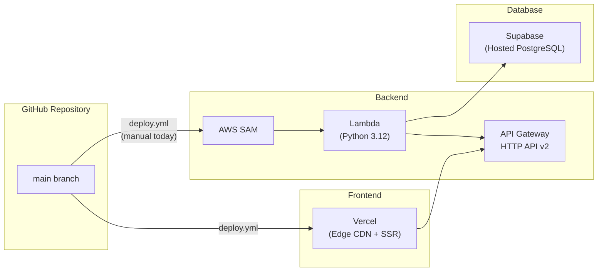
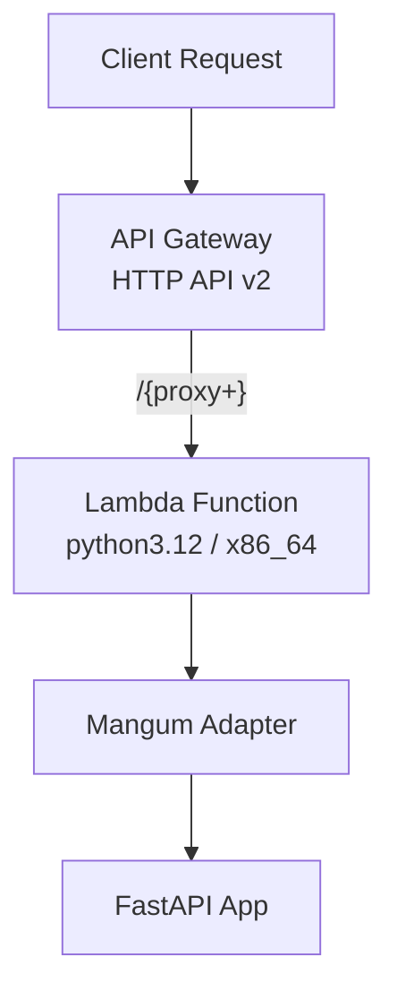

# Deployment

> How each part of the stack is built, packaged, and shipped to production.

---

## Deployment Targets



| Component | Platform               | Trigger                        | Config Files                                      |
| --------- | ---------------------- | ------------------------------ | ------------------------------------------------- |
| Frontend  | **Vercel**             | Push to `main`                 | `frontend/next.config.js`                         |
| Backend   | **AWS Lambda** via SAM | Manual / CI (when uncommented) | `backend/template.yaml`, `backend/samconfig.toml` |
| Database  | **Supabase** (managed) | Schema applied via SQL Editor  | `database/schema.sql`                             |

---

## Frontend  — Vercel

### How It Works

1. The `deploy-frontend` job in `.github/workflows/deploy.yml` runs on every
   push to `main`.
2. It installs the **Vercel CLI**, pulls environment info, builds locally, and
   deploys the pre-built artifacts.
3. Vercel also creates **preview deploys** for every pull request automatically
   (each gets a unique `*.vercel.app` URL).

### Required Secrets

| GitHub Secret                   | Description                         |
| ------------------------------- | ----------------------------------- |
| `VERCEL_TOKEN`                  | Vercel personal access token        |
| `NEXT_PUBLIC_SUPABASE_URL`      | Supabase project URL (build-time)   |
| `NEXT_PUBLIC_SUPABASE_ANON_KEY` | Supabase anonymous key (build-time) |

### Build Details

```bash
# What the workflow runs:
vercel pull --yes --environment=production --token=$TOKEN
vercel build --prod --token=$TOKEN
vercel deploy --prebuilt --prod --token=$TOKEN
```

The Next.js build uses the standalone output mode (`next.config.js` with
Turbopack). Static assets are served via Vercel's edge CDN.

---

## Backend  — AWS Lambda via SAM

### Architecture



- **API Gateway HTTP API v2** receives all requests and forwards them via a
  catch-all route (`/{proxy+}`) plus a root route (`/`).
- **Mangum** translates the API Gateway event into an ASGI scope that FastAPI
  understands.
- The `api_gateway_base_path` setting strips the stage prefix (e.g.
  `/development`) so FastAPI routes match without modification.

### SAM Template (`template.yaml`)

Key resources defined in the template:

| Resource                         | Type                        | Purpose                                 |
| -------------------------------- | --------------------------- | --------------------------------------- |
| `MorningRoutineFunction`         | `AWS::Serverless::Function` | The Lambda function itself              |
| `HttpApi`                        | `AWS::Serverless::HttpApi`  | API Gateway HTTP API                    |
| `MorningRoutineFunctionLogGroup` | `AWS::Logs::LogGroup`       | CloudWatch log group (14-day retention) |

### Parameters

All parameters can be overridden per environment:

| Parameter         | Default                     | Description                                    |
| ----------------- | --------------------------- | ---------------------------------------------- |
| `Environment`     | `development`               | `development` / `staging` / `production`       |
| `SupabaseUrl`     |  —                           | Supabase project URL                           |
| `SupabaseKey`     |  —                           | Supabase service role key                      |
| `CorsOrigins`     | `http://localhost:3000`     | Exact-match allowed origins (comma-separated)  |
| `CorsOriginRegex` | `https://.*\\.vercel\\.app` | Regex for additional origins (preview deploys) |

### Global Function Settings

```yaml
Timeout: 30 # seconds
MemorySize: 256 # MB
Runtime: python3.12
Architectures: [x86_64]
```

### Deploying Manually

```bash
cd backend

# Build (uses Docker for consistent packaging)
sam build

# Deploy to development
sam deploy

# Deploy to staging
sam deploy --config-env staging

# Deploy to production
sam deploy --config-env prod
```

### Environment Configs (`samconfig.toml`)

| Config Env      | Stack Name                    | Region      | Notes                               |
| --------------- | ----------------------------- | ----------- | ----------------------------------- |
| `default` (dev) | `morning-routine-api-dev`     | `us-east-1` | Localhost CORS, auto-resolve S3     |
| `staging`       | `morning-routine-api-staging` | `us-east-1` | Replace Supabase secrets before use |
| `prod`          | `morning-routine-api-prod`    | `us-east-1` | Production domain, no regex CORS    |

### Outputs After Deploy

After a successful deployment, SAM prints:

| Output         | Description                       |
| -------------- | --------------------------------- |
| `ApiUrl`       | The full API Gateway endpoint URL |
| `FunctionArn`  | Lambda function ARN               |
| `FunctionName` | Lambda function name              |

### Automated Deployment (CI)

The backend deploy job in `deploy.yml` is **commented out** by default. To
enable it:

1. Add the required GitHub secrets (see [CI-CD.md](02-CI-CD.md)).
2. Uncomment the `deploy-backend` job in `.github/workflows/deploy.yml`.
3. Push to `main`  — the job runs after the frontend deploys successfully.

---

## Docker (Local Development)

Docker Compose is available for running both services locally without
installing Node.js or Python on the host machine.

```bash
docker compose up --build
```

| Service    | Image Base         | Port   | Volumes Mounted            |
| ---------- | ------------------ | ------ | -------------------------- |
| `frontend` | `node:22-alpine`   | `3000` | `frontend/src` (read-only) |
| `backend`  | `python:3.12-slim` | `8000` | `backend/app` (read-only)  |

Both Dockerfiles use **multi-stage builds** (builder ↁErunner) to keep
production images small.

### Backend Dockerfile Highlights

- **Poetry** installed in the build stage; only production deps copied to the
  runner stage.
- Runs as a non-root `appuser`.
- Built-in health check at `/health` (30 s interval, 3 retries).

### Frontend Dockerfile Highlights

- Build-time `ARG`s for Supabase env vars (baked into the Next.js bundle).
- Runs as a non-root `nextjs` user.
- Uses the Next.js **standalone** output for minimal image size.

### Network

Both services share an `app-network` bridge network. The frontend reaches the
backend via `http://backend:8000/api` (Docker DNS).

---

## Related Docs

| Topic                       | Link                                                                             |
| --------------------------- | -------------------------------------------------------------------------------- |
| CI / CD pipeline            | [CI-CD.md](02-CI-CD.md)                                                             |
| Monitoring & logging        | [Monitoring-and-Logging.md](03-Monitoring-and-Logging.md)                           |
| Security practices          | [Security.md](04-Security.md)                                                       |
| Backend middleware & config | [../05-Backend/02-Middleware-and-Config.md](../05-Backend/02-Middleware-and-Config.md) |
| Environment variables       | [../01-Getting-Started/02-Configuration.md](../01-Getting-Started/02-Configuration.md) |
