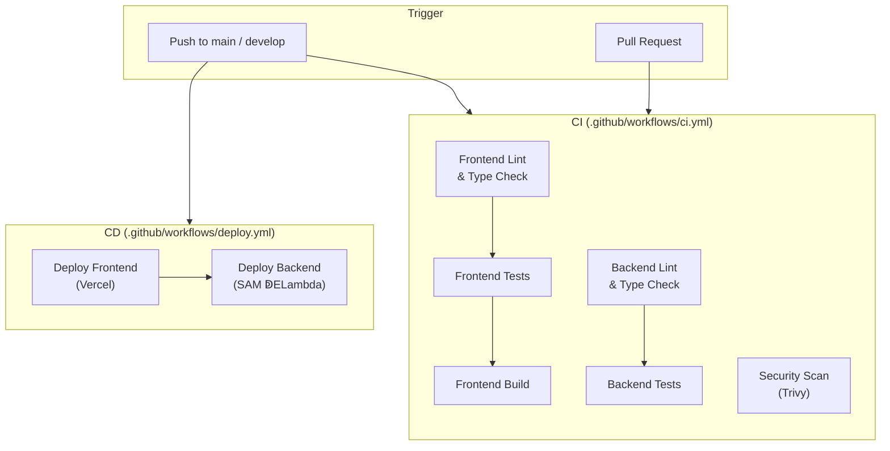

# CI / CD

> Continuous Integration and Continuous Deployment pipelines powered by
> GitHub Actions.

---

## Pipeline Overview



| Workflow   | File                           | Triggers                        | Purpose                          |
| ---------- | ------------------------------ | ------------------------------- | -------------------------------- |
| **CI**     | `.github/workflows/ci.yml`     | Push to `main`/`develop`, PRs   | Lint, test, build, security scan |
| **Deploy** | `.github/workflows/deploy.yml` | Push to `main`, manual dispatch | Ship frontend + backend          |

---

## CI Workflow  — Jobs in Detail

### 1. Frontend Lint & Type Check

| Step         | Command            | What It Does                        |
| ------------ | ------------------ | ----------------------------------- |
| Install deps | `npm ci`           | Clean install from lockfile         |
| ESLint       | `npm run lint`     | Catches code quality issues         |
| TypeScript   | `npx tsc --noEmit` | Validates types without emitting JS |

### 2. Frontend Tests

Runs after lint passes.

| Step         | Command                                    |
| ------------ | ------------------------------------------ |
| Install deps | `npm ci`                                   |
| Jest         | `npm test -- --coverage --passWithNoTests` |

### 3. Frontend Build

Runs after lint **and** tests pass. Verifies the Next.js build succeeds with
production env vars:

```yaml
env:
  NEXT_PUBLIC_SUPABASE_URL: ${{ secrets.NEXT_PUBLIC_SUPABASE_URL }}
  NEXT_PUBLIC_SUPABASE_ANON_KEY: ${{ secrets.NEXT_PUBLIC_SUPABASE_ANON_KEY }}
```

### 4. Backend Lint & Type Check

| Step           | Command                            | What It Does                    |
| -------------- | ---------------------------------- | ------------------------------- |
| Install Poetry | `snok/install-poetry@v1`           | Manages Python virtualenv       |
| Cache venv     | `actions/cache@v5`                 | Skips install on lockfile match |
| Ruff lint      | `poetry run ruff check .`          | Fast Python linter              |
| Ruff format    | `poetry run ruff format --check .` | Enforces consistent style       |

### 5. Backend Tests

Runs after lint passes.

| Step         | Command                                     |
| ------------ | ------------------------------------------- |
| Install deps | `poetry install --no-interaction --no-root` |
| Pytest       | `poetry run pytest -v`                      |

Environment variables `SUPABASE_URL` and `SUPABASE_KEY` are injected from
GitHub Secrets.

### 6. Security Scan

Runs in **parallel** with all other jobs (no dependencies).

| Step         | Tool                                   | What It Does                                              |
| ------------ | -------------------------------------- | --------------------------------------------------------- |
| Trivy        | `aquasecurity/trivy-action@master`     | Filesystem scan for `CRITICAL` and `HIGH` vulnerabilities |
| Upload SARIF | `github/codeql-action/upload-sarif@v4` | Publishes results to the GitHub Security tab              |

---

## Deploy Workflow

### Frontend

Runs on every push to `main` (and on `workflow_dispatch`):

```
Checkout ↁESetup Node 22 ↁEInstall Vercel CLI
  ↁEvercel pull ↁEvercel build --prod ↁEvercel deploy --prebuilt --prod
```

### Backend (Currently Commented Out)

The `deploy-backend` job is ready but **commented out** until the team is
prepared to deploy to AWS. To activate:

1. Add these GitHub Secrets:

   | Secret                  | Description                    |
   | ----------------------- | ------------------------------ |
   | `AWS_ACCESS_KEY_ID`     | IAM access key                 |
   | `AWS_SECRET_ACCESS_KEY` | IAM secret key                 |
   | `SUPABASE_URL`          | Supabase project URL           |
   | `SUPABASE_KEY`          | Supabase service role key      |
   | `CORS_ORIGINS`          | (optional) Exact-match origins |
   | `CORS_ORIGIN_REGEX`     | (optional) Origin regex        |

2. Uncomment the `deploy-backend` job in `deploy.yml`.
3. Push to `main`  — the backend deploys **after** the frontend succeeds.

The job uses:

```
Setup Python 3.12 ↁEInstall SAM CLI ↁEConfigure AWS creds
  ↁEsam build ↁEsam deploy --no-confirm-changeset
```

---

## Caching Strategy

| Ecosystem | Cache Key                         | Path                   |
| --------- | --------------------------------- | ---------------------- |
| npm       | `frontend/package-lock.json` hash | Node.js built-in cache |
| Poetry    | `backend/poetry.lock` hash        | `backend/.venv`        |

The Poetry venv cache is restored per-OS and Python version:

```yaml
key: venv-${{ runner.os }}-${{ env.PYTHON_VERSION }}-${{ hashFiles('backend/poetry.lock') }}
```

---

## Dependabot

Automated dependency updates are configured in `.github/dependabot.yml`:

| Ecosystem      | Directory   | Schedule        | PR Limit | Grouping              |
| -------------- | ----------- | --------------- | -------- | --------------------- |
| npm            | `/frontend` | Weekly (Monday) | 5        | Minor + patch grouped |
| pip            | `/backend`  | Weekly (Monday) | 5        | Minor + patch grouped |
| GitHub Actions | `/`         | Weekly (Monday) | 3        |  —                     |

All PRs are labelled (`dependencies`, `frontend`/`backend`/`ci`) and commit
messages are prefixed with `chore(deps)` or `chore(ci)`.

---

## Release Notes

GitHub auto-generated release notes are configured in `.github/release.yml`:

| Category      | Labels                   |
| ------------- | ------------------------ |
| Features      | `feature`, `enhancement` |
| Bug Fixes     | `fix`, `bugfix`, `bug`   |
| Documentation | `documentation`, `docs`  |
| Maintenance   | `chore`, `maintenance`   |
| Other         | everything else          |

Items labeled `ignore-for-release` are excluded from the changelog.

---

## Required GitHub Secrets Summary

| Secret                          | Used By                | Required?    |
| ------------------------------- | ---------------------- | ------------ |
| `VERCEL_TOKEN`                  | Deploy frontend        | Yes          |
| `NEXT_PUBLIC_SUPABASE_URL`      | CI build + deploy      | Yes          |
| `NEXT_PUBLIC_SUPABASE_ANON_KEY` | CI build + deploy      | Yes          |
| `SUPABASE_URL`                  | Backend tests + deploy | Yes          |
| `SUPABASE_KEY`                  | Backend tests + deploy | Yes          |
| `AWS_ACCESS_KEY_ID`             | Backend deploy         | When enabled |
| `AWS_SECRET_ACCESS_KEY`         | Backend deploy         | When enabled |
| `CORS_ORIGINS`                  | Backend deploy         | Optional     |
| `CORS_ORIGIN_REGEX`             | Backend deploy         | Optional     |

---

## Related Docs

| Topic                | Link                                                   |
| -------------------- | ------------------------------------------------------ |
| Deployment details   | [Deployment.md](01-Deployment.md)                         |
| Monitoring & logging | [Monitoring-and-Logging.md](03-Monitoring-and-Logging.md) |
| Testing guide        | [../08-Testing/](../08-Testing/)                       |
| Security             | [Security.md](04-Security.md)                             |
