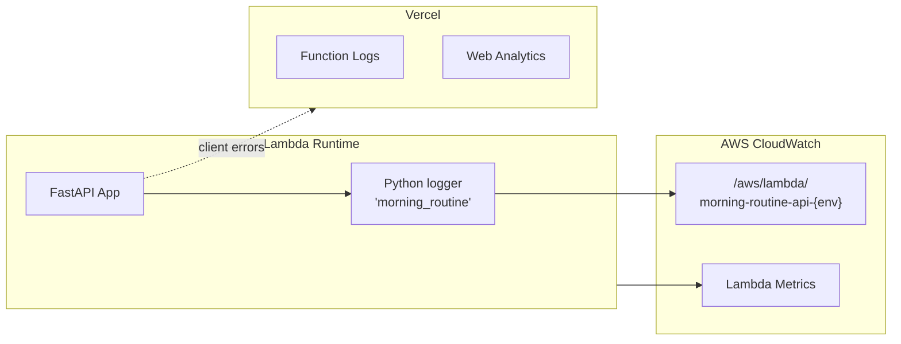

# Monitoring & Logging

> Observability setup  Ehow to see what the application is doing at runtime.

---

## Logging Architecture



| Component         | Log Destination      | Retention                            |
| ----------------- | -------------------- | ------------------------------------ |
| Backend (Lambda)  | CloudWatch Logs      | **14 days** (set in `template.yaml`) |
| Frontend (Vercel) | Vercel Function Logs | Per Vercel plan defaults             |

---

## Backend Logging

### Logger Configuration

The backend uses a named Python logger (`morning_routine`) configured in
`backend/app/main.py`:

```python
logger = logging.getLogger("morning_routine")
logger.setLevel(logging.INFO)
```

Log format:

```
%(asctime)s %(levelname)s %(name)s %(message)s
```

> In Lambda, `stdout` is captured by CloudWatch automatically. The
> `StreamHandler` writes to `stdout`, so every log line appears in the
> CloudWatch log group.

### Request Logging Middleware

Every HTTP request produces **two** log entries:

| Phase    | Format                                              | Example                                               |
| -------- | --------------------------------------------------- | ----------------------------------------------------- |
| Incoming | `REQ {method} {path} origin={origin}`               | `REQ GET /api/routines origin=https://app.vercel.app` |
| Response | `RES {method} {path} status={code} duration={ms}ms` | `RES GET /api/routines status=200 duration=42.3ms`    |

This gives full visibility into:

- Which endpoints are called most
- Response latency per route
- CORS origin tracking (useful for debugging cross-origin issues)

### Startup Log

On cold start, the app logs its configuration (without secrets):

```
App initializing: environment=production, cors_origins=[...], cors_regex=...
```

### Error Logging

The global exception handler logs unhandled errors with full traceback:

```python
logger.error(
    "Unhandled exception on %s %s: %s",
    request.method, request.url.path, exc,
    exc_info=True,   # ↁEincludes stack trace
)
```

The client only receives `{"detail": "Internal server error"}`  Eno
stack traces leak to the outside.

---

## CloudWatch

### Log Group

The SAM template creates a dedicated log group with automatic retention:

```yaml
MorningRoutineFunctionLogGroup:
  Type: AWS::Logs::LogGroup
  Properties:
    LogGroupName: !Sub "/aws/lambda/morning-routine-api-${Environment}"
    RetentionInDays: 14
```

### Useful CloudWatch Insights Queries

**Top 10 slowest endpoints (last 24 h):**

```sql
fields @timestamp, @message
| filter @message like /^RES/
| parse @message "RES * * status=* duration=*ms" as method, path, status, duration
| sort duration desc
| limit 10
```

**Error count by endpoint:**

```sql
fields @timestamp, @message
| filter @message like /^RES/ and status >= 500
| parse @message "RES * * status=* duration=*ms" as method, path, status, duration
| stats count() by path
| sort count desc
```

**Cold start detection:**

```sql
fields @timestamp, @message
| filter @message like /App initializing/
| sort @timestamp desc
| limit 20
```

### Built-In Lambda Metrics

CloudWatch automatically tracks these metrics for every Lambda function:

| Metric                 | Description                                 |
| ---------------------- | ------------------------------------------- |
| `Invocations`          | Total calls                                 |
| `Duration`             | Execution time (avg, p50, p99)              |
| `Errors`               | Unhandled exceptions                        |
| `Throttles`            | Requests rejected due to concurrency limits |
| `ConcurrentExecutions` | Simultaneous active instances               |
| `ColdStarts`           | (derived) count of init log lines           |

### Recommended Alarms

| Alarm           | Metric                 | Threshold         | Action                   |
| --------------- | ---------------------- | ----------------- | ------------------------ |
| High error rate | `Errors / Invocations` | > 5 % over 5 min  | SNS notification         |
| High latency    | `Duration p99`         | > 10 s over 5 min | SNS notification         |
| Throttling      | `Throttles`            | > 0 over 1 min    | Review concurrency limit |

> These alarms are not yet provisioned in the SAM template. Add them as
> `AWS::CloudWatch::Alarm` resources when the project moves to production.

---

## Health Checks

| Endpoint  | Method | Response                     | Used By                                    |
| --------- | ------ | ---------------------------- | ------------------------------------------ |
| `/`       | GET    | `{ message, version, docs }` | General                                    |
| `/health` | GET    | `{ status: "healthy" }`      | Docker `HEALTHCHECK`, load-balancer probes |

The backend Dockerfile includes a health check that polls `/health` every
30 seconds with a 5-second start period and 3 retries before marking the
container as unhealthy.

---

## Frontend Observability

Vercel provides built-in observability for the frontend:

| Feature             | What It Shows                                       |
| ------------------- | --------------------------------------------------- |
| **Function Logs**   | Server-side rendering logs, API route logs          |
| **Web Analytics**   | Page views, visitors, performance (Core Web Vitals) |
| **Speed Insights**  | LCP, FID, CLS per page                              |
| **Deployment Logs** | Build output, deploy status                         |

These are available in the Vercel dashboard without additional configuration.

---

## Adding Observability

### Structured JSON Logging (Future)

For richer CloudWatch queries, switch to JSON-formatted logs:

```python
import json

class JSONFormatter(logging.Formatter):
    def format(self, record):
        return json.dumps({
            "timestamp": self.formatTime(record),
            "level": record.levelname,
            "logger": record.name,
            "message": record.getMessage(),
            "path": getattr(record, "path", None),
            "duration_ms": getattr(record, "duration_ms", None),
        })
```

### X-Ray Tracing (Future)

AWS X-Ray can be enabled with a single SAM property:

```yaml
Globals:
  Function:
    Tracing: Active
```

This instruments Lambda invocations, API Gateway calls, and downstream
Supabase/HTTP requests automatically.

---

## Related Docs

| Topic              | Link                                                                             |
| ------------------ | -------------------------------------------------------------------------------- |
| Deployment         | [Deployment.md](01-Deployment.md)                                                   |
| Backend middleware | [../05-Backend/02-Middleware-and-Config.md](../05-Backend/02-Middleware-and-Config.md) |
| SAM template       | [Deployment.md](01-Deployment.md#backend--aws-lambda-via-sam)                       |
| Security           | [Security.md](04-Security.md)                                                       |
