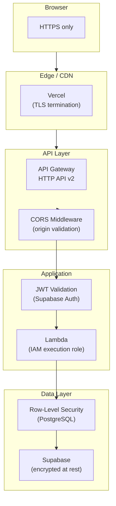
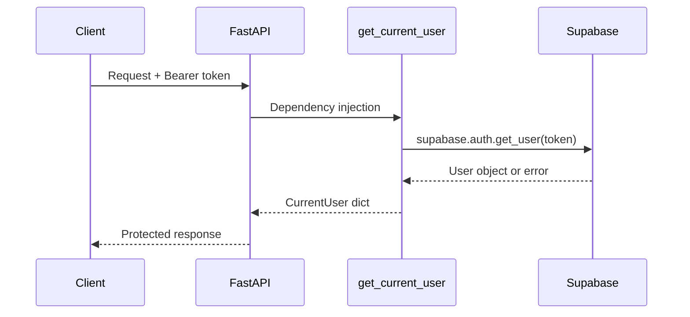

# Security

> Security posture across the stack  Esecrets management, authentication,
> network boundaries, and dependency hygiene.

---

## Security Layers



---

## Secrets Management

### Rule: Never Hardcode Secrets

All sensitive values are passed through **environment variables** or
**GitHub Secrets**  Enever committed to the repository.

| Secret                          | Where It Lives          | Consumed By           |
| ------------------------------- | ----------------------- | --------------------- |
| `SUPABASE_URL`                  | GitHub Secrets / `.env` | Backend               |
| `SUPABASE_KEY` (service role)   | GitHub Secrets / `.env` | Backend               |
| `NEXT_PUBLIC_SUPABASE_URL`      | GitHub Secrets / `.env` | Frontend (build-time) |
| `NEXT_PUBLIC_SUPABASE_ANON_KEY` | GitHub Secrets / `.env` | Frontend (build-time) |
| `VERCEL_TOKEN`                  | GitHub Secrets          | Deploy workflow       |
| `AWS_ACCESS_KEY_ID`             | GitHub Secrets          | Deploy workflow       |
| `AWS_SECRET_ACCESS_KEY`         | GitHub Secrets          | Deploy workflow       |

### SAM Parameters

The SAM template marks `SupabaseUrl` and `SupabaseKey` as `NoEcho: true`,
which prevents them from appearing in CloudFormation console output or
change-set diffs.

### `.env` Files

- `.env` files are listed in `.gitignore` and must **never** be committed.
- Each developer creates their own from the documented template (see
  [../01-Getting-Started/02-Configuration.md](../01-Getting-Started/02-Configuration.md)).

---

## Authentication & Authorization

### Supabase Auth

| Feature                  | Status                             |
| ------------------------ | ---------------------------------- |
| Email + password sign-up | Enabled                            |
| JWT-based sessions       | Enabled                            |
| Refresh token rotation   | Enabled (Supabase default)         |
| MFA                      | Available (opt-in per user)        |
| Session timeout          | Configurable in Supabase dashboard |

### Backend JWT Validation

Every protected endpoint runs through the `get_current_user` dependency:



If the token is invalid or expired, the endpoint returns `401 Unauthorized`.

### Row-Level Security

RLS is the **last line of defence**  Eeven if application code has a bug,
PostgreSQL enforces that each user can only access their own rows. Full
details in [../06-Database/02-Row-Level-Security.md](../06-Database/02-Row-Level-Security.md).

---

## CORS

CORS is handled **entirely by FastAPI middleware** (not API Gateway) because
HTTP API v2 does not support wildcard subdomains in `AllowOrigins`.

| Setting              | Value                                                                |
| -------------------- | -------------------------------------------------------------------- |
| `allow_origins`      | Configurable list (e.g., `http://localhost:3000`, production domain) |
| `allow_origin_regex` | `https://.*\.vercel\.app` (covers preview deploys)                   |
| `allow_credentials`  | `true`                                                               |
| `allow_methods`      | `*`                                                                  |
| `allow_headers`      | `*`                                                                  |

Production deployments should set `CorsOriginRegex` to an empty string and
list only the exact production origin in `CorsOrigins`.

---

## Network Boundaries

| Boundary                  | Who Can Reach     | Protection                           |
| ------------------------- | ----------------- | ------------------------------------ |
| Vercel edge ↁEAPI Gateway | Public internet   | HTTPS, CORS                          |
| API Gateway ↁELambda      | AWS internal      | IAM execution role                   |
| Lambda ↁESupabase         | Public internet   | HTTPS + service role key             |
| Supabase ↁEPostgreSQL     | Supabase internal | Connection pooler, encrypted at rest |

### Principle of Least Privilege

- The Lambda function's IAM execution role grants **only** what SAM auto-
  creates  E`logs:CreateLogGroup`, `logs:CreateLogStream`, `logs:PutLogEvents`.
- No S3, DynamoDB, or other AWS service access is granted.
- The Supabase service role key is powerful  Eit is only used server-side and
  never exposed to the browser.

---

## Dependency Security

### Automated Scanning

| Tool                       | When            | What                                                    |
| -------------------------- | --------------- | ------------------------------------------------------- |
| **Trivy**                  | Every CI run    | Filesystem scan for `CRITICAL` & `HIGH` CVEs            |
| **Dependabot**             | Weekly (Monday) | Creates PRs for outdated dependencies                   |
| **GitHub Security Alerts** | Continuous      | Alerts on known vulnerabilities in the dependency graph |

### Manual Checks

```bash
# Frontend
cd frontend
npm audit

# Backend
cd backend
poetry run pip-audit        # if pip-audit is installed
poetry run bandit -r app/   # static security analysis (configured in pyproject.toml)
```

`bandit` is included as a dev dependency in `pyproject.toml` for static
analysis of common Python security issues.

---

## Production Hardening Checklist

| Item                                 | Status | Notes                                                                            |
| ------------------------------------ | ------ | -------------------------------------------------------------------------------- |
| Interactive docs disabled in prod    | Done   | `docs_url` and `redoc_url` set to `None` when `environment == "production"`      |
| Error details hidden from clients    | Done   | Global exception handler returns generic `Internal server error`                 |
| Stack traces logged server-side only | Done   | `exc_info=True` in logger, not in response                                       |
| RLS enabled on all tables            | Done   | See [../06-Database/02-Row-Level-Security.md](../06-Database/02-Row-Level-Security.md) |
| Non-root Docker users                | Done   | `appuser` (backend), `nextjs` (frontend)                                         |
| Docker health checks                 | Done   | Backend polls `/health` every 30 s                                               |
| SAM `NoEcho` on secrets              | Done   | `SupabaseUrl`, `SupabaseKey`                                                     |
| `.env` in `.gitignore`               | Done   |                                                                                  |
| HTTPS everywhere                     | Done   | Vercel + API Gateway enforce TLS                                                 |

---

## Vulnerability Reporting

The project follows a responsible disclosure policy documented in
[SECURITY.md](../../SECURITY.md) at the repository root:

- **Do not** open public issues for vulnerabilities.
- Report via **GitHub Security Advisories** or email.
- Response SLAs: Critical 24-48 h, High 1 week, Medium 2 weeks.

---

## Related Docs

| Topic                 | Link                                                                             |
| --------------------- | -------------------------------------------------------------------------------- |
| Deployment            | [Deployment.md](01-Deployment.md)                                                   |
| CI / CD               | [CI-CD.md](02-CI-CD.md)                                                             |
| RLS details           | [../06-Database/02-Row-Level-Security.md](../06-Database/02-Row-Level-Security.md)     |
| Auth middleware       | [../05-Backend/02-Middleware-and-Config.md](../05-Backend/02-Middleware-and-Config.md) |
| Auth API              | [../03-API/02-Auth.md](../03-API/02-Auth.md)                                           |
| Environment variables | [../01-Getting-Started/02-Configuration.md](../01-Getting-Started/02-Configuration.md) |
