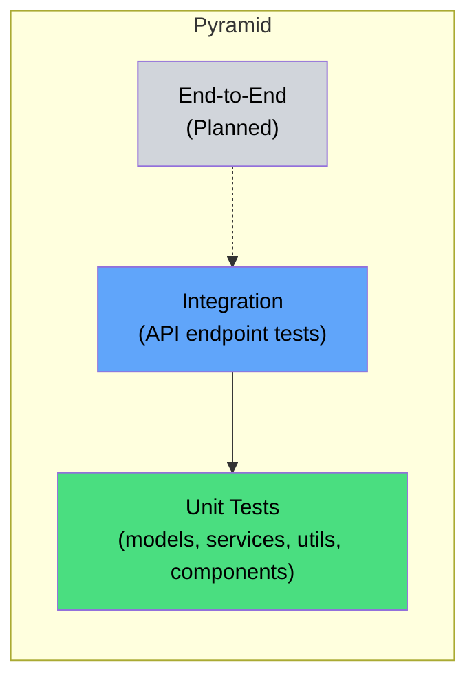

# Testing Strategy

> An overview of how (and why) we test the Morning Routine & Productivity
> Tracker  Efrom unit tests to security scans.

---

## Testing Pyramid



| Layer           | Backend                                       | Frontend                               | Status  |
| --------------- | --------------------------------------------- | -------------------------------------- | ------- |
| **Unit**        | Pydantic model validation, service CRUD logic | Utility functions, component rendering | Active  |
| **Integration** | FastAPI endpoint tests with mock Supabase     | API client behaviour (fetch mocking)   | Active  |
| **E2E**         |  E                                            |  E                                     | Planned |

---

## Test Stacks

### Backend

| Tool                   | Version   | Purpose                        |
| ---------------------- | --------- | ------------------------------ |
| **pytest**             | ^9.0.2    | Test runner                    |
| **pytest-asyncio**     | ^1.3.0    | Async test support             |
| **FastAPI TestClient** | (bundled) | HTTP integration tests         |
| **httpx**              | ^0.28.0   | HTTP client used by TestClient |

### Frontend

| Tool                          | Version       | Purpose                       |
| ----------------------------- | ------------- | ----------------------------- |
| **Jest**                      | (via Next.js) | Test runner                   |
| **@testing-library/react**    | (project dep) | Component rendering + queries |
| **@testing-library/jest-dom** | (project dep) | DOM assertion matchers        |
| **jsdom**                     | (Jest env)    | Browser-like environment      |

---

## Running Tests

### Backend

```bash
cd backend

# Run all tests (verbose)
poetry run pytest -v

# Run a specific file
poetry run pytest tests/api/test_routines.py -v

# Run a specific test class
poetry run pytest tests/models/test_models.py::TestMorningRoutineModels -v

# Run with coverage
poetry run pytest --cov=app --cov-report=term-missing
```

### Frontend

```bash
cd frontend

# Run all tests
npm test

# Run with coverage
npm test -- --coverage

# Run in watch mode (development)
npm test -- --watch

# Run a specific file
npm test -- src/__tests__/lib/utils.test.ts
```

---

## Test Directory Structure

```
backend/tests/
├── conftest.py              # Shared fixtures, mock Supabase
├── test_mock_supabase.py    # Tests for the mock itself
├── api/
━E  ├── test_main.py         # Health, docs, CORS, exception handler
━E  ├── test_routines.py     # /api/routines CRUD endpoints
━E  ├── test_productivity.py # /api/productivity CRUD endpoints
━E  └── test_analytics.py    # /api/analytics endpoints
├── models/
━E  └── test_models.py       # Pydantic model validation
└── services/
    ├── test_routine_service.py      # RoutineService logic
    └── test_productivity_service.py # ProductivityService logic

frontend/src/
├── test-utils.tsx                   # Custom render, data factories
└── __tests__/
    ├── components/
    ━E  └── StatsCard.test.tsx       # UI component tests
    └── lib/
        ├── api.test.ts              # API client tests
        └── utils.test.ts            # Utility function tests
```

---

## Mocking Philosophy

### Backend  EMock Supabase, Not the Service Layer

We mock at the **Supabase client boundary**, not inside the service layer.
This means:

- Tests exercise the real `RoutineService` / `ProductivityService` code.
- The mock simulates Supabase's query builder pattern (`.table().select().eq().execute()`).
- Endpoint tests use FastAPI's **dependency override** to swap
  `get_current_user` and `get_user_supabase` with mock replacements.

### Frontend  EMock Fetch, Not Components

- **API tests** mock `global.fetch` to verify request construction and
  response handling without a running server.
- **Component tests** use `@testing-library/react` to render components in
  jsdom, asserting on DOM output and user interactions.
- **Next.js APIs** (`useRouter`, `Image`) are mocked globally in
  `jest.setup.ts`.

---

## Quality Gates (CI)

Every push and PR triggers these checks (see
[../07-Operations/02-CI-CD.md](../07-Operations/02-CI-CD.md)):

| Check         | Backend                    | Frontend                                   |
| ------------- | -------------------------- | ------------------------------------------ |
| Lint          | `ruff check .`             | `npm run lint`                             |
| Format        | `ruff format --check .`    | (included in lint)                         |
| Type check    | (mypy  Eavailable locally) | `npx tsc --noEmit`                         |
| Tests         | `poetry run pytest -v`     | `npm test -- --coverage --passWithNoTests` |
| Security scan | Trivy (filesystem)         | Trivy (filesystem)                         |

All checks must pass before a PR can merge.

---

## Coverage

### Backend

No formal coverage threshold is enforced yet. To see coverage locally:

```bash
poetry run pytest --cov=app --cov-report=html
open htmlcov/index.html
```

### Frontend

Jest is configured with relaxed thresholds for the initial test setup:

```json
{
  "coverageThreshold": {
    "global": {
      "branches": 5,
      "functions": 5,
      "lines": 5,
      "statements": 5
    }
  }
}
```

Coverage reports are generated in `frontend/coverage/` during CI runs.

---

## Adding New Tests

1. **Follow the existing pattern**  Elook at a neighbouring test file for
   the fixture and assertion style.
2. **Name tests descriptively**  E`test_create_routine_invalid_mood` beats
   `test_create_3`.
3. **One concern per test**  Etest a single behaviour, not an entire flow.
4. **Use data factories**  E`createMockRoutine()` (frontend) and the
   `sample_routine` fixture (backend) keep test data consistent.

---

## Related Docs

| Topic                   | Link                                                   |
| ----------------------- | ------------------------------------------------------ |
| Backend test details    | [Backend-Tests.md](02-Backend-Tests.md)                   |
| Frontend test details   | [Frontend-Tests.md](03-Frontend-Tests.md)                 |
| Linting & quality tools | [Linting-and-Quality.md](04-Linting-and-Quality.md)       |
| CI / CD pipeline        | [../07-Operations/02-CI-CD.md](../07-Operations/02-CI-CD.md) |
