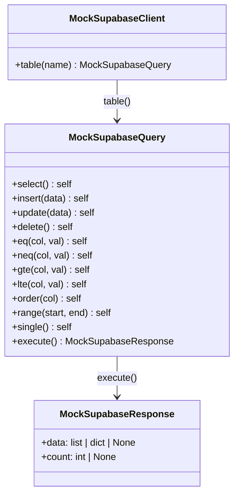

# Backend Tests

> How the backend test suite is structured, how mocking works, and what each
> test file covers.

---

## Configuration

### `pyproject.toml`

```toml
[tool.pytest.ini_options]
asyncio_mode = "auto"
testpaths = ["tests"]
```

- **`asyncio_mode = "auto"`**  — pytest-asyncio automatically handles async
  test functions without requiring an explicit `@pytest.mark.asyncio`
  decorator.
- **`testpaths`**  — pytest only scans the `tests/` directory.

### Running

```bash
cd backend

poetry run pytest -v                 # All tests, verbose
poetry run pytest tests/api/ -v      # Only API tests
poetry run pytest -k "test_create"   # Tests matching a keyword
poetry run pytest --cov=app          # With coverage
```

---

## Mock Supabase Infrastructure

The test suite **never** calls a real Supabase instance. Instead,
[tests/conftest.py](../../backend/tests/conftest.py) provides a set of mock
classes that replicate the Supabase query builder chain.

### Class Hierarchy



### Key Behaviours

| Method                                 | Mock Behaviour                                                     |
| -------------------------------------- | ------------------------------------------------------------------ |
| `select()`, `eq()`, `gte()`, etc.      | Return `self` (fluent chaining)                                    |
| `insert(data)`                         | Stamps `id`, `created_at`, `updated_at` onto the input dict        |
| `single()`                             | Marks the query; `execute()` returns `data` as a dict (not a list) |
| `execute()` (without `single()`)       | Returns `data` as a list                                           |
| `execute()` (with `single()`, no data) | Returns `data = None`                                              |

### Test for the Mock Itself

[tests/test_mock_supabase.py](../../backend/tests/test_mock_supabase.py)
verifies that the mock accurately simulates Supabase's `single()` vs list
behaviour  — a safety net that prevents false-positive test results.

---

## Shared Fixtures (`conftest.py`)

| Fixture                   | Type                 | Description                                         |
| ------------------------- | -------------------- | --------------------------------------------------- |
| `mock_supabase`           | `MockSupabaseClient` | Empty client (no data)                              |
| `mock_supabase_with_data` | `MockSupabaseClient` | Pre-loaded with `sample_routine`                    |
| `sample_routine`          | `dict`               | A complete morning routine record                   |
| `sample_productivity`     | `dict`               | A complete productivity record                      |
| `auth_headers`            | `dict`               | `{"Authorization": "Bearer test-token-123"}`        |
| `client`                  | `TestClient`         | FastAPI client with auth + empty Supabase overrides |
| `client_with_data`        | `TestClient`         | FastAPI client with auth + sample routine data      |

### Test User

```python
TEST_USER_ID = "test-user-123"
TEST_USER = {
    "id": TEST_USER_ID,
    "email": "test@example.com",
    "created_at": "2024-01-01T00:00:00Z",
}
```

### Dependency Overrides

Every test client swaps two FastAPI dependencies:

```python
app.dependency_overrides[get_current_user] = lambda: TEST_USER
app.dependency_overrides[get_user_supabase] = lambda: MockSupabaseClient(...)
```

This removes the need for a real JWT or Supabase connection.

---

## Test Files

### `tests/api/test_main.py`  — App-Level Tests

| Test Class                   | # Tests | What It Covers                                                                            |
| ---------------------------- | ------: | ----------------------------------------------------------------------------------------- |
| `TestHealthEndpoints`        |       4 | `GET /`, `GET /health`, `/docs`, `/redoc` accessible                                      |
| `TestProductionDocsDisabled` |       2 | Docs return 404 when `ENVIRONMENT=production`; root endpoint hides docs link              |
| `TestExceptionHandler`       |       1 | Unhandled exceptions return JSON `500`, not HTML                                          |
| `TestCorsOriginsParsing`     |       3 | `Settings.get_cors_origins_list()` handles plain, comma-separated, and JSON array origins |

Uses `importlib.reload(main_module)` with patched settings to toggle between
development and production configuration within the same test session.

### `tests/api/test_routines.py`  — Routines CRUD

| Test                                          | Endpoint                               | Expected                    |
| --------------------------------------------- | -------------------------------------- | --------------------------- |
| `test_list_routines_success`                  | `GET /api/routines`                    | 200, paginated response     |
| `test_list_routines_empty`                    | `GET /api/routines`                    | 200, empty data + total 0   |
| `test_list_routines_with_pagination`          | `GET /api/routines?page=1&page_size=5` | Pagination params respected |
| `test_list_routines_with_date_filter`         | `GET /api/routines?start_date=...`     | 200                         |
| `test_get_routine_success`                    | `GET /api/routines/:id`                | 200                         |
| `test_get_routine_not_found`                  | `GET /api/routines/:id`                | 404                         |
| `test_create_routine_success`                 | `POST /api/routines`                   | 201                         |
| `test_create_routine_invalid_mood`            | `POST /api/routines`                   | 422 (mood > 10)             |
| `test_create_routine_invalid_sleep_duration`  | `POST /api/routines`                   | 422 (sleep > 24)            |
| `test_create_routine_missing_required_fields` | `POST /api/routines`                   | 422                         |
| `test_update_routine_success`                 | `PUT /api/routines/:id`                | 200                         |
| `test_update_routine_not_found`               | `PUT /api/routines/:id`                | 404                         |
| `test_delete_routine_success`                 | `DELETE /api/routines/:id`             | 204                         |
| `test_delete_routine_not_found`               | `DELETE /api/routines/:id`             | 404                         |

### `tests/api/test_productivity.py`  — Productivity CRUD

Mirrors the routines test structure for `/api/productivity`:

- List (success, empty, pagination), Get (success, not found)
- Create (success, with routine link, invalid score, negative tasks, missing required)
- Update (success, not found), Delete (success, not found)

### `tests/api/test_analytics.py`  — Analytics

| Test                                | Endpoint                         | Expected             |
| ----------------------------------- | -------------------------------- | -------------------- |
| `test_get_summary_success`          | `GET /api/analytics/summary`     | 200                  |
| `test_get_summary_empty`            | `GET /api/analytics/summary`     | 200 (graceful empty) |
| `test_get_summary_with_date_filter` | `GET /api/analytics/summary?...` | 200                  |
| `test_get_charts_success`           | `GET /api/analytics/charts`      | 200, returns list    |
| `test_get_charts_empty`             | `GET /api/analytics/charts`      | 200, empty list      |
| `test_get_charts_with_date_filter`  | `GET /api/analytics/charts?...`  | 200                  |

### `tests/models/test_models.py`  — Pydantic Validation

**`TestMorningRoutineModels`** (14 tests):

- Valid creation, defaults, mood boundaries (too high / too low),
  sleep duration (> 24, negative), negative exercise, invalid/valid
  breakfast quality enum, partial update, full update, full model.

**`TestProductivityModels`** (13 tests):

- Valid creation, routine link, defaults, score boundaries
  (too high / too low), invalid energy/stress levels, negative tasks,
  negative focus hours, partial update, full model, boundary values (1 and 10).

### `tests/services/test_routine_service.py`  — RoutineService

| Test                                    | What It Verifies                           |
| --------------------------------------- | ------------------------------------------ |
| `test_list_returns_paginated_response`  | Response has `data`, `total`, `page`, etc. |
| `test_list_with_pagination_params`      | `page` and `page_size` are respected       |
| `test_list_with_date_filters`           | Date filters don't crash                   |
| `test_list_calculates_total_pages`      | Correct ceiling division                   |
| `test_get_returns_routine_data`         | Found record returned                      |
| `test_get_returns_none_for_missing`     | `None` for missing ID                      |
| `test_create_routine`                   | Insert returns dict with `id`              |
| `test_update_routine`                   | Update returns data                        |
| `test_update_returns_none_for_missing`  | `None` for missing ID                      |
| `test_delete_routine`                   | Returns `bool`                             |
| `test_delete_returns_false_for_missing` | `False` for missing ID                     |
| `test_service_uses_correct_table`       | `service.table == "morning_routines"`      |

### `tests/services/test_productivity_service.py`  — ProductivityService

Same pattern as RoutineService tests, targeting `productivity_entries` table.
Adds `test_service_stores_user_id` to verify constructor state.

---

## Writing a New Backend Test

1. **Choose the right level**  — model validation ↁE`tests/models/`,
   service logic ↁE`tests/services/`, HTTP endpoint ↁE`tests/api/`.
2. **Use a fixture for data**  — define it in the test class or in `conftest.py`
   if it's shared.
3. **Override dependencies**  — swap `get_current_user` and
   `get_user_supabase` to control auth and data.
4. **Assert status codes and response shape**  — don't assert on mock internals.

```python
def test_example(self, client_with_routines: TestClient) -> None:
    """Describe the exact behaviour under test."""
    response = client_with_routines.get("/api/routines")

    assert response.status_code == 200
    assert "data" in response.json()
```

---

## Related Docs

| Topic             | Link                                                   |
| ----------------- | ------------------------------------------------------ |
| Testing strategy  | [Testing-Strategy.md](01-Testing-Strategy.md)             |
| Frontend tests    | [Frontend-Tests.md](03-Frontend-Tests.md)                 |
| Linting & quality | [Linting-and-Quality.md](04-Linting-and-Quality.md)       |
| Backend services  | [../05-Backend/04-Services.md](../05-Backend/04-Services.md) |
| Backend models    | [../05-Backend/03-Models.md](../05-Backend/03-Models.md)     |
