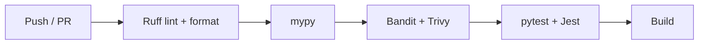

# Linting & Code Quality

> Configuration and usage of the static analysis, formatting, and security
> scanning tools used across the stack.

---

## Backend Tools

### Ruff  — Linter & Formatter

Ruff replaces Flake8, isort, and Black with a single, fast Rust-based tool.

**Configuration** (from `pyproject.toml`):

```toml
[tool.ruff]
target-version = "py310"
line-length = 100

[tool.ruff.lint]
select = [
  "E",    # pycodestyle errors
  "W",    # pycodestyle warnings
  "F",    # pyflakes
  "I",    # isort (import sorting)
  "N",    # pep8-naming
  "UP",   # pyupgrade
  "B",    # flake8-bugbear
  "SIM",  # flake8-simplify
  "TCH",  # flake8-type-checking
  "RUF",  # ruff-specific rules
]
ignore = [
  "E501",    # Line too long  — formatter handles it
  "B008",    # Function call in default argument (FastAPI Depends pattern)
  "TCH001",  # Move import into TYPE_CHECKING block
  "TCH002",  # Move third-party import into TYPE_CHECKING block
  "TCH003",  # Move stdlib import into TYPE_CHECKING block
]

[tool.ruff.lint.per-file-ignores]
"tests/**/*.py" = ["S101"]   # Allow assert in tests

[tool.ruff.format]
quote-style = "double"
indent-style = "space"
skip-magic-trailing-comma = false
line-ending = "auto"
```

**Commands:**

```bash
cd backend

ruff check .              # Lint
ruff check . --fix        # Lint + auto-fix
ruff format .             # Format all files
ruff format . --check     # Verify formatting (CI)
```

### mypy  — Static Type Checking

```toml
[tool.mypy]
python_version = "3.12"
warn_return_any = true
warn_unused_configs = true
disallow_untyped_defs = true
disallow_incomplete_defs = true
check_untyped_defs = true
no_implicit_optional = true
strict_equality = true
plugins = ["pydantic.mypy", "fastapi.mypy"]

[[tool.mypy.overrides]]
module = "tests.*"
disallow_untyped_defs = false    # Relax strictness for tests
```

Key strictness flags:

| Flag                    | Effect                                                     |
| ----------------------- | ---------------------------------------------------------- |
| `disallow_untyped_defs` | Every function must have type annotations                  |
| `no_implicit_optional`  | `Optional[X]` must be explicit, not inferred from `= None` |
| `strict_equality`       | Prevents comparing unrelated types with `==`               |
| `warn_return_any`       | Flags functions that implicitly return `Any`               |

Plugins provide deeper understanding of Pydantic models and FastAPI
dependency injection.

```bash
cd backend

mypy app/              # Check application code
mypy app/ tests/       # Check everything
```

### Bandit  — Security Scanning

```toml
[tool.bandit]
exclude_dirs = ["tests"]
skips = ["B101"]           # Skip assert warnings (used in non-test code sparingly)
```

Bandit scans for common Python security issues: hard-coded passwords,
insecure hash functions, shell injection risks, etc.

```bash
cd backend

bandit -r app/ -c pyproject.toml
```

---

## Frontend Tools

### ESLint

Configured via [eslint.config.mjs](../../frontend/eslint.config.mjs) and
extends the Next.js recommended ruleset.

```bash
cd frontend

npx next lint            # Lint src/ and pages/
npx next lint --fix      # Auto-fix where possible
```

### TypeScript Compiler

Strict mode is enabled in `tsconfig.json`:

```jsonc
{
  "compilerOptions": {
    "strict": true,
    "noEmit": true,
    // ...
  },
}
```

Type-checking runs during the build and can be executed independently:

```bash
cd frontend

npx tsc --noEmit         # Type-check without emitting files
```

---

## Pre-Commit Hooks

The backend uses **pre-commit** to run checks before every commit.

```bash
cd backend

pre-commit install              # One-time setup
pre-commit run --all-files      # Manual full run
```

Typical hook chain:

```
1. ruff check --fix      (lint + auto-fix)
2. ruff format            (format)
3. mypy                   (type-check)
4. bandit                 (security scan)
```

---

## CI Integration

All quality gates are enforced in the GitHub Actions CI pipeline.



| Check      | Backend                  | Frontend              |
| ---------- | ------------------------ | --------------------- |
| Lint       | `ruff check .`           | `npx next lint`       |
| Format     | `ruff format . --check`  |  — (Prettier optional) |
| Type-check | `mypy app/`              | `npx tsc --noEmit`    |
| Security   | `bandit -r app/` + Trivy | Trivy                 |
| Tests      | `pytest`                 | `npm test`            |

A PR cannot merge until every check passes.

---

## Quick Reference

| Task                     | Command                            |
| ------------------------ | ---------------------------------- |
| Lint backend             | `ruff check .`                     |
| Format backend           | `ruff format .`                    |
| Type-check backend       | `mypy app/`                        |
| Security scan backend    | `bandit -r app/ -c pyproject.toml` |
| Lint frontend            | `npx next lint`                    |
| Type-check frontend      | `npx tsc --noEmit`                 |
| Run all pre-commit hooks | `pre-commit run --all-files`       |

---

## Related Docs

| Topic              | Link                                                         |
| ------------------ | ------------------------------------------------------------ |
| Testing strategy   | [Testing-Strategy.md](01-Testing-Strategy.md)                   |
| Backend tests      | [Backend-Tests.md](02-Backend-Tests.md)                         |
| Frontend tests     | [Frontend-Tests.md](03-Frontend-Tests.md)                       |
| CI / CD pipeline   | [../07-Operations/02-CI-CD.md](../07-Operations/02-CI-CD.md)       |
| Security practices | [../07-Operations/04-Security.md](../07-Operations/04-Security.md) |
