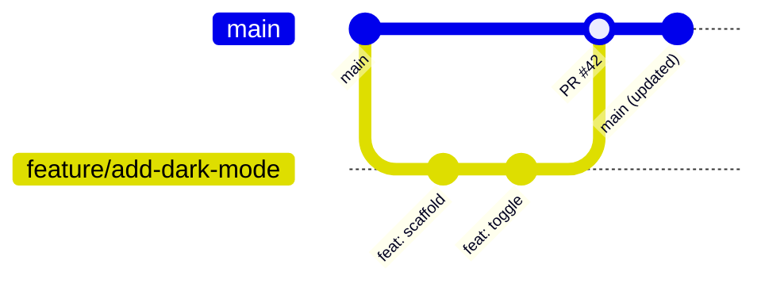

# Contributing Guide

> Everything a new contributor needs to know  Efrom forking to merging.

---

## Prerequisites

| Tool    | Version | Purpose                      |
| ------- | ------- | ---------------------------- |
| Node.js | 22 +    | Frontend runtime             |
| Python  | 3.12 +  | Backend runtime              |
| Poetry  | latest  | Python dependency management |
| Git     | latest  | Version control              |

---

## Fork ↁEClone ↁEConfigure

```bash
# 1. Fork on GitHub, then clone your fork
git clone https://github.com/YOUR_USERNAME/morning-routine-productivity.git
cd morning-routine-productivity

# 2. Add the upstream remote
git remote add upstream https://github.com/ORIGINAL_OWNER/morning-routine-productivity.git
```

### Frontend

```bash
cd frontend
npm install
cp .env.example .env.local
# Edit .env.local with your Supabase credentials
```

### Backend

```bash
cd ../backend
poetry install
cp .env.example .env
# Edit .env with your Supabase credentials
```

### Pre-Commit Hooks

```bash
# Activate the backend virtual environment first
# Windows:
backend\.venv\Scripts\Activate.ps1
# macOS / Linux:
source backend/.venv/bin/activate

pre-commit install
pre-commit install --hook-type commit-msg
```

### Database

1. Create a Supabase project at <https://supabase.com>.
2. Run the SQL scripts in the `/database` folder.

> For a more detailed walkthrough, see
> [01-Getting-Started / Local-Setup.md](../01-Getting-Started/01-Local-Setup.md).

---

## Branching Model



### Branch Prefixes

| Prefix      | Use Case                             | Example                     |
| ----------- | ------------------------------------ | --------------------------- |
| `feature/`  | New functionality                    | `feature/add-dark-mode`     |
| `fix/`      | Bug fixes                            | `fix/login-redirect`        |
| `docs/`     | Documentation only                   | `docs/update-api-guide`     |
| `refactor/` | Structural changes, no new behaviour | `refactor/extract-service`  |
| `test/`     | Test additions or updates            | `test/analytics-edge-cases` |

### Creating a Branch

```bash
git fetch upstream
git checkout main
git merge upstream/main

git checkout -b feature/your-feature-name
```

---

## Commit Conventions

We follow [Conventional Commits](https://www.conventionalcommits.org/):

```
<type>(<scope>): <short description>

[optional body]

[optional footer]
```

### Allowed Types

| Type       | Meaning                                  |
| ---------- | ---------------------------------------- |
| `feat`     | New feature                              |
| `fix`      | Bug fix                                  |
| `docs`     | Documentation only                       |
| `style`    | Formatting  Eno logic change             |
| `refactor` | Code restructuring  Eno behaviour change |
| `test`     | Adding or updating tests                 |
| `chore`    | Tooling, dependencies, CI maintenance    |

### Examples

```
feat(dashboard): add weekly summary chart
fix(auth): resolve token refresh loop
docs(readme): update setup instructions
chore(deps): update fastapi to 0.128.0
```

---

## Coding Standards

### Frontend (TypeScript / React)

- Functional components with hooks
- TypeScript strict mode  Eavoid `any`
- Follow the ESLint config
- Tailwind CSS for styling
- Small, focused components

```tsx
// Preferred
const UserCard: React.FC<UserCardProps> = ({ user }) => (
  <div className="rounded-lg p-4 shadow">
    <h2>{user.name}</h2>
  </div>
);
```

### Backend (Python / FastAPI)

- PEP 8 via Ruff
- Type hints on every function
- Pydantic models for validation
- Keep functions small and single-purpose

```python
async def get_user(user_id: str) -> UserResponse:
    """Retrieve a user by ID."""
    user = await user_service.get(user_id)
    if not user:
        raise HTTPException(status_code=404, detail="User not found")
    return user
```

> Full linting and quality tool docs:
> [08-Testing / Linting-and-Quality.md](../08-Testing/04-Linting-and-Quality.md)

---

## Running Checks Locally

```bash
# Pre-commit (recommended  Eruns everything)
pre-commit run --all-files

# Frontend
cd frontend
npm run lint
npx tsc --noEmit
npm test

# Backend
cd backend
ruff check .
ruff format . --check
mypy app/
pytest -v
```

---

## Pull Request Workflow

### 1. Rebase on `main`

```bash
git fetch upstream
git rebase upstream/main
```

### 2. Run All Checks

```bash
pre-commit run --all-files
cd frontend && npm run build
cd ../backend && pytest
```

### 3. Push & Open the PR

```bash
git push origin feature/your-feature-name
```

- Use the [PR template](../../.github/pull_request_template.md).
- Link related issues (`Closes #123`).
- Add screenshots for any UI changes.
- Request a review.

### 4. Address Feedback

- Push additional commits to the same branch.
- Re-request review once resolved.

### PR Checklist

- [ ] Code follows the project style guidelines
- [ ] Self-reviewed the diff
- [ ] Added or updated tests
- [ ] Updated relevant documentation
- [ ] No new warnings
- [ ] All CI checks pass

---

## Release Labels

The project uses GitHub release categories driven by labels:

| Label                    | Category      |
| ------------------------ | ------------- |
| `feature`, `enhancement` | Features      |
| `fix`, `bugfix`, `bug`   | Bug Fixes     |
| `documentation`, `docs`  | Documentation |
| `chore`, `maintenance`   | Maintenance   |

Labels marked `ignore-for-release` are excluded from the changelog.

---

## Questions?

Open a GitHub issue  Ewe're happy to help.

---

## Related Docs

| Topic                | Link                                                                         |
| -------------------- | ---------------------------------------------------------------------------- |
| Code of conduct      | [Code-of-Conduct.md](01-Code-of-Conduct.md)                                     |
| Issue & PR templates | [Issue-and-PR-Templates.md](03-Issue-and-PR-Templates.md)                       |
| Security policy      | [Security-Policy.md](04-Security-Policy.md)                                     |
| Local setup          | [../01-Getting-Started/01-Local-Setup.md](../01-Getting-Started/01-Local-Setup.md) |
| Linting & quality    | [../08-Testing/04-Linting-and-Quality.md](../08-Testing/04-Linting-and-Quality.md) |
