# Architecture Documentation

This document describes the system architecture, technology choices, and design decisions for the Morning Routine & Productivity Tracker.

---

## 🏗️ System Architecture Overview

```mermaid
flowchart TB
    subgraph CLIENT["CLIENT LAYER"]
        direction TB
        Browser["Web Browser<br/>(Desktop/Tablet)"]
        subgraph Assets["Application Assets"]
            Static["Static Assets"]
            JS["JavaScript Bundle"]
            React["React Application<br/>(Next.js App Router)"]
        end
    end

    subgraph SERVICES["SERVICE LAYER"]
        direction TB
        subgraph Backend["Backend Layer (AWS)"]
            APIGW["API Gateway<br/>HTTP API V2"]
            Lambda["AWS Lambda<br/>Python 3.12"]
            FastAPI["FastAPI App<br/>API Router<br/>Services<br/>Auth Middleware"]
            MangumAdapter["Mangum Adapter<br/>ASGI → Lambda"]
        end
        subgraph Auth["Auth Layer"]
            SupaAuth["Supabase Auth<br/>JWT Token Generation<br/>Session Management"]
        end
        subgraph Hosting["Frontend Hosting"]
            Vercel["Vercel Edge Network<br/>SSR/SSG<br/>CDN Cache<br/>Edge Functions"]
        end
    end

    subgraph DATABASE["DATABASE LAYER"]
        direction TB
        subgraph Supabase["Supabase PostgreSQL"]
            Tables["user_profiles | morning_routines | productivity_entries<br/>user_settings | user_goals"]
            RLS["Row-Level Security (RLS) Policies"]
        end
    end

    Browser --> |"HTTP/HTTPS<br/>(API Calls)"| APIGW
    APIGW --> Lambda
    Lambda --> MangumAdapter
    MangumAdapter --> FastAPI
    Browser --> |"WebSocket<br/>(Real-time)"| SupaAuth
    Browser --> |"HTTPS<br/>(Static)"| Vercel

    FastAPI --> Supabase
    SupaAuth --> Supabase
```



---

## 🛠️ Technology Stack

### Frontend

| Technology       | Version | Purpose                                  |
| ---------------- | ------- | ---------------------------------------- |
| **Next.js**      | 16.x    | React framework with App Router, SSR/SSG |
| **React**        | 19.x    | UI component library                     |
| **TypeScript**   | 5.7.x   | Type safety and developer experience     |
| **Tailwind CSS** | 4.x     | Utility-first CSS framework              |
| **Recharts**     | 2.x     | Data visualization library               |
| **Lucide React** | 0.5.x   | Icon library                             |

### Backend

| Technology          | Version | Purpose                                        |
| ------------------- | ------- | ---------------------------------------------- |
| **FastAPI**         | 0.115.x | High-performance API framework                 |
| **Python**          | 3.12+   | Programming language                           |
| **Pydantic**        | 2.x     | Data validation and serialization              |
| **Mangum**          | 0.21.x  | ASGI adapter for AWS Lambda                    |
| **Supabase Python** | 2.x     | Supabase client library                        |
| **Pandas**          | 2.x     | CSV parsing for data import                    |

### Database & Auth

| Technology             | Purpose                                   |
| ---------------------- | ----------------------------------------- |
| **Supabase**           | Backend-as-a-Service platform             |
| **PostgreSQL**         | Relational database (managed by Supabase) |
| **Row-Level Security** | Data isolation per user                   |
| **JWT Tokens**         | Stateless authentication                  |

### DevOps & Tooling

| Tool               | Purpose                                        |
| ------------------ | ---------------------------------------------- |
| **GitHub Actions** | CI/CD pipelines                                |
| **Vercel**         | Frontend deployment                            |
| **AWS Lambda**     | Backend compute (serverless)                   |
| **API Gateway**    | HTTP API V2 — routing, throttling, stages       |
| **AWS SAM**        | Infrastructure as Code for Lambda + API Gateway |
| **CloudWatch**     | Lambda log aggregation and monitoring          |
| **Docker**         | Local development & container builds           |
| **Pre-commit**     | Code quality hooks                             |
| **Ruff**           | Python linting and formatting                  |
| **ESLint**         | TypeScript/JavaScript linting                  |
| **Prettier**       | Code formatting                                |
| **Jest**           | Frontend testing                               |
| **Pytest**         | Backend testing                                |

---

## 📐 Design Principles

### 1. Separation of Concerns

The application follows a clean separation between layers:


### 2. Security First

- **JWT Authentication**: All API requests require valid tokens
- **Row-Level Security**: Database enforces user data isolation
- **Input Validation**: Pydantic models validate all inputs
- **CORS Configuration**: Restricted cross-origin requests

### 3. Type Safety

- **TypeScript**: Frontend uses strict typing
- **Pydantic**: Backend uses model validation
- **Shared Types**: Consistent data shapes across stack

### 4. Stateless Design

- **No Server Sessions**: JWT tokens carry all auth info
- **RLS-Enabled Queries**: Database handles authorization
- **Scalable Backend**: Stateless API supports horizontal scaling

---

## 📁 Directory Structure

### Frontend (`/frontend`)

```
frontend/
+-- src/
|   +-- app/                    # Next.js App Router
|   |   +-- layout.tsx          # Root layout with providers
|   |   +-- page.tsx            # Landing page
|   |   +-- auth/               # Authentication pages
|   |   |   +-- login/          # Login page
|   |   |   +-- signup/         # Signup page
|   |   +-- dashboard/          # Protected dashboard
|   |       +-- page.tsx        # Dashboard home
|   |       +-- entry/          # Manual data entry
|   |       +-- import/         # CSV import
|   |       +-- settings/       # User settings
|   +-- components/             # Reusable components
|   |   +-- charts/             # Recharts visualizations
|   |   +-- layout/             # Layout components
|   |   +-- ui/                 # UI primitives
|   +-- contexts/               # React contexts
|   |   +-- AuthContext.tsx     # Authentication state
|   +-- hooks/                  # Custom React hooks
|   |   +-- useApi.ts           # API interaction hooks
|   +-- lib/                    # Utilities
|   |   +-- api.ts              # API client
|   |   +-- supabase/           # Supabase clients
|   |   +-- utils.ts            # Helper functions
|   +-- types/                  # TypeScript definitions
|   |   +-- index.ts            # All type exports
|   +-- __tests__/              # Jest test files
+-- public/                     # Static assets
+-- next.config.ts              # Next.js configuration
+-- tailwind.config.ts          # Tailwind configuration
+-- tsconfig.json               # TypeScript configuration
+-- jest.config.ts              # Jest configuration
```

### Backend (`/backend`)

```
backend/
+-- app/
|   +-- __init__.py
|   +-- main.py                 # FastAPI application entry + Mangum handler
|   +-- api/                    # API route modules
|   |   +-- __init__.py         # Router aggregation
|   |   +-- users.py            # User endpoints
|   |   +-- routines.py         # Routine endpoints
|   |   +-- productivity.py     # Productivity endpoints
|   |   +-- analytics.py        # Analytics endpoints
|   |   +-- import_data.py      # CSV import endpoint
|   +-- core/                   # Core utilities
|   |   +-- __init__.py
|   |   +-- config.py           # Configuration settings (env var parsing)
|   |   +-- auth.py             # JWT authentication via Supabase
|   |   +-- supabase.py         # Supabase client setup
|   +-- models/                 # Pydantic models
|   |   +-- __init__.py         # All model exports
|   |   +-- routine.py          # Morning routine models
|   |   +-- productivity.py     # Productivity models
|   |   +-- user.py             # User-related models
|   |   +-- analytics.py        # Analytics models
|   |   +-- common.py           # Shared models
|   +-- services/               # Business logic
|       +-- __init__.py
|       +-- routine_service.py
|       +-- productivity_service.py
|       +-- user_service.py
|       +-- analytics_service.py
+-- tests/                      # Pytest test files
+-- template.yaml               # AWS SAM template (Lambda + API Gateway)
+-- samconfig.toml              # SAM deploy config per environment
+-- requirements.txt            # Production deps for Lambda packaging
+-- .samignore                  # Files excluded from Lambda package
+-- pyproject.toml              # Python dependencies (Poetry)
+-- poetry.lock                 # Locked dependencies
```

---

## 🔐 Security Architecture

### Authentication Flow


### Row-Level Security (RLS)

Every table has RLS policies ensuring users can only access their own data:

```sql
-- Example: Users can only view their own routines
CREATE POLICY "Users can view own routines"
    ON morning_routines FOR SELECT
    USING (auth.uid() = user_id);
```

---

## 🔄 Data Flow Architecture

### Read Path (GET request)


### Write Path (POST request)


---

## 🚀 Deployment Architecture

### Production Environment

```mermaid
flowchart TB
    Internet["INTERNET"]

    subgraph Frontend["Frontend (Vercel)"]
        VercelEdge["Vercel Edge<br/>CDN Cache<br/>SSR/SSG<br/>Edge Functions"]
    end

    subgraph Backend["Backend (AWS)"]
        direction TB
        APIGW["API Gateway HTTP API V2<br/>Stage-based routing<br/>e.g. /development, /staging"]
        Lambda["AWS Lambda (Python 3.12)<br/>256 MB · 30 s timeout<br/>Auto-scaling · Pay-per-use"]
        Mangum["Mangum Adapter<br/>ASGI → Lambda event translation<br/>Stage prefix stripping"]
        FastAPIApp["FastAPI Application<br/>CORS Middleware<br/>Request Logging<br/>Auth + Services"]
        CW["CloudWatch Logs<br/>14-day retention<br/>Structured logging"]
    end

    subgraph Database["Database (Supabase)"]
        Supabase["Supabase Managed<br/>PostgreSQL<br/>Auth<br/>Storage"]
    end

    Internet --> VercelEdge
    Internet --> APIGW
    APIGW --> Lambda
    Lambda --> Mangum
    Mangum --> FastAPIApp
    Lambda -.->|"logs"| CW
    FastAPIApp --> Supabase
    VercelEdge -.->|"API Calls"| APIGW
```



### Lambda Request Lifecycle


### Infrastructure as Code (SAM)

The backend infrastructure is defined in `backend/template.yaml` using AWS SAM.
This template provisions:

| Resource               | Type                          | Purpose                                    |
| ---------------------- | ----------------------------- | ------------------------------------------ |
| `MorningRoutineFunction` | `AWS::Serverless::Function` | Lambda function running FastAPI via Mangum  |
| `HttpApi`              | `AWS::Serverless::HttpApi`    | API Gateway HTTP API with stage routing    |
| `MorningRoutineFunctionLogGroup` | `AWS::Logs::LogGroup` | CloudWatch log group with 14-day retention   |

Deploy configuration per environment is stored in `backend/samconfig.toml`:

| Environment   | Stack Name                   | Notes                              |
| ------------- | ---------------------------- | ---------------------------------- |
| `development` | `morning-routine-api-dev`    | Default config (`sam deploy`)      |
| `staging`     | `morning-routine-api-staging`| `sam deploy --config-env staging`  |
| `production`  | `morning-routine-api-prod`   | `sam deploy --config-env prod`     |

### CORS Strategy

CORS is handled entirely by FastAPI's `CORSMiddleware` (not API Gateway) because
HTTP API V2 does not support wildcard subdomains in `AllowOrigins`. This gives us:

- **Exact origin matching** via `CORS_ORIGINS` env var (comma-separated or JSON array)
- **Regex pattern matching** via `CORS_ORIGIN_REGEX` for Vercel preview deploys
- **Full header control** including `Authorization` and `Content-Type`

### Observability

The Lambda function uses a named Python logger (`morning_routine`) with a
`StreamHandler` so logs appear in CloudWatch. Key log events:

- **App initialization** — environment, CORS origins, regex pattern
- **Request/response** — method, path, origin, status code, latency
- **Authentication** — token validation (prefix, length), success/failure details
- **Unhandled exceptions** — full traceback for debugging

### Local Development


---

## 📈 Scalability Considerations

### Frontend Scalability

- **CDN Distribution**: Static assets cached globally via Vercel Edge
- **Server Components**: Reduce client-side JavaScript
- **Code Splitting**: Automatic chunking by Next.js

### Backend Scalability

- **Stateless Design**: Any Lambda invocation can handle any request
- **Auto-scaling**: Lambda scales automatically with traffic
- **Connection Pooling**: Supabase manages database connections
- **Cold Start Optimization**: 256 MB memory, Python 3.12 for fast startup

### Database Scalability

- **Indexes**: Optimized queries on common access patterns
- **Partitioning**: Can partition by date for large datasets
- **Read Replicas**: Supabase supports read replicas for scale

---

## ⚠️ Error Handling Strategy

### Frontend Errors

```typescript
// Structured error handling in hooks
// Uses name-based check instead of instanceof because
// Next.js Turbopack/webpack can duplicate class identities
// across chunk boundaries, making instanceof unreliable.
import { getApiErrorMessage } from '@/lib/api';

try {
  const data = await api.routines.list(token);
  setData(data);
} catch (err) {
  setError(getApiErrorMessage(err, 'An unexpected error occurred'));
}
```

### Backend Errors

```python
# HTTP exceptions with proper status codes
raise HTTPException(
    status_code=status.HTTP_404_NOT_FOUND,
    detail="Routine not found",
)
```

### Authentication Errors

The backend provides user-friendly auth error messages based on error type:

```python
# Token expired
{"detail": "Token expired — please sign in again"}

# Invalid signature
{"detail": "Invalid token — please sign in again"}

# Generic auth failure
{"detail": "Authentication failed — please sign in again"}
```

### Database Errors

- Caught at service layer
- Transformed into appropriate HTTP responses
- Logged for debugging (without sensitive data)

---

## 📚 Related Documentation

- [API Reference](./API.md) - Detailed API documentation
- [System Flows](./SYSTEM_FLOWS.md) - User action flow diagrams
- [Database Schema](./DATABASE.md) - Database design details
- [Frontend Guide](./FRONTEND.md) - Frontend architecture details
- [Development Guide](./DEVELOPMENT.md) - Setup and contribution
