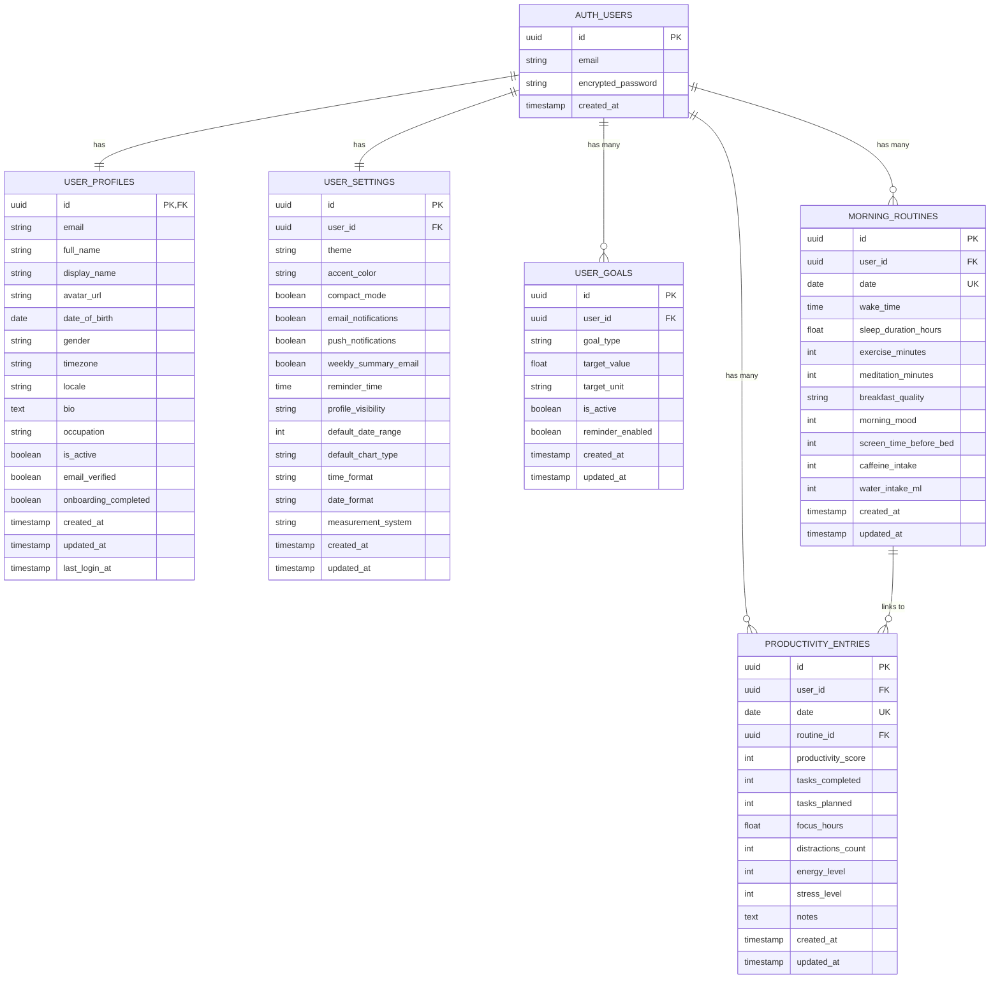
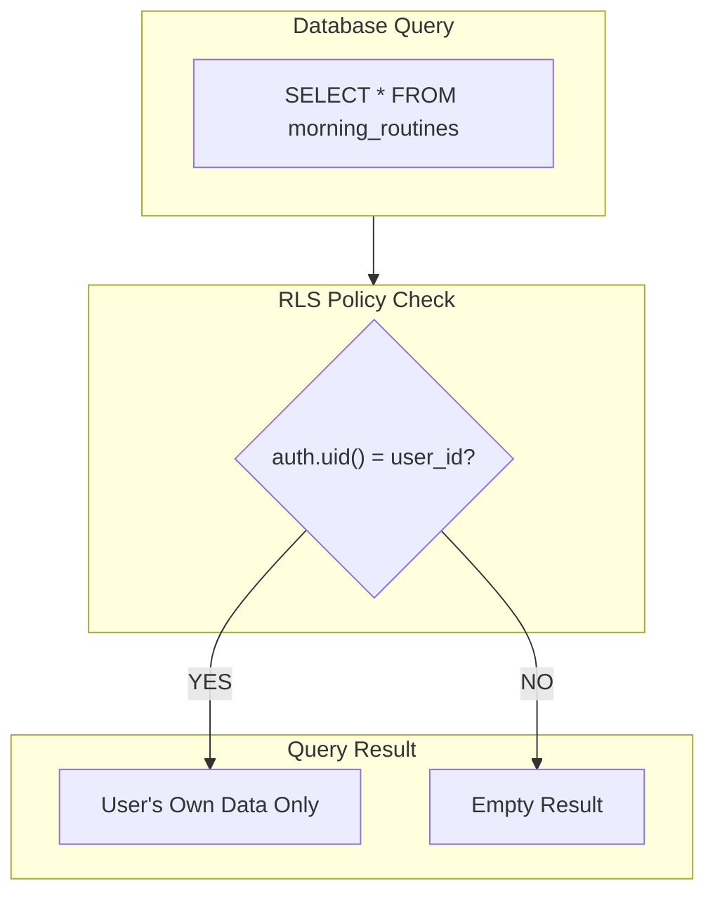

# Database Schema Documentation

This document provides comprehensive documentation of the database schema, relationships, constraints, and security policies for the Morning Routine & Productivity Tracker.

---

## 📚 Table of Contents

- [Overview](#overview)
- [Entity Relationship Diagram](#entity-relationship-diagram)
- [Tables](#tables)
  - [user_profiles](#user_profiles)
  - [user_settings](#user_settings)
  - [user_goals](#user_goals)
  - [morning_routines](#morning_routines)
  - [productivity_entries](#productivity_entries)
- [Indexes](#indexes)
- [Triggers](#triggers)
- [Row-Level Security](#row-level-security)
- [Data Types Reference](#data-types-reference)

---

## 🔍 Overview

### Database Platform

- **Provider:** Supabase (managed PostgreSQL)
- **Version:** PostgreSQL 15+
- **Extensions:** `uuid-ossp` (UUID generation)

### Design Principles

1. **User Isolation** - All data is scoped to individual users via RLS
2. **Referential Integrity** - Foreign keys with appropriate cascade rules
3. **Audit Trail** - Automatic `created_at` and `updated_at` timestamps
4. **Normalization** - Separate tables for profiles, settings, and goals
5. **Constraints** - Data validation at database level

---

## 📊 Entity Relationship Diagram



---

## 🗃️ Tables

### user_profiles

Stores user profile information. Created automatically via trigger when a user signs up.

| Column                 | Type         | Nullable | Default | Description                            |
| ---------------------- | ------------ | -------- | ------- | -------------------------------------- |
| `id`                   | UUID         | NO       | -       | Primary key, references auth.users(id) |
| `email`                | VARCHAR(255) | NO       | -       | User email address                     |
| `full_name`            | VARCHAR(100) | YES      | NULL    | Full name                              |
| `display_name`         | VARCHAR(50)  | YES      | NULL    | Display/nickname                       |
| `avatar_url`           | TEXT         | YES      | NULL    | Profile picture URL                    |
| `date_of_birth`        | DATE         | YES      | NULL    | Birth date                             |
| `gender`               | VARCHAR(20)  | YES      | NULL    | Gender (enum)                          |
| `timezone`             | VARCHAR(50)  | YES      | 'UTC'   | User timezone                          |
| `locale`               | VARCHAR(10)  | YES      | 'en-US' | Language/locale                        |
| `bio`                  | TEXT         | YES      | NULL    | User biography                         |
| `occupation`           | VARCHAR(100) | YES      | NULL    | Job title                              |
| `is_active`            | BOOLEAN      | YES      | true    | Account active status                  |
| `email_verified`       | BOOLEAN      | YES      | false   | Email verification status              |
| `onboarding_completed` | BOOLEAN      | YES      | false   | Onboarding completion                  |
| `created_at`           | TIMESTAMPTZ  | YES      | NOW()   | Record creation time                   |
| `updated_at`           | TIMESTAMPTZ  | YES      | NOW()   | Last update time                       |
| `last_login_at`        | TIMESTAMPTZ  | YES      | NULL    | Last login timestamp                   |

**Constraints:**

```sql
PRIMARY KEY (id)
FOREIGN KEY (id) REFERENCES auth.users(id) ON DELETE CASCADE
UNIQUE (email)
```

---

### user_settings

Stores user preferences and application settings.

| Column                 | Type        | Nullable | Default      | Description            |
| ---------------------- | ----------- | -------- | ------------ | ---------------------- |
| `id`                   | UUID        | NO       | uuid()       | Primary key            |
| `user_id`              | UUID        | NO       | -            | References user        |
| `theme`                | VARCHAR(20) | YES      | 'system'     | UI theme               |
| `accent_color`         | VARCHAR(20) | YES      | 'blue'       | Accent color           |
| `compact_mode`         | BOOLEAN     | YES      | false        | Compact view mode      |
| `email_notifications`  | BOOLEAN     | YES      | true         | Email notifications    |
| `push_notifications`   | BOOLEAN     | YES      | true         | Push notifications     |
| `weekly_summary_email` | BOOLEAN     | YES      | true         | Weekly email summary   |
| `reminder_time`        | TIME        | YES      | '07:00'      | Daily reminder time    |
| `profile_visibility`   | VARCHAR(20) | YES      | 'private'    | Profile visibility     |
| `default_date_range`   | INT         | YES      | 30           | Default date range     |
| `default_chart_type`   | VARCHAR(20) | YES      | 'line'       | Default chart type     |
| `time_format`          | VARCHAR(10) | YES      | '24h'        | Time format preference |
| `date_format`          | VARCHAR(20) | YES      | 'YYYY-MM-DD' | Date format            |
| `measurement_system`   | VARCHAR(10) | YES      | 'metric'     | Measurement system     |
| `created_at`           | TIMESTAMPTZ | YES      | NOW()        | Record creation time   |
| `updated_at`           | TIMESTAMPTZ | YES      | NOW()        | Last update time       |

**Constraints:**

```sql
PRIMARY KEY (id)
FOREIGN KEY (user_id) REFERENCES auth.users(id) ON DELETE CASCADE
UNIQUE (user_id)
CHECK (theme IN ('light', 'dark', 'system'))
CHECK (time_format IN ('12h', '24h'))
CHECK (measurement_system IN ('metric', 'imperial'))
```

---

### user_goals

Stores user-defined goals for tracking.

| Column             | Type        | Nullable | Default | Description          |
| ------------------ | ----------- | -------- | ------- | -------------------- |
| `id`               | UUID        | NO       | uuid()  | Primary key          |
| `user_id`          | UUID        | NO       | -       | References user      |
| `goal_type`        | VARCHAR(50) | NO       | -       | Goal category        |
| `target_value`     | FLOAT       | NO       | -       | Target value         |
| `target_unit`      | VARCHAR(20) | NO       | -       | Unit of measurement  |
| `is_active`        | BOOLEAN     | YES      | true    | Goal active status   |
| `reminder_enabled` | BOOLEAN     | YES      | false   | Enable reminders     |
| `created_at`       | TIMESTAMPTZ | YES      | NOW()   | Record creation time |
| `updated_at`       | TIMESTAMPTZ | YES      | NOW()   | Last update time     |

**Goal Types:**

| Type                 | Description            | Example Target |
| -------------------- | ---------------------- | -------------- |
| `sleep_duration`     | Target sleep hours     | 8.0 hours      |
| `wake_time`          | Target wake time       | 06:30          |
| `exercise_minutes`   | Daily exercise minutes | 30 minutes     |
| `meditation_minutes` | Daily meditation       | 15 minutes     |
| `water_intake`       | Daily water intake     | 2000 ml        |
| `caffeine_limit`     | Max caffeine           | 400 mg         |
| `productivity_score` | Target productivity    | 8 (1-10)       |
| `focus_hours`        | Daily focus time       | 6 hours        |
| `tasks_completed`    | Daily tasks            | 10 count       |
| `stress_level_max`   | Max stress level       | 5 (1-10)       |
| `screen_time_limit`  | Limit screen time      | 60 minutes     |

**Constraints:**

```sql
PRIMARY KEY (id)
FOREIGN KEY (user_id) REFERENCES auth.users(id) ON DELETE CASCADE
CHECK (target_value > 0)
```

---

### morning_routines

Stores daily morning routine entries.

| Column                   | Type        | Nullable | Default | Description              |
| ------------------------ | ----------- | -------- | ------- | ------------------------ |
| `id`                     | UUID        | NO       | uuid()  | Primary key              |
| `user_id`                | UUID        | NO       | -       | References user          |
| `date`                   | DATE        | NO       | -       | Entry date               |
| `wake_time`              | TIME        | YES      | NULL    | Wake up time             |
| `sleep_duration_hours`   | FLOAT       | YES      | NULL    | Hours of sleep           |
| `exercise_minutes`       | INT         | YES      | 0       | Exercise duration        |
| `meditation_minutes`     | INT         | YES      | 0       | Meditation duration      |
| `breakfast_quality`      | VARCHAR(20) | YES      | NULL    | Breakfast quality rating |
| `morning_mood`           | INT         | YES      | NULL    | Mood (1-10)              |
| `screen_time_before_bed` | INT         | YES      | 0       | Pre-bed screen time      |
| `caffeine_intake`        | INT         | YES      | 0       | Caffeine (mg)            |
| `water_intake_ml`        | INT         | YES      | 0       | Water intake (ml)        |
| `created_at`             | TIMESTAMPTZ | YES      | NOW()   | Record creation time     |
| `updated_at`             | TIMESTAMPTZ | YES      | NOW()   | Last update time         |

**Constraints:**

```sql
PRIMARY KEY (id)
FOREIGN KEY (user_id) REFERENCES auth.users(id) ON DELETE CASCADE
UNIQUE (user_id, date)  -- One entry per user per day
CHECK (morning_mood BETWEEN 1 AND 10)
CHECK (sleep_duration_hours BETWEEN 0 AND 24)
CHECK (breakfast_quality IN ('poor', 'fair', 'good', 'excellent'))
CHECK (exercise_minutes >= 0)
CHECK (meditation_minutes >= 0)
CHECK (caffeine_intake >= 0)
CHECK (water_intake_ml >= 0)
```

---

### productivity_entries

Stores daily productivity tracking data.

| Column               | Type        | Nullable | Default | Description              |
| -------------------- | ----------- | -------- | ------- | ------------------------ |
| `id`                 | UUID        | NO       | uuid()  | Primary key              |
| `user_id`            | UUID        | NO       | -       | References user          |
| `date`               | DATE        | NO       | -       | Entry date               |
| `routine_id`         | UUID        | YES      | NULL    | Links to morning routine |
| `productivity_score` | INT         | YES      | NULL    | Productivity (1-10)      |
| `tasks_completed`    | INT         | YES      | 0       | Tasks completed          |
| `tasks_planned`      | INT         | YES      | 0       | Tasks planned            |
| `focus_hours`        | FLOAT       | YES      | 0       | Hours of focused work    |
| `distractions_count` | INT         | YES      | 0       | Number of distractions   |
| `energy_level`       | INT         | YES      | NULL    | Energy (1-10)            |
| `stress_level`       | INT         | YES      | NULL    | Stress (1-10)            |
| `notes`              | TEXT        | YES      | NULL    | Additional notes         |
| `created_at`         | TIMESTAMPTZ | YES      | NOW()   | Record creation time     |
| `updated_at`         | TIMESTAMPTZ | YES      | NOW()   | Last update time         |

**Constraints:**

```sql
PRIMARY KEY (id)
FOREIGN KEY (user_id) REFERENCES auth.users(id) ON DELETE CASCADE
FOREIGN KEY (routine_id) REFERENCES morning_routines(id) ON DELETE SET NULL
UNIQUE (user_id, date)  -- One entry per user per day
CHECK (productivity_score BETWEEN 1 AND 10)
CHECK (energy_level BETWEEN 1 AND 10)
CHECK (stress_level BETWEEN 1 AND 10)
CHECK (tasks_completed >= 0)
CHECK (tasks_planned >= 0)
CHECK (focus_hours >= 0)
CHECK (distractions_count >= 0)
```

---

## 🔎 Indexes

Performance indexes for common queries:

```sql
-- User lookups
CREATE INDEX idx_user_profiles_email ON user_profiles(email);

-- Routine date range queries
CREATE INDEX idx_morning_routines_user_date
    ON morning_routines(user_id, date DESC);

-- Productivity date range queries
CREATE INDEX idx_productivity_entries_user_date
    ON productivity_entries(user_id, date DESC);

-- Goal lookups
CREATE INDEX idx_user_goals_user_active
    ON user_goals(user_id, is_active) WHERE is_active = true;

-- Foreign key indexes
CREATE INDEX idx_productivity_entries_routine
    ON productivity_entries(routine_id);
```

---

## ⚡ Triggers

### Auto-update `updated_at`

```sql
CREATE OR REPLACE FUNCTION update_updated_at_column()
RETURNS TRIGGER AS $$
BEGIN
    NEW.updated_at = NOW();
    RETURN NEW;
END;
$$ LANGUAGE plpgsql;

-- Apply to all tables
CREATE TRIGGER update_user_profiles_updated_at
    BEFORE UPDATE ON user_profiles
    FOR EACH ROW EXECUTE FUNCTION update_updated_at_column();

CREATE TRIGGER update_morning_routines_updated_at
    BEFORE UPDATE ON morning_routines
    FOR EACH ROW EXECUTE FUNCTION update_updated_at_column();

-- ... similar for other tables
```

### Auto-create Profile and Settings

```sql
CREATE OR REPLACE FUNCTION handle_new_user()
RETURNS TRIGGER AS $$
BEGIN
    -- Create user profile
    INSERT INTO user_profiles (id, email, full_name)
    VALUES (
        NEW.id,
        NEW.email,
        NEW.raw_user_meta_data->>'full_name'
    );

    -- Create default settings
    INSERT INTO user_settings (user_id)
    VALUES (NEW.id);

    RETURN NEW;
END;
$$ LANGUAGE plpgsql SECURITY DEFINER;

CREATE TRIGGER on_auth_user_created
    AFTER INSERT ON auth.users
    FOR EACH ROW EXECUTE FUNCTION handle_new_user();
```

---

## 🔒 Row-Level Security

### RLS Policy Pattern

Every table follows this security pattern:



### User Profiles Policies

```sql
-- Enable RLS
ALTER TABLE user_profiles ENABLE ROW LEVEL SECURITY;

-- Users can view their own profile
CREATE POLICY "Users can view own profile"
    ON user_profiles FOR SELECT
    USING (auth.uid() = id);

-- Users can update their own profile
CREATE POLICY "Users can update own profile"
    ON user_profiles FOR UPDATE
    USING (auth.uid() = id);
```

### Morning Routines Policies

```sql
ALTER TABLE morning_routines ENABLE ROW LEVEL SECURITY;

-- SELECT policy
CREATE POLICY "Users can view own routines"
    ON morning_routines FOR SELECT
    USING (auth.uid() = user_id);

-- INSERT policy
CREATE POLICY "Users can create own routines"
    ON morning_routines FOR INSERT
    WITH CHECK (auth.uid() = user_id);

-- UPDATE policy
CREATE POLICY "Users can update own routines"
    ON morning_routines FOR UPDATE
    USING (auth.uid() = user_id);

-- DELETE policy
CREATE POLICY "Users can delete own routines"
    ON morning_routines FOR DELETE
    USING (auth.uid() = user_id);
```

### Productivity Entries Policies

```sql
ALTER TABLE productivity_entries ENABLE ROW LEVEL SECURITY;

CREATE POLICY "Users can view own productivity"
    ON productivity_entries FOR SELECT
    USING (auth.uid() = user_id);

CREATE POLICY "Users can create own productivity"
    ON productivity_entries FOR INSERT
    WITH CHECK (auth.uid() = user_id);

CREATE POLICY "Users can update own productivity"
    ON productivity_entries FOR UPDATE
    USING (auth.uid() = user_id);

CREATE POLICY "Users can delete own productivity"
    ON productivity_entries FOR DELETE
    USING (auth.uid() = user_id);
```

---

## 📝 Data Types Reference

### Custom Enums

```sql
CREATE TYPE breakfast_quality AS ENUM ('poor', 'fair', 'good', 'excellent');
CREATE TYPE theme_type AS ENUM ('light', 'dark', 'system');
CREATE TYPE time_format_type AS ENUM ('12h', '24h');
CREATE TYPE measurement_system_type AS ENUM ('metric', 'imperial');
CREATE TYPE visibility_type AS ENUM ('private', 'public', 'friends');
CREATE TYPE gender_type AS ENUM ('male', 'female', 'non_binary', 'prefer_not_to_say');
```

### Score Ranges

All score fields use a 1-10 scale:

| Score | Meaning   |
| ----- | --------- |
| 1-2   | Very Low  |
| 3-4   | Low       |
| 5-6   | Moderate  |
| 7-8   | High      |
| 9-10  | Very High |

### Time Zones

User timezones follow IANA timezone database format:

- `America/New_York`
- `Europe/London`
- `Asia/Tokyo`
- `UTC`

---

## 📚 Related Documentation

- [Architecture](./ARCHITECTURE.md) - System design overview
- [API Reference](./API.md) - REST API documentation
- [System Flows](./SYSTEM_FLOWS.md) - User action flow diagrams
- [Frontend Guide](./FRONTEND.md) - Frontend architecture details
- [Development Guide](./DEVELOPMENT.md) - Setup and contribution
