# Development Guide

This document provides comprehensive instructions for setting up the development environment, running tests, deploying the application, and contributing to the project.

---

## 📋 Table of Contents

- [Prerequisites](#prerequisites)
- [Initial Setup](#initial-setup)
- [Environment Configuration](#environment-configuration)
- [Running the Application](#running-the-application)
- [Development Workflow](#development-workflow)
- [Testing](#testing)
- [Code Quality](#code-quality)
- [Deployment](#deployment)
- [Troubleshooting](#troubleshooting)
- [Contributing](#contributing)

---

## ✅ Prerequisites

### Required Software

| Software    | Version | Purpose                      |
| ----------- | ------- | ---------------------------- |
| **Node.js** | 22+ LTS | Frontend runtime             |
| **npm**     | 10+     | Package management           |
| **Python**  | 3.12+   | Backend runtime              |
| **Poetry**  | 1.7+    | Python dependency management |
| **Git**     | 2.40+   | Version control              |

### Accounts Needed

| Service      | Required    | Purpose                     |
| ------------ | ----------- | --------------------------- |
| **Supabase** | ✅          | Database and authentication |
| **GitHub**   | ✅          | Source control              |
| **Vercel**   | ⚪ Optional | Frontend deployment         |
| **AWS**      | ⚪ Optional | Backend deployment          |

### Installation Links

- [Node.js](https://nodejs.org/) - Download LTS version
- [Python](https://www.python.org/downloads/)
- [Poetry](https://python-poetry.org/docs/#installation)
- [Git](https://git-scm.com/downloads)

---

## 🚀 Initial Setup

### 1. Clone the Repository

```bash
git clone https://github.com/YOUR_USERNAME/morning-routine-productivity.git
cd morning-routine-productivity
```

### 2. Set Up Supabase

1. Go to [supabase.com](https://supabase.com) and create a new project
2. Wait for the project to initialize (~2 minutes)
3. Go to **SQL Editor** and run the schema:

```sql
-- Run the contents of database/schema.sql
```

4. Copy your credentials from **Settings > API**:
   - Project URL
   - `anon` public key (for frontend)
   - `service_role` key (for backend)

### 3. Set Up Frontend

```bash
cd frontend
npm install

# Copy environment template
cp .env.example .env.local
```

Edit `.env.local`:

```env
# Supabase Configuration
NEXT_PUBLIC_SUPABASE_URL=https://your-project.supabase.co
NEXT_PUBLIC_SUPABASE_ANON_KEY=your-anon-key

# API Configuration
NEXT_PUBLIC_API_URL=http://localhost:8000
```

### 4. Set Up Backend

```bash
cd backend
poetry install

# Copy environment template
cp .env.example .env
```

Edit `.env`:

```env
# Supabase Configuration
SUPABASE_URL=https://your-project.supabase.co
SUPABASE_KEY=your-service-role-key

# Environment
ENVIRONMENT=development
DEBUG=true
```

### 5. Set Up Pre-commit Hooks (Recommended)

```bash
cd ..  # Back to project root

# Activate Python environment
# Windows:
backend\.venv\Scripts\Activate.ps1
# macOS/Linux:
source backend/.venv/bin/activate

# Install pre-commit hooks
pip install pre-commit
pre-commit install
pre-commit install --hook-type commit-msg
```

---

## ⚙️ Environment Configuration

### Frontend Environment Variables

| Variable                        | Required | Description            |
| ------------------------------- | -------- | ---------------------- |
| `NEXT_PUBLIC_SUPABASE_URL`      | ✅       | Supabase project URL   |
| `NEXT_PUBLIC_SUPABASE_ANON_KEY` | ✅       | Supabase anonymous key |
| `NEXT_PUBLIC_API_URL`           | ✅       | Backend API URL        |

### Backend Environment Variables

| Variable       | Required | Description                   |
| -------------- | -------- | ----------------------------- |
| `SUPABASE_URL` | ✅       | Supabase project URL          |
| `SUPABASE_KEY` | ✅       | Supabase service role key     |
| `ENVIRONMENT`  | ⚪       | `development` or `production` |
| `DEBUG`        | ⚪       | Enable debug mode             |

### Environment Files

```
project/
├── frontend/
│   ├── .env.local          # Local development (gitignored)
│   ├── .env.example        # Template
│   └── .env.production     # Production values (Vercel)
└── backend/
    ├── .env                # Local development (gitignored)
    └── .env.example        # Template
```

---

## ▶️ Running the Application

### Start Both Services

**Terminal 1 - Backend:**

```bash
cd backend
poetry run uvicorn app.main:app --reload --host 0.0.0.0 --port 8000
```

**Terminal 2 - Frontend:**

```bash
cd frontend
npm run dev
```

### Access Points

| Service            | URL                         |
| ------------------ | --------------------------- |
| Frontend           | http://localhost:3000       |
| Backend API        | http://localhost:8000       |
| API Docs (Swagger) | http://localhost:8000/docs  |
| API Docs (ReDoc)   | http://localhost:8000/redoc |

### Docker Alternative

```bash
# Start all services
docker-compose up

# Start in background
docker-compose up -d

# View logs
docker-compose logs -f

# Stop services
docker-compose down
```

---

## 🔄 Development Workflow

### Branch Naming Convention

```
feature/    - New features
fix/        - Bug fixes
docs/       - Documentation updates
test/       - Test additions
refactor/   - Code refactoring
chore/      - Maintenance tasks

Examples:
feature/add-user-goals
fix/login-redirect-issue
docs/update-api-reference
```

### Commit Message Convention

We use [Conventional Commits](https://www.conventionalcommits.org/):

```
<type>(<scope>): <subject>

<body>

<footer>
```

**Types:**

- `feat` - New feature
- `fix` - Bug fix
- `docs` - Documentation
- `style` - Formatting (no code change)
- `refactor` - Code restructuring
- `test` - Adding tests
- `chore` - Maintenance

**Examples:**

```bash
feat(api): add user goals endpoint
fix(auth): resolve token refresh issue
docs(readme): update installation steps
test(hooks): add useRoutines tests
```

### Development Cycle

```mermaid
flowchart LR
    subgraph Step1["1️⃣ Create Branch"]
        Branch["git checkout -b<br/>feature/my-feature"]
    end

    subgraph Step2["2️⃣ Make Changes"]
        Edit["Edit files<br/>Write code"]
    end

    subgraph Step3["3️⃣ Run Tests"]
        Tests["npm test (frontend)<br/>pytest (backend)"]
    end

    subgraph Step4["4️⃣ Pre-commit Hooks"]
        Hooks["Runs automatically:<br/>• Ruff (Python)<br/>• ESLint (TS)<br/>• Prettier<br/>• Type checks"]
    end

    subgraph Step5["5️⃣ Commit Changes"]
        Commit["git add .<br/>git commit -m<br/>'feat: add X'"]
    end

    subgraph Step6["6️⃣ Push & PR"]
        Push["git push origin<br/>Create PR on GitHub"]
    end

    Step1 --> Step2 --> Step3 --> Step4 --> Step5 --> Step6
```



---

## 🧪 Testing

### Backend Tests (pytest)

```bash
cd backend
poetry run pytest

# Run with coverage
poetry run pytest --cov=app --cov-report=html

# Run specific file
poetry run pytest tests/test_routines.py

# Run with verbose output
poetry run pytest -v

# Run matching pattern
poetry run pytest -k "test_create"
```

**Test Structure:**

```
backend/tests/
├── conftest.py           # Shared fixtures
├── test_api/
│   ├── test_routines.py
│   ├── test_productivity.py
│   └── test_users.py
├── test_services/
│   ├── test_routine_service.py
│   └── test_analytics_service.py
└── test_models/
    └── test_validation.py
```

### Frontend Tests (Jest)

```bash
cd frontend
npm test

# Run with coverage
npm test -- --coverage

# Run in watch mode
npm test -- --watch

# Run specific file
npm test -- StatsCard.test.tsx

# Update snapshots
npm test -- -u
```

**Test Structure:**

```
frontend/src/__tests__/
├── components/
│   ├── StatsCard.test.tsx
│   └── ProductivityChart.test.tsx
├── hooks/
│   ├── useApi.test.ts
│   └── useAuth.test.ts
└── lib/
    ├── api.test.ts
    └── utils.test.ts
```

### CI Test Pipeline

Tests run automatically on every PR via GitHub Actions:

```yaml
# .github/workflows/ci.yml
jobs:
  backend-tests:
    - Install Python 3.11
    - Install dependencies
    - Run Ruff linting
    - Run pytest with coverage

  frontend-tests:
    - Install Node.js 22
    - Install dependencies
    - Run ESLint
    - Run Jest tests
    - Build check
```

---

## ✨ Code Quality

### Pre-commit Hooks

Automatically run on every commit:

```yaml
# .pre-commit-config.yaml
repos:
  - repo: https://github.com/astral-sh/ruff-pre-commit
    hooks:
      - id: ruff # Python linting
      - id: ruff-format # Python formatting

  - repo: local
    hooks:
      - id: eslint # TypeScript linting
      - id: prettier # Code formatting
      - id: typecheck # TypeScript type checking
```

### Manual Quality Checks

**Backend:**

```bash
cd backend

# Lint with Ruff
poetry run ruff check .

# Format with Ruff
poetry run ruff format .

# Type check with mypy (optional)
poetry run mypy app
```

**Frontend:**

```bash
cd frontend

# Lint with ESLint
npm run lint

# Fix lint issues
npm run lint -- --fix

# Format with Prettier
npm run format

# Type check
npm run type-check
```

### Code Standards

**Python (Backend):**

- Follow PEP 8
- Use type hints
- Max line length: 88 characters
- Docstrings for public functions

**TypeScript (Frontend):**

- Strict TypeScript mode
- No `any` types
- React functional components
- Descriptive variable names

---

## ☁️ Deployment

### Frontend Deployment (Vercel)

#### Automatic Deployment

1. Connect GitHub repo to Vercel
2. Configure environment variables in Vercel dashboard
3. Every push to `main` triggers deployment

#### Manual Deployment

```bash
cd frontend

# Install Vercel CLI
npm i -g vercel

# Deploy preview
vercel

# Deploy to production
vercel --prod
```

#### Environment Variables in Vercel

```
NEXT_PUBLIC_SUPABASE_URL=https://your-project.supabase.co
NEXT_PUBLIC_SUPABASE_ANON_KEY=your-anon-key
NEXT_PUBLIC_API_URL=https://api.your-domain.com
```

### Backend Deployment (AWS Lambda)

The backend runs on AWS Lambda with API Gateway using [Mangum](https://mangum.io/)
to adapt FastAPI for the Lambda runtime. Infrastructure is defined as code via
[AWS SAM](https://docs.aws.amazon.com/serverless-application-model/).

#### Prerequisites

1. [AWS CLI](https://docs.aws.amazon.com/cli/latest/userguide/getting-started-install.html) — configured with credentials (`aws configure`)
2. [AWS SAM CLI](https://docs.aws.amazon.com/serverless-application-model/latest/developerguide/install-sam-cli.html) — for building and deploying

#### Architecture

```
Client → API Gateway (HTTP API) → Lambda (FastAPI + Mangum) → Supabase
```

Key files:

| File                       | Purpose                                                                         |
| -------------------------- | ------------------------------------------------------------------------------- |
| `backend/template.yaml`    | SAM template — defines Lambda function, API Gateway, and CloudWatch logs        |
| `backend/samconfig.toml`   | Default deploy settings per environment (dev, staging, prod)                    |
| `backend/requirements.txt` | Production dependencies for Lambda packaging (keep in sync with pyproject.toml) |
| `backend/.samignore`       | Files excluded from the Lambda deployment package                               |
| `backend/app/main.py`      | FastAPI app + `handler = Mangum(app)` Lambda entry point                        |

#### First-Time Deployment (Guided)

```bash
cd backend

# Build the Lambda package
sam build

# Interactive deployment — creates the CloudFormation stack
sam deploy --guided
```

SAM will prompt you for:

- **Stack name**: e.g., `morning-routine-api-dev`
- **AWS Region**: e.g., `us-east-1`
- **Parameter values**: `SupabaseUrl`, `SupabaseKey`, `CorsOrigins`, `Environment`

These choices are saved to `samconfig.toml` for future deploys.

#### Subsequent Deployments

```bash
cd backend

# Build and deploy with saved config
sam build && sam deploy

# Deploy to a specific environment
sam deploy --config-env staging
sam deploy --config-env prod
```

#### Useful SAM Commands

```bash
# Validate the template
sam validate

# Test locally (requires Docker)
sam local start-api

# Invoke a single request locally (provide a JSON event file)
sam local invoke MorningRoutineFunction -e path/to/event.json

# View deployed stack outputs (API URL, function ARN)
sam list stack-outputs --stack-name morning-routine-api-dev

# Tail Lambda logs in real time
sam logs -n MorningRoutineFunction --stack-name morning-routine-api-dev --tail

# Delete the entire stack
sam delete --stack-name morning-routine-api-dev
```

#### Environment Variables

Set via SAM parameters (in `samconfig.toml` or `--parameter-overrides`):

| Parameter     | Description                            | Example                                |
| ------------- | -------------------------------------- | -------------------------------------- |
| `Environment` | Deployment environment                 | `development`, `staging`, `production` |
| `SupabaseUrl` | Supabase project URL                   | `https://xxx.supabase.co`              |
| `SupabaseKey` | Supabase service role key              | `eyJ...`                               |
| `CorsOrigins` | Allowed CORS origins (comma-separated) | `https://your-app.vercel.app`          |

#### CI/CD Deployment

The GitHub Actions workflow (`.github/workflows/deploy.yml`) includes a commented-out
backend deployment job. To enable it:

1. Add these GitHub Secrets: `AWS_ACCESS_KEY_ID`, `AWS_SECRET_ACCESS_KEY`, `SUPABASE_URL`, `SUPABASE_KEY`
2. Uncomment the `deploy-backend` job in `deploy.yml`
3. Push to `main` to trigger deployment

#### Keeping requirements.txt in Sync

SAM uses `requirements.txt` (not Poetry) to build the Lambda package. When you add
or update dependencies in `pyproject.toml`, regenerate it:

```bash
cd backend
poetry export --only main -f requirements.txt --without-hashes -o requirements.txt
```

### Docker Deployment

The included `Dockerfile` builds a container image for traditional hosting (e.g., ECS, Railway, Render):

```bash
cd backend

# Build
docker build -t morning-routine-api .

# Run
docker run -p 8000:8000 --env-file .env morning-routine-api
```

---

## 🔧 Troubleshooting

### Common Issues

#### "Module not found" in Frontend

```bash
# Clear Next.js cache
rm -rf .next
npm run dev
```

#### "Poetry not found"

```bash
# Ensure Poetry is in PATH
export PATH="$HOME/.local/bin:$PATH"

# Or reinstall
curl -sSL https://install.python-poetry.org | python3 -
```

#### "Supabase connection failed"

1. Check environment variables are set
2. Verify Supabase project is active
3. Check API keys are correct (not expired)

#### "CORS error" in browser

Ensure backend allows frontend origin:

```python
# backend/app/main.py
app.add_middleware(
    CORSMiddleware,
    allow_origins=["http://localhost:3000"],
    allow_credentials=True,
    allow_methods=["*"],
    allow_headers=["*"],
)
```

#### "Pre-commit hooks failing"

```bash
# Update hooks
pre-commit autoupdate

# Run manually to see errors
pre-commit run --all-files

# Skip hooks temporarily (not recommended)
git commit --no-verify -m "message"
```

#### "Tests failing on CI but passing locally"

1. Check Node.js/Python versions match CI
2. Ensure all dependencies are in package.json/pyproject.toml
3. Check for environment-specific code

### Debug Mode

**Backend:**

```python
# Enable debug logging
import logging
logging.basicConfig(level=logging.DEBUG)

# Or in .env
DEBUG=true
```

**Frontend:**

```tsx
// Add to component
console.log("Debug:", data);

// Or use React DevTools
// Install React DevTools browser extension
```

---

## 🤝 Contributing

### Getting Started

1. **Fork** the repository
2. **Clone** your fork
3. **Create** a feature branch
4. **Make** your changes
5. **Test** your changes
6. **Submit** a pull request

### Pull Request Guidelines

1. **Title**: Use conventional commit format
2. **Description**: Explain what and why
3. **Tests**: Add tests for new features
4. **Documentation**: Update docs if needed
5. **Small PRs**: Keep changes focused

### Pull Request Template

```markdown
## Description

Brief description of changes

## Type of Change

- [ ] Bug fix
- [ ] New feature
- [ ] Documentation update
- [ ] Refactoring

## Testing

- [ ] Tests pass locally
- [ ] New tests added

## Checklist

- [ ] Code follows style guidelines
- [ ] Self-reviewed code
- [ ] Documentation updated
```

### Code Review Process

1. Automated checks run (tests, lint)
2. Reviewer assigned automatically or manually
3. Address feedback
4. Approval required for merge
5. Squash and merge

### Community Guidelines

- Be respectful and inclusive
- Focus on constructive feedback
- Assume good intentions
- Help newcomers

---

## 📚 Additional Resources

### Documentation

- [Architecture](./ARCHITECTURE.md)
- [API Reference](./API.md)
- [System Flows](./SYSTEM_FLOWS.md)
- [Database Schema](./DATABASE.md)
- [Frontend Guide](./FRONTEND.md)

### External Documentation

- [Next.js Docs](https://nextjs.org/docs)
- [FastAPI Docs](https://fastapi.tiangolo.com/)
- [Supabase Docs](https://supabase.com/docs)
- [Tailwind CSS Docs](https://tailwindcss.com/docs)
- [Recharts Docs](https://recharts.org/)

### Getting Help

- **GitHub Issues** - Bug reports and feature requests
- **Discussions** - Questions and general discussion
- **Discord** - Real-time community chat (if available)

---

## 🙏 Acknowledgments

Thank you to all contributors who have helped build this project!

---

_Happy coding! 🚀_
