# Morning Routine & Productivity Tracker - Documentation

Welcome to the comprehensive documentation for the Morning Routine & Productivity Tracker application. This documentation is designed to help developers, contributors, and users understand how the system works.

---

## 📚 Documentation Index

| Document                              | Description                                       |
| ------------------------------------- | ------------------------------------------------- |
| [Architecture](./ARCHITECTURE.md)     | System design, tech stack, and component overview |
| [API Reference](./API.md)             | Complete REST API documentation with examples     |
| [System Flows](./SYSTEM_FLOWS.md)     | Detailed flow diagrams for every user action      |
| [Database Schema](./DATABASE.md)      | ERD, table definitions, and RLS policies          |
| [Frontend Guide](./FRONTEND.md)       | Components, hooks, state management, and routing  |
| [Development Guide](./DEVELOPMENT.md) | Setup, testing, deployment, and contribution      |

---

## 🎯 Quick Overview

### What is this application?

The Morning Routine & Productivity Tracker is a full-stack web application that helps users:

1. **Track Morning Routines** - Log daily habits like wake time, sleep duration, exercise, meditation, and mood
2. **Monitor Productivity** - Record productivity scores, tasks completed, focus hours, and stress levels
3. **Visualize Correlations** - See how morning habits affect daily productivity through interactive charts
4. **Import Historical Data** - Bulk import data from CSV files

### Who is this for?

- **Individuals** interested in understanding how their morning habits impact productivity
- **Researchers** studying the correlation between lifestyle and performance
- **Developers** wanting to learn full-stack development with modern technologies

---

## 🏗️ High-Level Architecture

```mermaid
flowchart TB
    subgraph Browser["🌐 USER BROWSER"]
        User["User"]
    end

    subgraph Frontend["📱 NEXT.JS FRONTEND (Vercel)"]
        direction LR
        AppRouter["App Router<br/>(Pages)"]
        Components["Components<br/>(UI)"]
        Contexts["Contexts<br/>(State)"]
        Hooks["Hooks<br/>(Logic)"]
    end

    subgraph Backend["⚙️ FASTAPI BACKEND (AWS)"]
        direction LR
        APIRoutes["API Routes"]
        Services["Services<br/>(Logic)"]
    end

    subgraph Supabase["🗄️ SUPABASE"]
        direction LR
        Auth["Auth<br/>(JWT)"]
        PostgreSQL["PostgreSQL<br/>(RLS)"]
    end

    User --> Frontend
    Frontend -->|"API Calls"| Backend
    Frontend -->|"Direct Auth"| Auth
    Backend <--> PostgreSQL
    Auth --> PostgreSQL
```

---

## 🔑 Key Concepts

### 1. Authentication Flow

- Users authenticate via Supabase Auth (email/password)
- JWT tokens are issued and used for all API requests
- Row-Level Security (RLS) ensures users only access their own data

### 2. Data Models

- **Morning Routine** - Daily morning habit tracking (wake time, sleep, exercise, etc.)
- **Productivity Entry** - Daily productivity metrics (score, tasks, focus hours, etc.)
- **User Profile** - User information and preferences
- **User Settings** - Application preferences (theme, notifications, etc.)
- **User Goals** - Personal targets for various metrics

### 3. API Design

- RESTful endpoints with FastAPI
- All endpoints require JWT authentication (except health checks)
- Paginated list responses
- Pydantic models for validation

### 4. Frontend Architecture

- Next.js App Router for routing
- React Context for global state (auth)
- Custom hooks for API interactions
- Tailwind CSS for styling

---

## 🚀 Getting Started

For a quick start guide, see the main [README.md](../README.md).

For detailed development setup, see [Development Guide](./DEVELOPMENT.md).

---

## 📖 Further Reading

- [Next.js Documentation](https://nextjs.org/docs)
- [FastAPI Documentation](https://fastapi.tiangolo.com/)
- [Supabase Documentation](https://supabase.com/docs)
- [Tailwind CSS Documentation](https://tailwindcss.com/docs)
- [Recharts Documentation](https://recharts.org/)

---

## 📝 Contributing

Please read [CONTRIBUTING.md](../CONTRIBUTING.md) for details on our code of conduct and the process for submitting pull requests.

---

## 📄 License

This project is licensed under the MIT License - see the [LICENSE](../LICENSE) file for details.
